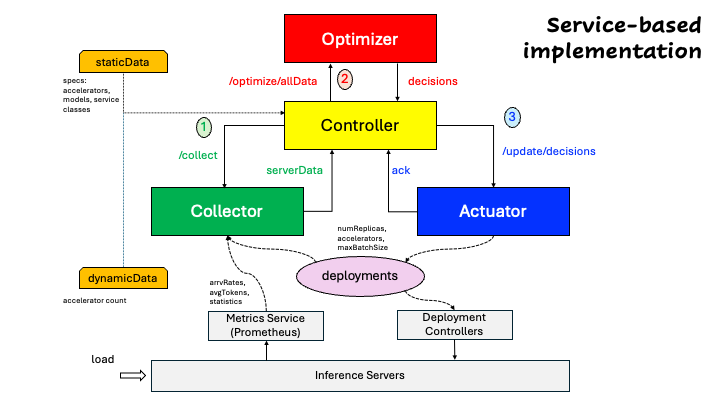
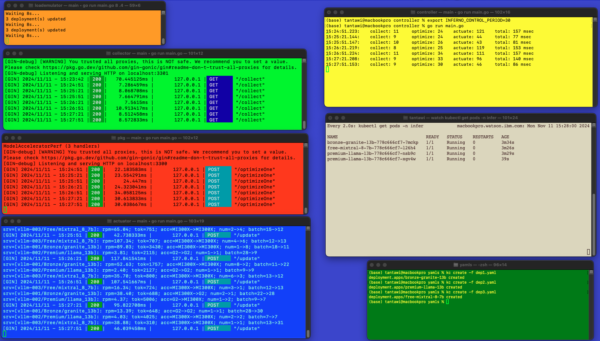
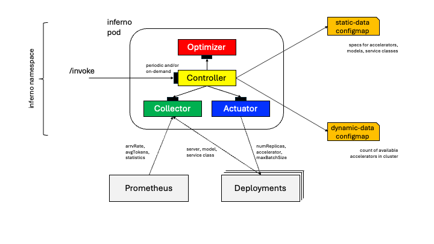

# Control loop for inference optimizer

The control loop comprises (1) a Collector to get data about the inference servers through Prometheus and server deployments, (2) an Optimizer to make decisions, (3) an Actuator to realize such decisions by updating server deployments, and (4) a periodic Controller that has access to static and dynamic data. The control loop may run either externally or in a Kubernetes cluster.



## Running

## I. Run control loop externally

Following are the steps to run the optimization control loop external to a cluster.

### Steps

- [Install prerequisites](https://github.com/llm-inferno/inferno/blob/main/README.md#prerequisites).
- Create a Kubernetes cluster and make sure `$HOME/.kube/config` points to it.
- Run script to create terminals for the various components. You may need to install [term](https://github.com/liyanage/macosx-shell-scripts/blob/master/term) and add terminal coloring support. (Hint: [Change OSX Terminal Settings from Command Line](https://ict4g.net/adolfo/notes/admin/change-osx-terminal-settings-from-command-line.html))

    ```bash
    cd $REPO_BASE/scripts
    ./launch-terms.sh
    ```

    where `$REPO_BASE` is the path to this repository.

    

    In this demo there are five components: Collector, Optimizer, Actuator, Controller, and Load Emulator.
    Terminals for the Collector, Optimizer, Actuator, and Controller are (light) green, red, blue, and yellow, repectively.
    The Load Emulator is orange.
    The green terminal is for interaction with the cluster through kubectl commands.
    And, the beige terminal to observe the currently running pods.

- Set the data path to the data (static+dynamic) for the Controller (yellow). [Make sure `$REPO_BASE` is set.]

    ```bash
    export INFERNO_DATA_PATH=$REPO_BASE/sample-data/large/
    ```

- Set the environment in all of the (five) component terminals. [Make sure `$REPO_BASE` is set]

    ```bash
    . $REPO_BASE/scripts/setparms.sh
    ```

- Deploy sample deployments (green terminal) in namespace `infer`, representing three inference servers.

    ```bash
    kubectl apply -f ns.yaml
    kubectl apply -f dep1.yaml,dep2.yaml,dep3.yaml
    ```

- Observe (beige) changes in the number of pods (replicas) for all inference servers (deployments).

    ```bash
    watch kubectl get pods -n infer
    ```

- Run the components.

  - Collector (light green), Optimizer (red), and Actuator (blue)
  
    ```bash
    go run main.go
    ```

  - Controller (yellow)
  
    ```bash
    go run main.go <controlPeriodInSec> <isDynamicMode>
    ```

    The control period dictates the frequency with which the Controler goes through a control loop (default 60).
    In addition, the Controler runs as a REST server with an endpoint `/invoke` for on-demand activation of the control loop.
    Hence, **periodic** as well as **aperiodic** modes are supported simultaneously.
    Setting `controlPeriodInSec` to zero makes the Controller run in the **aperiodic** mode only.

    ```bash
    curl http://$CONTROLLER_HOST:$CONTROLLER_PORT/invoke
    ```

    (Default is localhost:3300)

    Further, there is an option for running the Controller in dynamic mode.
    This means that, at the beginning of every control cycle, the (static) data files are read (default false).
    The arguments for the Controller may also be set through the environment variables `INFERNO_CONTROL_PERIOD` and `INFERNO_CONTROL_DYNAMIC`, respectively.
    The command line arguments override the values of the environment variables.

  - Load Emulator (orange)
  
    ```bash
    go run main.go <intervalInSec> <alpha (0,1)>
    ```

    The Load Emulator periodically, given by the argument `intervalInSec`, pertubs the values of request rate and average number of tokens per request for all inference servers (deployments) in the cluster. The disturbance amount is normally distributed with zero mean and `sigma` standard deviation, where `sigma = alpha * originalUndisturbedValue`.
    (Default arguments are 60 and 0.5, respectively.)

- Cleanup

  - Stop all (five) components using Ctrl-c

  - Delete sample deployments (green terminal)
  
      ```bash
    kubectl delete -f dep1.yaml,dep2.yaml,dep3.yaml
    kubectl delete -f ns.yaml
    ```

## II. Run control loop in a cluster

### Building

To create a docker image for the control loop (excluding the Optimizer). Instructions for the Optimizer are in the [optimizer repository](https://github.com/llm-inferno/inferno).

```bash
docker build -t  inferno-loop . --load
```

Following are the steps to run the optimization control loop within a cluster.



- Create or have access to a cluster.

- Clone this repository and set environment variable `REPO_BASE` to the path to it.

- Create namespace *inferno*, where all optimizer components will reside.

    ```bash
    cd $REPO_BASE/yamls/deploy
    kubectl apply -f ns.yaml
    ```

- Create a configmap populated with inferno static data, e.g. samples taken from the *large* directory.

    ```bash
    SAMPLE_DATA_PATH=$REPO_BASE/sample-data/large
    kubectl create configmap inferno-static-data -n inferno \
    --from-file=/$SAMPLE_DATA_PATH/accelerator-data.json \
    --from-file=/$SAMPLE_DATA_PATH/model-data.json \
    --from-file=/$SAMPLE_DATA_PATH/serviceclass-data.json \
    --from-file=/$SAMPLE_DATA_PATH/optimizer-data.json
    ```

- Create a configmap populated with inferno dynamic data (count of accelerator types).

    ```bash
    kubectl create configmap inferno-dynamic-data -n inferno --from-file=/$SAMPLE_DATA_PATH/capacity-data.json 
    ```

- Deploy inferno in the cluster.

    ```bash
    kubectl apply -f deploy-loop.yaml
    ```

- Get the inferno pod name.

    ```bash
    POD=$(kubectl get pod -l app=inferno -n inferno -o jsonpath="{.items[0].metadata.name}")
    ```

- Inspect logs.

    ```bash
    kubectl logs -f $POD -n inferno -c controller
    kubectl logs -f $POD -n inferno -c collector
    kubectl logs -f $POD -n inferno -c optimizer
    kubectl logs -f $POD -n inferno -c actuator
    ```

- Create deployments representing inference servers in namespace *infer*.

    ```bash
    cd $REPO_BASE/yamls/workload
    kubectl apply -f ns.yaml
    kubectl apply -f dep1.yaml,dep2.yaml,dep3.yaml
    ```

    Note that the deployment should have the following labels set (a missing service class name defaults to *Free*)

    ```bash
    labels:
        inferno.server.managed: "true"
        inferno.server.name: vllm-001
        inferno.server.model: llama_13b
        inferno.server.class: Premium
        inferno.server.allocation.accelerator: MI250
    ```

    and some optional labels (if metrics are not available from  Pometheus).

    ```bash
    labels:
        inferno.server.allocation.maxbatchsize: "8"
        inferno.server.load.rpm: "30"
        inferno.server.load.numtokens: "2048"
    ```

- Observe changes in the number of pods (replicas) for all inference servers (deployments).

    ```bash
    watch kubectl get pods -n infer
    ```

- (Optional) Start a load emulator to inference servers.

    ```bash
    cd $REPO_BASE/yamls/deploy
    kubectl apply -f load-emulator.yaml
    kubectl logs -f load-emulator -n inferno
    ```

- Invoke an inferno control loop.

    ```bash
    kubectl port-forward service/inferno -n inferno 8080:80
    curl http://localhost:8080/invoke
    ```

- Cleanup

    ```bash
    cd $REPO_BASE/yamls/deploy
    kubectl delete -f load-emulator.yaml
    kubectl delete -f deploy-loop.yaml 
    kubectl delete configmap inferno-static-data inferno-dynamic-data -n inferno
    kubectl delete -f ns.yaml

    cd $REPO_BASE/yamls/workload
    kubectl delete -f dep1.yaml,dep2.yaml,dep3.yaml
    kubectl delete -f ns.yaml
    ```
