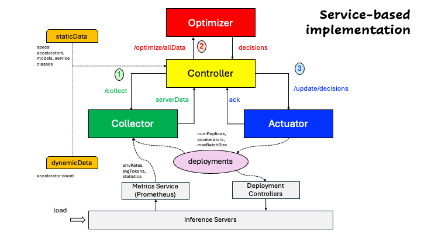
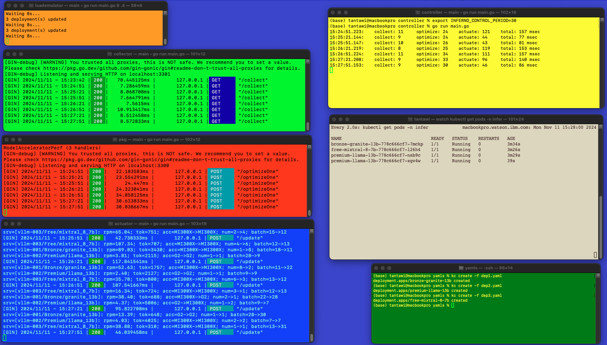
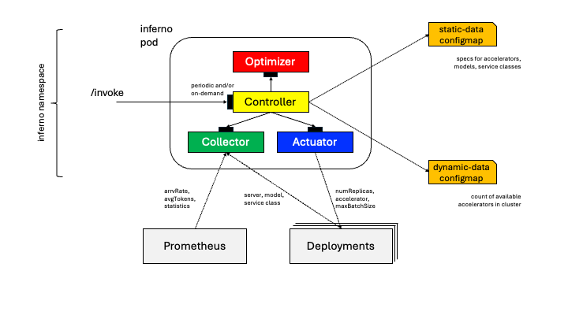

# Control loop for inference optimizer

The control loop comprises (1) a Collector to get data about the inference servers through Prometheus and server deployments, (2) an Optimizer to make decisions, (3) an Actuator to realize such decisions by updating server deployments, and (4) a periodic Controller that has access to static and dynamic data. The control loop may run either externally or in a Kubernetes cluster.



## Running

## I. Run control loop externally

Following are the steps to run the optimization control loop external to a cluster.

### Steps

- If using [optimizer](https://github.com/llm-inferno/optimizer), as opposed to [optimizer-light](https://github.com/llm-inferno/optimizer-light), [install optimizer prerequisites](https://github.com/llm-inferno/optimizer/blob/main/README.md#prerequisites).
- Create a Kubernetes cluster and make sure `$HOME/.kube/config` points to it.
- Set env variables:
  - `REPO_BASE` path to this repository
  - `TUNER_REPO`path to [model-tuner](https://github.com/llm-inferno/model-tuner) repository
- Setup [server-sim](https://github.com/llm-inferno/server-sim), which is used in the demo as a replacement to a real vLLM server.
  - Make sure images `inferno-server-sim` and `inferno-evaluator`, as specified in the [deployment yaml files](yamls/workload/), are built and available in the cluster.
  - For the queue-model server-sim (default) evaluator, deploy `server-sim-model-data` configMap.

    ```bash
    kubectl create ns infer
    kubectl create configmap server-sim-model-data -n infer \
      --from-file=model-data.json=$REPO_BASE/sample-data/large/model-data.json \
      --dry-run=client -o yaml | kubectl apply -f -
    ```

- Run script to create terminals for the various components. You may need to install [term](https://github.com/liyanage/macosx-shell-scripts/blob/master/term) and add terminal coloring support. (Hint: [Change OSX Terminal Settings from Command Line](https://ict4g.net/adolfo/notes/admin/change-osx-terminal-settings-from-command-line.html)).

    ```bash
    cd $REPO_BASE/scripts
    ./launch-terms.sh
    ```

    

    In this demo there are six components: Collector, Optimizer, Actuator, Controller, Tuner, and Load Emulator.
    Terminals for the Collector, Optimizer, Actuator, and Controller are (light) green, red, blue, and yellow, respectively.
    The Tuner is purple and the Load Emulator is orange.
    The green terminal is for interaction with the cluster through kubectl commands.
    And, the beige terminal to observe the currently running pods.

- Set the data path to the data (static+dynamic) for the Controller (yellow). [Make sure `$REPO_BASE` is set.]

    ```bash
    export INFERNO_DATA_PATH=$REPO_BASE/sample-data/large/
    ```

- Set the environment in all of the (six) component terminals. [Make sure `$REPO_BASE` is set]

    ```bash
    . $REPO_BASE/scripts/setparms.sh
    ```

- Deploy sample deployments (green terminal) in namespace `infer`, representing three inference servers.

    ```bash
    kubectl apply -f ns.yaml
    kubectl apply -f dep1.yaml,dep2.yaml,dep3.yaml
    ```

- Observe (beige) changes in the number of pods (replicas) for all inference servers (deployments).

    ```bash
    watch kubectl get pods -n infer
    ```

- Run the components.

  - Collector (light green), Optimizer (red), and Actuator (blue)
  
    ```bash
    go run main.go
    ```

  - Controller (yellow)
  
    ```bash
    go run main.go <controlPeriodInSec> <isDynamicMode>
    ```

    The control period dictates the frequency with which the Controler goes through a control loop (default 60).
    In addition, the Controler runs as a REST server with an endpoint `/invoke` for on-demand activation of the control loop.
    Hence, **periodic** as well as **aperiodic** modes are supported simultaneously.
    Setting `controlPeriodInSec` to zero makes the Controller run in the **aperiodic** mode only.

    ```bash
    curl http://$CONTROLLER_HOST:$CONTROLLER_PORT/invoke
    ```

    (Default is localhost:3300)

    Further, there is an option for running the Controller in dynamic mode.
    This means that, at the beginning of every control cycle, the (static) data files are read (default false).
    The arguments for the Controller may also be set through the environment variables `INFERNO_CONTROL_PERIOD` and `INFERNO_CONTROL_DYNAMIC`, respectively.
    The command line arguments override the values of the environment variables.

    Set `DEFAULT_MAX_BATCH_SIZE` to pin the batch size for all servers (overrides the optimizer's computed value). When unset or 0, the optimizer determines the batch size per server from performance data.

  - Tuner (purple, optional)

    The Tuner runs from the [model-tuner](https://github.com/llm-inferno/model-tuner) repository.
    Set `$TUNER_REPO` to the path of that repository, then in its terminal:

    ```bash
    cd $TUNER_REPO
    go run cmd/tuner/main.go
    ```

    The Controller enables the Tuner only when `TUNER_HOST` is set (already set to `localhost` by `setparms.sh`).
    To disable the Tuner, unset the variable in the Controller terminal before starting it:

    ```bash
    unset TUNER_HOST
    ```

  - Load Emulator (orange)

    ```bash
    go run main.go
    ```

    The Load Emulator periodically updates the request rate and average number of tokens per request for all managed inference server deployments and their running pods.
    Each metric follows a mean-reverting random walk: `next = current + theta*(nominal - current) + Normal(0, alpha*nominal)`, keeping the time average near the nominal value set in the deployment labels.
    The total deployment request rate is split across running pods using a skew factor (0 = equal split, 1 = fully random split).

    Optionally, a **phase sequence** can be configured to vary the nominal request rate over time. Each phase specifies a real-time duration and a change ratio; the nominal RPM ramps linearly from its value at the start of the phase to `ratio × start` by the end. Ratios are chained: each is relative to the nominal at the start of that phase. The random walk tracks the changing nominal throughout. A `duration: 0s` terminal phase holds the final value indefinitely. Example (`yamls/deploy/configmap-load-phases.yaml`):

    ```yaml
    phases:
      - duration: 2m
        ratio: 1.0    # hold flat at baseline
      - duration: 5m
        ratio: 3.0    # ramp up to 3x over 5 minutes
      - duration: 5m
        ratio: 0.333  # ramp back down to ~1x
      - duration: 0s  # hold at final value forever
    ```

    The phase config is delivered as the `load-phases-config` ConfigMap (see `yamls/deploy/load-emulator.yaml`). When `INFERNO_LOAD_PHASES` is unset, the emulator behaves as before (static nominal).

    Configuration is via environment variables (all optional, defaults shown):

    | Variable | Default | Description |
    |---|---|---|
    | `INFERNO_LOAD_INTERVAL` | `20` | Update interval in seconds |
    | `INFERNO_LOAD_ALPHA` | `0.1` | Noise magnitude relative to nominal |
    | `INFERNO_LOAD_THETA` | `0.2` | Mean-reversion strength (0=no reversion, 1=snap to nominal) |
    | `INFERNO_LOAD_SKEW` | `0.3` | Load skew across pods (0=equal, 1=fully random) |
    | `INFERNO_LOAD_PHASES` | `""` | Path to YAML phase config file; empty = static nominal |
    | `INFERNO_STARTUP_DELAY` | `0` | Seconds after pod start before it is treated as ready; pods within this window are skipped by both the Load Emulator and the Collector |

- Cleanup

  - Stop all (five) components using Ctrl-c

  - Delete sample deployments (green terminal)
  
      ```bash
    kubectl delete -f dep1.yaml,dep2.yaml,dep3.yaml
    kubectl delete -f ns.yaml
    ```

## II. Run control loop in a cluster

### Building

To create a docker image for the control loop (excluding the Optimizer). Instructions for the Optimizer are in the [optimizer repository](https://github.com/llm-inferno/optimizer).

```bash
docker build -t  inferno-loop . --load
```

Following are the steps to run the optimization control loop within a cluster.



- Create or have access to a cluster.

- Clone this repository and set environment variable `REPO_BASE` to the path to it.

- Create namespace *inferno*, where all optimizer components will reside.

    ```bash
    cd $REPO_BASE/yamls/deploy
    kubectl apply -f ns.yaml
    ```

- Create a configmap populated with inferno static data, e.g. samples taken from the *large* directory.

    ```bash
    SAMPLE_DATA_PATH=$REPO_BASE/sample-data/large
    kubectl create configmap inferno-static-data -n inferno \
    --from-file=/$SAMPLE_DATA_PATH/accelerator-data.json \
    --from-file=/$SAMPLE_DATA_PATH/model-data.json \
    --from-file=/$SAMPLE_DATA_PATH/serviceclass-data.json \
    --from-file=/$SAMPLE_DATA_PATH/optimizer-data.json
    ```

- Create a configmap populated with inferno dynamic data (count of accelerator types).

    ```bash
    kubectl create configmap inferno-dynamic-data -n inferno --from-file=/$SAMPLE_DATA_PATH/capacity-data.json 
    ```

- Deploy inferno in the cluster.

    ```bash
    kubectl apply -f deploy-loop.yaml
    ```

- Get the inferno pod name.

    ```bash
    POD=$(kubectl get pod -l app=inferno -n inferno -o jsonpath="{.items[0].metadata.name}")
    ```

- Inspect logs.

    ```bash
    kubectl logs -f $POD -n inferno -c controller
    kubectl logs -f $POD -n inferno -c collector
    kubectl logs -f $POD -n inferno -c optimizer
    kubectl logs -f $POD -n inferno -c actuator
    ```

- Build and push server-sim container images.

    ```bash
    cd $REPO_BASE/../server-sim
    docker build -f Dockerfile.server-sim -t quay.io/atantawi/inferno-server-sim:latest .
    docker build -f Dockerfile.evaluator  -t quay.io/atantawi/inferno-evaluator:latest .
    docker push quay.io/atantawi/inferno-server-sim:latest
    docker push quay.io/atantawi/inferno-evaluator:latest
    ```

- Create deployments representing inference servers in namespace *infer*.

    ```bash
    cd $REPO_BASE/yamls/workload
    kubectl apply -f ns.yaml
    kubectl create configmap server-sim-model-data -n infer \
      --from-file=model-data.json=$REPO_BASE/sample-data/large/model-data.json \
      --dry-run=client -o yaml | kubectl apply -f -
    kubectl apply -f dep1.yaml,dep2.yaml,dep3.yaml,dep4.yaml
    ```

    Note that the deployment should have the following labels set (a missing service class name defaults to *Free*)

    ```bash
    labels:
        inferno.server.managed: "true"
        inferno.server.name: vllm-001
        inferno.server.model: llama_13b
        inferno.server.class: Premium
        inferno.server.allocation.accelerator: MI250
    ```

    Each pod must run two sidecars: **server-sim** (port 8080) and **evaluator** (port 8081, `queue-analysis` mode).
    The Collector calls `server-sim /simulate` on each running pod to obtain ITL and TTFT latency estimates.

    Optional static fallback labels for load metrics (used only if Prometheus is unavailable; ITL/TTFT always come from server-sim):

    ```bash
    labels:
        inferno.server.allocation.maxbatchsize: "8"
        inferno.server.load.rpm: "30"
        inferno.server.load.intokens: "128"
        inferno.server.load.outtokens: "2048"
    ```

    Also set nominal load labels (used by the Load Emulator as the mean-reversion target):

    ```bash
    labels:
        inferno.server.load.nominal.rpm: "30"
        inferno.server.load.nominal.intokens: "128"
        inferno.server.load.nominal.outtokens: "2048"
    ```

- Observe changes in the number of pods (replicas) for all inference servers (deployments).

    ```bash
    watch kubectl get pods -n infer
    ```

- Start a load emulator to inference servers.

    ```bash
    cd $REPO_BASE/yamls/deploy
    kubectl apply -f load-emulator.yaml
    kubectl logs -f load-emulator -n inferno
    ```

- Invoke an inferno control loop.

    ```bash
    kubectl port-forward service/inferno -n inferno 8080:80
    curl http://localhost:8080/invoke
    ```

- Cleanup

    ```bash
    cd $REPO_BASE/yamls/deploy
    kubectl delete -f load-emulator.yaml
    kubectl delete -f deploy-loop.yaml 
    kubectl delete configmap inferno-static-data inferno-dynamic-data -n inferno
    kubectl delete -f ns.yaml

    cd $REPO_BASE/yamls/workload
    kubectl delete -f dep1.yaml,dep2.yaml,dep3.yaml,dep4.yaml
    kubectl delete configmap server-sim-model-data -n infer
    kubectl delete -f ns.yaml
    ```

## (Optional) Run the visualization dashboard

The controller writes one JSON line per completed cycle to a JSONL log file (`inferno-cycles.jsonl` by default, configurable via `INFERNO_CYCLE_LOG`). A standalone Python dashboard reads the log and displays five auto-refreshing panels: workload, performance vs SLO targets, controls, accelerator capacity, and EKF internals.

**Step 1 — set up a Python virtual environment (first time only):**

```bash
cd $REPO_BASE/dashboard
python3 -m venv .venv
source .venv/bin/activate
pip install -r requirements.txt
```

**Step 2 — run the dashboard:**

Choose one of two options for sourcing the log file:

*Option A — auto-fetch from the running pod (recommended):*

```bash
cd $REPO_BASE/dashboard
source .venv/bin/activate
INFERNO_POD_SYNC=1 \
INFERNO_NAMESPACE=inferno \
INFERNO_CYCLE_LOG=/tmp/inferno-cycles.jsonl \
python dashboard.py
```

The dashboard fetches the log from the controller container every 10 seconds via `kubectl exec`. No manual copy needed.

*Option B — copy the log file manually:*

```bash
kubectl exec -n inferno deployment/inferno -c controller -- \
  cat inferno-cycles.jsonl > $REPO_BASE/inferno-cycles.jsonl
```

Then run:

```bash
cd $REPO_BASE/dashboard
source .venv/bin/activate
INFERNO_CYCLE_LOG=$REPO_BASE/inferno-cycles.jsonl python dashboard.py
```

Repeat the copy command to refresh the data while the controller is running.

Open `http://localhost:8050` in a browser. The dashboard auto-refreshes every 5 seconds.

**Environment variables:**

| Variable | Default | Description |
|---|---|---|
| `INFERNO_CYCLE_LOG` | `inferno-cycles.jsonl` | Path to the local JSONL log file. Set to `-` to disable controller logging. |
| `INFERNO_DASH_REFRESH` | `5000` | Dashboard auto-refresh interval in milliseconds |
| `INFERNO_DASH_PORT` | `8050` | Dashboard port |
| `INFERNO_POD_SYNC` | `0` | Set to `1` to auto-fetch the log from the pod via `kubectl exec` |
| `INFERNO_NAMESPACE` | `inferno` | Kubernetes namespace containing the inferno pod (used with pod sync) |
| `INFERNO_POD_SYNC_INTERVAL` | `10` | How often (seconds) to fetch the log from the pod |
| `INFERNO_CYCLE_LOG_POD_PATH` | `inferno-cycles.jsonl` | Path to the log file inside the controller container |
