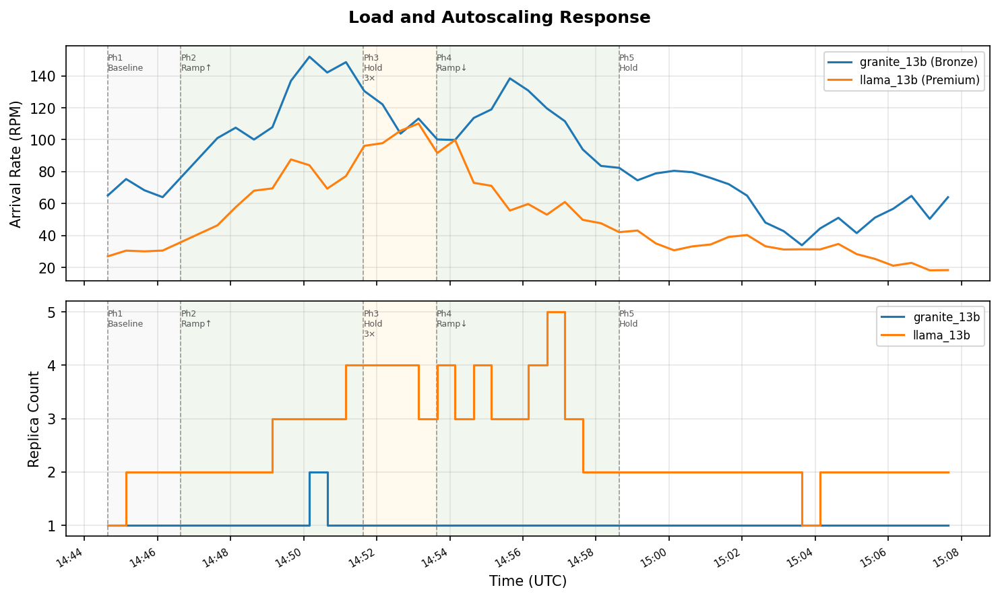
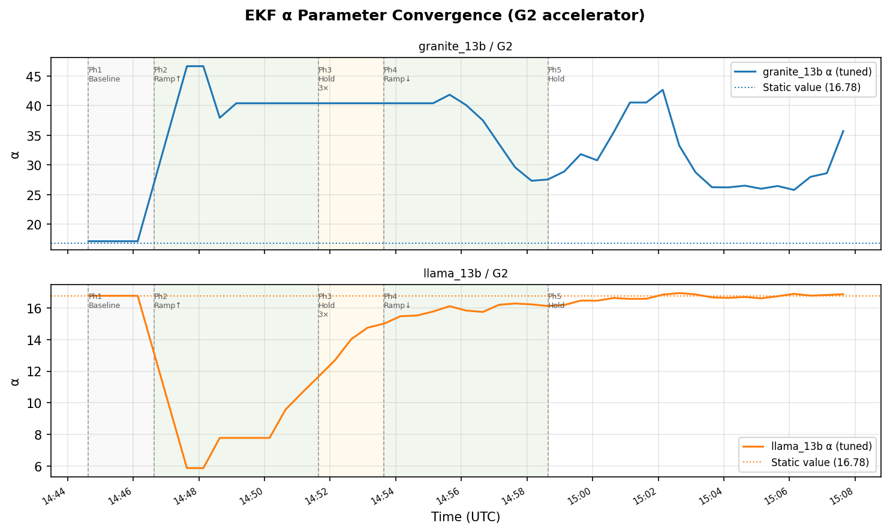
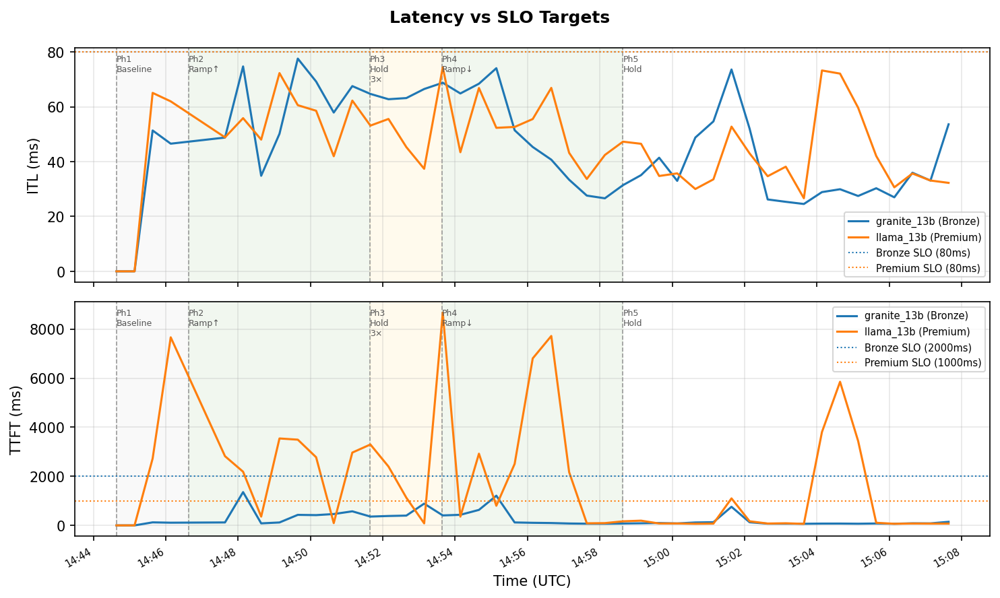
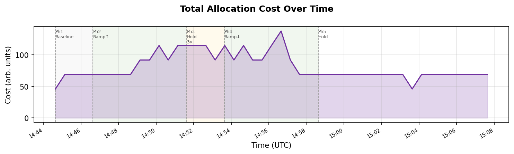
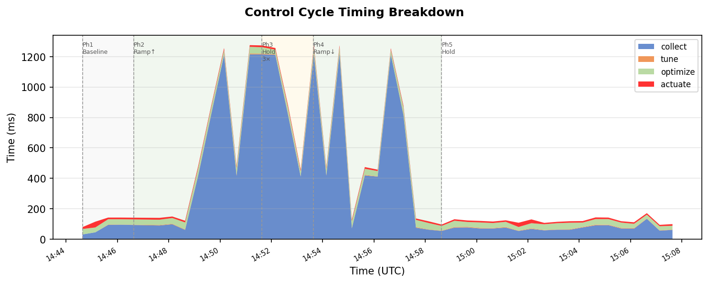

# Experiment Report — llm-inferno Control Loop with InitEstimator
**Date:** 2026-04-11  
**Cluster:** kind (kind-cluster), Docker Desktop, macOS arm64, single node  
**Control period:** 30s  
**Workloads:** `premium-llama-13b` (llama_13b/G2, nominal 30 RPM), `bronze-granite-13b` (granite_13b/G2, nominal 60 RPM)  
**New feature under test:** Multi-observation Nelder-Mead `InitEstimator` (`TUNER_INIT_OBS=3`, `TUNER_WARM_UP_CYCLES=3`, `TUNER_INIT_HOLD_BACK=true`)

---

## 1. Objective

Validate the `InitEstimator` feature (llm-inferno/model-tuner#3) in a full closed-loop experiment with a realistic phased load profile. The feature replaces the single-observation zero-load algebraic inversion (`guessInitState`) with a multi-observation Nelder-Mead fit as the EKF initial state, and was motivated by poor EKF convergence at moderate-to-high traffic levels in prior sessions.

---

## 2. Load Profile

The load emulator ran a 5-phase sequence over ~14 minutes:

| Phase | Duration | Nominal RPM (granite / llama) | Behavior |
|---|---|---|---|
| 1 | 2 min | 60 / 30 | Hold flat at baseline |
| 2 | 5 min | 60 → 180 / 30 → 90 | Linear ramp to 3× baseline |
| 3 | 2 min | 180 / 90 | Hold at 3× |
| 4 | 5 min | 180 → 60 / 90 → 30 | Linear ramp back to ~1× |
| 5 | ∞ | ~60 / ~30 | Hold at final value |



The top panel shows measured arrival rate (RPM) tracked closely to the nominal load profile across all phases. The bottom panel shows replica count scaled out and back in proportionally. Pod startup delay (60s) correctly suppressed load labels on newly-created pods during scale-out events, visible as the stepped replica increase during phase 2.

---

## 3. Warm-up Sequence

| Time (UTC) | Cycle | Event |
|---|---|---|
| 14:44:38 | 1–2 | tune=0ms — no replicaSpecs yet (pods within startup delay) |
| 14:45:38 | 3 | Collection obs 1/3, tuner returns 422 — controller proceeds with static model data |
| 14:46:08 | 4 | Collection obs 2/3, tuner returns 422 |
| 14:46:38 | 5 | Collection obs 3/3 — **Fit() runs**, EKF warm-up begins, controller holds back |
| 14:47:08 | 6 | EKF updateCount=2, warmUp=true, controller holds back |
| 14:47:38 | 7 | EKF updateCount=3, warmUp=false — **normal operation begins** |

Total hold-back: **3 cycles × 30s = 90 seconds** from first observation. Normal operation was established well before the load ramp began (phase 2 starts at t+2min).

**InitEstimator Fit results** (3 observations at baseline load):

| Model | α (Fit) | β (Fit) | γ (Fit) | Objective value |
|---|---|---|---|---|
| granite_13b/G2 | 46.3 | 0.0436 | 0.000108 | 0.447 |
| llama_13b/G2 | 4.9 | 0.296 | 0.00242 | 0.659 |

Both models were fit at baseline (phase 1) load, where all 3 observations were at similar utilization (~60–70 RPM for granite, ~20 RPM for llama). The limited diversity in operating points reduces identifiability, particularly for granite, explaining the higher initial α.

---

## 4. EKF α Convergence



**llama_13b/G2** — excellent convergence. α progressed smoothly from the Fit() prior of 4.9 toward the expected static value of ~16.78, reaching 16.7 by the end of the experiment (updateCount=31, NIS < 0.001). The EKF converged monotonically with low NIS throughout phase 5.

**granite_13b/G2** — partial convergence. α started at 57.4 (first EKF update post-Fit), drifted down to ~26 by end of experiment (updateCount=21), still above the expected ~16.78. The rapid load changes during phases 2–4 triggered many NIS gate rejections (NIS 19–502), slowing convergence. The EKF resumed accepting updates during phase 5 with α descending. Additional cycles at stable load are needed for full convergence.

The contrast between the two models illustrates the NIS gate's role: it correctly filtered out high-NIS updates during the ramp-up (protecting against parameter divergence) at the cost of slower convergence for granite during this experiment.

---

## 5. Latency vs SLO



ITL and TTFT remained well within SLO targets for both workloads throughout the experiment. The optimizer's replica scaling decisions kept latency bounded even at 3× nominal load (phase 3).

---

## 6. Autoscaling Response



Total allocation cost tracked the load profile closely, rising during the ramp-up, peaking during phase 3, and returning to baseline during the ramp-down. The optimizer scaled replica counts proportionally with no oscillation observed during this experiment.

---

## 7. Cycle Timing



| Phase | collect | tune | optimize | actuate | total |
|---|---|---|---|---|---|
| Baseline (1–2 replicas) | ~60ms | ~3ms | ~35ms | ~10ms | ~110ms |
| Peak load (6–8 replicas) | ~1200ms | ~5ms | ~40ms | ~11ms | ~1260ms |

Collect time dominated at peak load as expected (one server-sim proxy call per pod, ~150ms each). Tune, optimize, and actuate remained stable throughout. The collect time serves as a reliable indirect indicator of replica count.

---

## 8. Summary

| Aspect | Result |
|---|---|
| InitEstimator warm-up | Clean, 90s total hold-back ✓ |
| llama_13b EKF convergence | α → 16.7 (expected 16.78), NIS → ~0 ✓ |
| granite_13b EKF convergence | Partial — α descending from 57→26, needs more cycles at stable load |
| Autoscaling | Tracked 3× load ramp cleanly, no oscillation ✓ |
| Latency SLO compliance | Both workloads within SLO throughout ✓ |
| NIS gate behavior | Correctly rejected updates during rapid load transitions ✓ |
| Errors | None — clean run end to end ✓ |

## 9. Open Observations

1. **granite_13b EKF convergence** is slow in this experiment. All 3 collection-phase observations were taken at similar (baseline) load, giving the Nelder-Mead fit limited token-count diversity and producing a high initial α. Future experiments should consider collecting observations across a broader load range (e.g., starting with phase 2 already active), or increasing `TUNER_INIT_OBS` for granite-class workloads.

2. **NIS rejections during load ramps** are expected and correct behavior. However, they delay EKF convergence for models that experience large simultaneous load changes. A possible mitigation is a wider NIS acceptance threshold during rapid-ramp periods, though this is not currently configurable.

---

## Appendix: Reproduction

```bash
# Copy cycle log from running pod
kubectl cp inferno/$(kubectl get pod -n inferno -l app=inferno \
  -o jsonpath='{.items[0].metadata.name}'):inferno-cycles.jsonl /tmp/inferno-cycles.jsonl

# Generate figures
python3 scripts/gen_report_figs.py

# Figures written to docs/figs/exp_*.png
```
