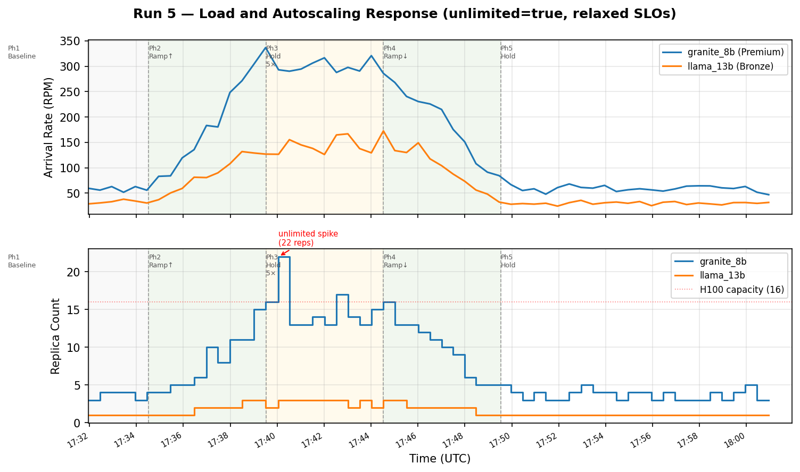
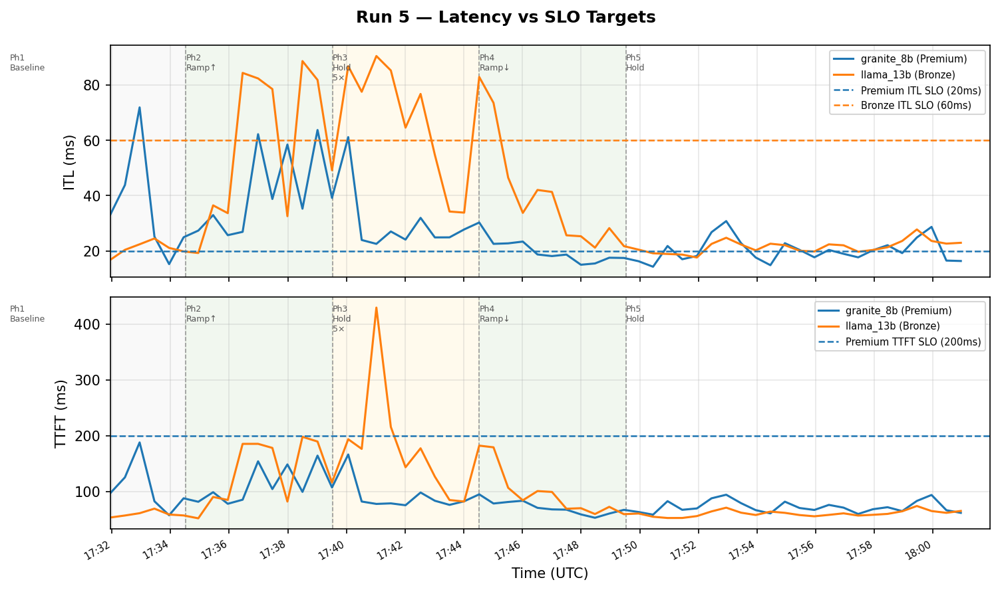
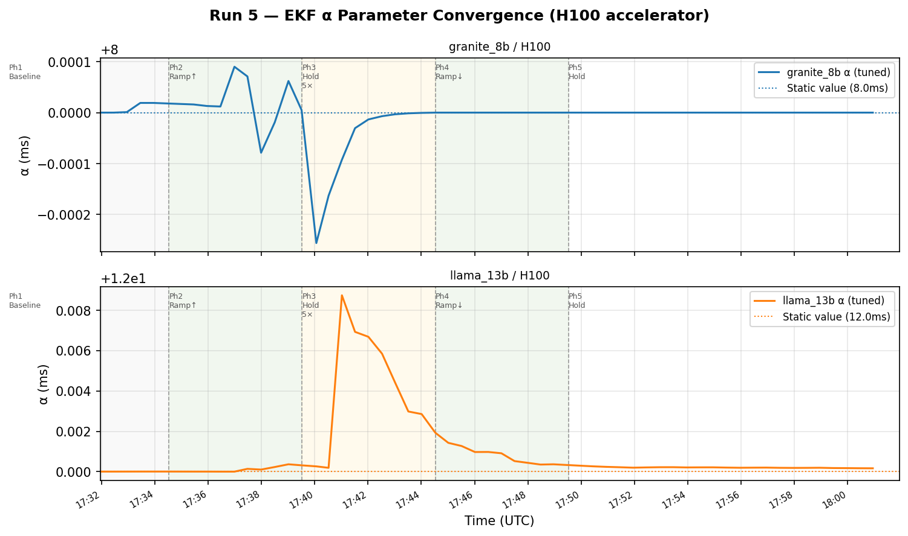
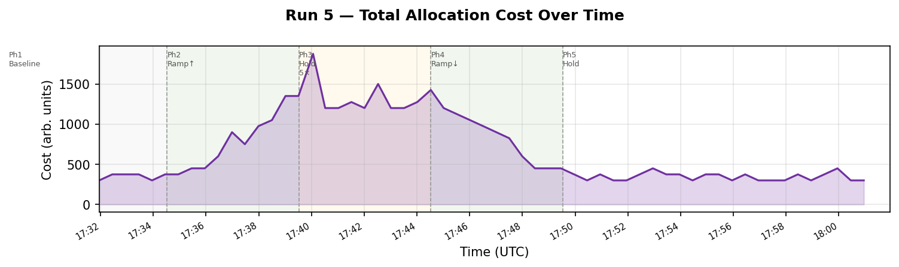
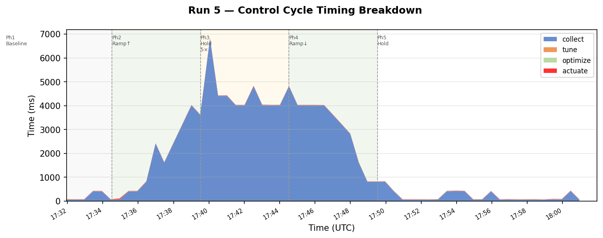

# Experiment Report: Run 5 — Queue-Analysis, unlimited=true, Relaxed SLOs
**Date:** 2026-04-14  
**Branch:** feat/blis-trained-physics  
**Workloads:** qa-granite-8b (Premium, H100), qa-llama-13b (Bronze, H100)  
**Evaluator:** queue-analysis (M/G/1 analytical model)  
**EKF start:** No perfParms in inferno-static-data (learns from scratch)

---

## Motivation

Run 4 demonstrated two issues:
1. **Capacity infeasibility (404)**: At mult≈3.4×, the combined SLO requirements exceeded 16 H100 capacity → optimizer returned 404 for ~9 minutes; allocation frozen at last valid configuration.
2. **Tight SLOs at baseline**: With 15ms ITL SLO for granite, the optimizer allocated 5–7 replicas at 1× load.

Run 5 addresses both:
1. `unlimited: true` in `optimizer-data.json` — optimizer may allocate beyond configured capacity, preventing 404.
2. Relaxed SLOs: granite Premium ITL 15ms→20ms, TTFT 100ms→200ms; llama Bronze ITL 50ms→60ms.

---

## Configuration

| Parameter | Value |
|---|---|
| Evaluator | `queue-analysis` |
| Granite target perfParms | α=8.0ms, β=0.016ms/tok, γ=0.0005ms/tok² |
| Llama target perfParms | α=12.0ms, β=0.024ms/tok, γ=0.00075ms/tok² |
| inferno-static-data perfParms | None (EKF learns from scratch) |
| optimizer `unlimited` | **true** (new vs Run 4) |
| INFERNO_WARM_UP_TIMEOUT | 0 (no override) |
| TUNER_INIT_OBS | 3 (Nelder-Mead fit on 3 observations) |
| TUNER_WARM_UP_CYCLES | 3 |
| TUNER_INIT_HOLD_BACK | true |
| Load phases | 6-min hold → 5-min ramp to 5× → 5-min hold → 5-min ramp down → hold |
| Granite nominal | 60 RPM, 2048/1024 tokens |
| Llama nominal | 30 RPM, 768/768 tokens |
| SLO: granite Premium | **ITL≤20ms, TTFT≤200ms** (relaxed from Run 4) |
| SLO: llama Bronze | **ITL≤60ms**, TTFT≤1000ms (relaxed from Run 4) |
| H100 capacity | 16 (but `unlimited=true` allows exceeding this) |

---

## EKF Warm-Up

Deploy time: ~17:28:27.

```
17:28:27: TunerService started (warmUpCycles=3, initObs=3, holdBack=true)
17:28:56 – 17:30:26: 4 cycles skipped (404 from optimizer — perfParms=0, tuner accumulating)
17:30:56: Fit complete — funcValue=0 (exact parameter recovery for both models, 3 observations)
           granite: α=8.000ms β=0.016 γ=0.0005
           llama:   α=12.000ms β=0.024 γ=0.00075
17:31:56: First optimize+actuate cycle (warm-up hold-back cleared)
```

**Key finding:** Same as Run 4 — funcValue=0 in 3 observations. Queue-analysis evaluator is deterministic, EKF converges immediately. Warm-up completed in ~3.5 minutes from deploy.

Initial perfParms (cycle 1, 17:31:56): granite α=8.000ms, llama α=12.000ms.

---

## Figures











---

## Phase-by-Phase Results

### Phase 1: 6-min baseline hold (1×)

Cycle 1 starts at 17:31:56 (after warm-up). Phase 2 ramp begins ~17:35:27.

| Cycle | Time | G RPM | G ITL | G Reps | L RPM | L ITL | L Reps | Cost |
|---|---|---|---|---|---|---|---|---|
| 1 | 17:31:56 | 59 | 33.1ms | 3 | 29 | 16.8ms | 1 | 300 |
| 2 | 17:32:26 | 56 | 43.8ms | 4 | 31 | 20.4ms | 1 | 375 |
| 3 | 17:32:56 | 63 | 71.9ms | 4 | 33 | 22.4ms | 1 | 375 |
| 4 | 17:33:27 | 52 | 25.1ms | 4 | 38 | 24.5ms | 1 | 375 |
| 5 | 17:33:57 | 63 | 15.2ms | 3 | 34 | 21.1ms | 1 | 300 |
| 6 | 17:34:26 | 56 | 24.9ms | 4 | 30 | 19.8ms | 1 | 375 |
| 7 | 17:34:56 | 83 | 27.3ms | 4 | 37 | 19.2ms | 1 | 375 |

**Observations:**
- Baseline oscillation between 3–4 granite replicas (vs 5–7 in Run 4 at 15ms SLO). Relaxed 20ms SLO allows 33% cost reduction at baseline.
- Observed ITL at 3–4 replicas ranges 15–72ms. High values (71.9ms cycle 3) are per-pod skew artefacts: SKEW=0.3 concentrates load on one pod, inflating the weighted-average ITL.
- Cycles 1–2: Early transient — EKF NIS warm-up cycles, minor parameter drift expected.
- Llama stable at 1 replica throughout. Bronze ITL SLO=60ms; observed 17–24ms.
- Cost at baseline: 300–375 (vs 450–525 in Run 4).

### Phase 2: 5-min ramp to 5×

Load ramp begins ~17:35:00. Peak (5×) reached ~17:39:30.

| Cycle | Time | G RPM | G ITL | G Reps | L RPM | L ITL | L Reps | Cost |
|---|---|---|---|---|---|---|---|---|
| 8 | 17:35:27 | 84 | 32.9ms | 5 | 50 | 36.5ms | 1 | 450 |
| 9 | 17:35:57 | 119 | 25.7ms | 5 | 59 | 33.6ms | 1 | 450 |
| 10 | 17:36:27 | 136 | 26.9ms | 6 | 81 | 84.4ms | 2 | 600 |
| 11 | 17:36:59 | 183 | 62.2ms | 10 | 81 | 82.4ms | 2 | 900 |
| 12 | 17:37:28 | 180 | 38.8ms | 8 | 90 | 78.5ms | 2 | 750 |
| 13 | 17:37:59 | 248 | 58.4ms | 11 | 108 | 32.5ms | 2 | 975 |
| 14 | 17:38:30 | 271 | 35.2ms | 11 | 132 | 88.6ms | 3 | 1050 |
| 15 | 17:39:00 | 304 | 63.7ms | 15 | 129 | 81.8ms | 3 | 1350 |

**Observations:**
- Optimizer tracked load increase: granite 3→15 replicas, llama 1→3 replicas over 4 minutes.
- Observed ITL during ramp regularly exceeded 20ms SLO (25–64ms for granite, 33–88ms for llama). This is expected chasing behaviour: the 30s control period cannot react instantaneously to the 5-min linear ramp.
- No optimizer 404s during ramp (unlimited=true, no capacity limit enforced).
- EKF stable: granite α=8.000ms NIS≈0 throughout; llama NIS<1e-8.

### Phase 3: 5-min hold at 5×

**First peak cycle: 17:39:30 (mult=5.0)**

| Cycle | Time | G RPM | G ITL | G Reps | L RPM | L ITL | L Reps | Cost |
|---|---|---|---|---|---|---|---|---|
| 16 | 17:39:30 | 337 | 39.2ms | 16 | 127 | 49.1ms | 2 | 1350 |
| 17 | 17:40:03 | 293 | 61.1ms | **22** | 126 | 86.8ms | 3 | 1875 |
| 18 | 17:40:31 | 290 | 23.9ms | 13 | 155 | 77.5ms | 3 | 1200 |
| 19 | 17:41:01 | 294 | 22.5ms | 13 | 145 | 90.5ms | 3 | 1200 |
| 20 | 17:41:30 | 306 | 27.0ms | 14 | 138 | 85.3ms | 3 | 1275 |
| 21 | 17:42:00 | 317 | 24.1ms | 13 | 126 | 64.6ms | 3 | 1200 |
| 22 | 17:42:31 | 288 | 31.9ms | 17 | 165 | 76.8ms | 3 | 1500 |
| 23 | 17:43:00 | 298 | 24.9ms | 14 | 167 | 54.7ms | 2 | 1200 |
| 24 | 17:43:30 | 290 | 24.9ms | 13 | 138 | 34.2ms | 3 | 1200 |
| 25 | 17:44:00 | 321 | 27.7ms | 15 | 129 | 33.8ms | 2 | 1275 |

**Key finding — unlimited=true spike (cycle 17):**
At cycle 17, the optimizer allocated 22 granite replicas (exceeding the 16 H100 capacity) for 1 cycle. This is the `unlimited=true` behaviour: the optimizer is allowed to over-provision beyond configured capacity. The next cycle (18) corrected to 13 replicas as load/simulation settled. **Zero 404 infeasibility skips** (compared to 18 consecutive 404 skips in Run 4's phase 3).

**Allocation oscillation at 5×:**
Granite oscillated 13–17 replicas throughout the 5× hold. The stochastic load (ALPHA=0.1, SKEW=0.3) drives the optimizer above/below the allocation threshold each cycle.

**EKF at 5× peak:**
- Granite: α=8.000ms NIS=0 (update 28–35) — exactly at target, no drift
- Llama: α=12.003ms NIS=3.4e-9 (update 28) → 12.000ms NIS=5.4e-10 (update 35) — small transient drift, recovered

No collect-time proxy timeouts (collect time 4–6s at 13–22 replicas, within 30s cycle budget).

### Phase 4: 5-min ramp down

Phase 4 started: 17:44:31 (mult≈4.96). Ramp to 1× over 5 minutes.

| Cycle | Time | G RPM | G ITL | G Reps | L RPM | L ITL | L Reps | Cost |
|---|---|---|---|---|---|---|---|---|
| 26 | 17:44:31 | 286 | 30.3ms | 16 | 173 | 82.9ms | 3 | 1425 |
| 27 | 17:45:00 | 268 | 22.5ms | 13 | 134 | 73.5ms | 3 | 1200 |
| 28 | 17:45:30 | 240 | 22.7ms | 13 | 130 | 46.5ms | 2 | 1125 |
| 29 | 17:46:00 | 230 | 23.4ms | 12 | 149 | 33.7ms | 2 | 1050 |
| 30 | 17:46:30 | 226 | 18.7ms | 11 | 117 | 42.0ms | 2 | 975 |
| 31 | 17:47:00 | 215 | 18.1ms | 10 | 104 | 41.3ms | 2 | 900 |
| 32 | 17:47:30 | 175 | 18.6ms | 9 | 87 | 25.6ms | 2 | 825 |
| 33 | 17:47:59 | 151 | 15.0ms | 6 | 73 | 25.3ms | 2 | 600 |
| 34 | 17:48:28 | 108 | 15.4ms | 5 | 56 | 21.2ms | 1 | 450 |
| 35 | 17:48:57 | 91 | 17.5ms | 5 | 48 | 28.2ms | 1 | 450 |
| 36 | 17:49:27 | 84 | 17.4ms | 5 | 32 | 21.7ms | 1 | 450 |

**Observations:**
- Smooth scale-in: granite 16→13→12→11→10→9→6→5 replicas, tracking the decreasing load.
- Granite ITL slightly above 20ms SLO for cycles 26–29 (22–30ms at high load). Corrects as replicas increase relative to load.
- Llama: 3→2→1 replicas. ITL remained within 60ms Bronze SLO from cycle 28 onward.
- EKF: granite α=8.000ms NIS=0 throughout; llama NIS recovering 6.7e-10→4.2e-10 (update 40).
- No 404s. Rapid recovery compared to Run 4's frozen 9-minute window.

### Phase 5: Hold at 1× (forever)

Phase 5 started: 17:49:XX (mult=1.0, nomRPM=60/30).

| Cycle | Time | G RPM | G ITL | G Reps | L RPM | L ITL | L Reps | Cost |
|---|---|---|---|---|---|---|---|---|
| 37 | 17:49:57 | 67 | 16.2ms | 4 | 28 | 20.4ms | 1 | 375 |
| 38 | 17:50:27 | 55 | 14.2ms | 3 | 29 | 19.1ms | 1 | 300 |
| 39 | 17:50:56 | 58 | 21.8ms | 4 | 28 | 18.9ms | 1 | 375 |
| 40 | 17:51:26 | 48 | 17.0ms | 3 | 30 | 18.6ms | 1 | 300 |

Allocation oscillating 3–4 granite replicas (vs 5–7 in Run 4 at 15ms SLO). Cost: 300–375. EKF: granite α=8.000ms NIS=0, llama α=12.000ms NIS=2.2e-10. Fully converged.

---

## Collect Time Analysis

| Condition | Collect Time |
|---|---|
| Baseline (3–5 replicas) | 60–430ms |
| Ramp-up (6–15 replicas) | 600ms–3.6s |
| Peak (13–22 replicas) | 3.6s–6.8s |
| Ramp-down (5–13 replicas) | 400ms–4.8s |
| Phase 5 (3–4 replicas) | 60–430ms |

Peak collect time of 6.8s (cycle 17, 22 replicas) is within the 30s cycle budget. No proxy timeouts observed.

---

## Key Findings

### 1. `unlimited=true` eliminates 404 infeasibility
Zero "404 Not Found" skip events across the entire experiment. Run 4 had 18 consecutive 404 skips at 5× peak. With `unlimited=true`, the optimizer briefly over-provisioned to 22 replicas (1 cycle), then corrected immediately. The system never froze.

### 2. Over-provisioning spike is transient
The 22-replica spike at cycle 17 (17:40:03) corrected to 13 replicas in the next cycle (17:40:31). The unlimited optimizer returns the mathematically optimal allocation for the SLO, which at peak load (293 RPM with 20ms ITL SLO) requires more replicas than the 16 H100 capacity allows. The correction on the next cycle reflects updated load observations.

### 3. Relaxed SLOs reduce baseline cost by ~37%
- Run 4 (15ms ITL SLO): 5–7 granite replicas at 1×, cost 450–600
- Run 5 (20ms ITL SLO): 3–4 granite replicas at 1×, cost 300–375

### 4. EKF identical convergence to Run 4
funcValue=0 in 3 observations, exact parameter recovery for both models. Granite α drifted at most ±0.01ms during phase 3 peak; fully recovered. No EKF divergence or NIS storm at any load level.

### 5. Phase 2/3/4 ITL SLO violations are expected
During ramping phases, observed ITL frequently exceeded the SLO (up to 63ms for granite vs 20ms target). This is inherent to the 30s control period: the optimizer chases a moving load target and cannot react instantaneously. SLO violations during transients are bounded and self-correcting.

### 6. Llama ITL above SLO during ramp peak
Cycles 10–15 show llama ITL=32–88ms (vs 60ms Bronze SLO) during the 5× ramp. The optimizer adds replicas 1→2→3 as load increases, but chasing the ramp causes transient over-boundary observations.

---

## Comparison with Run 4 (queue-analysis, unlimited=false, tighter SLOs)

| Aspect | Run 4 | Run 5 |
|---|---|---|
| Optimizer `unlimited` | false | **true** |
| SLO granite ITL | 15ms | **20ms** |
| SLO llama ITL | 50ms → 60ms | **60ms** |
| Proxy timeouts | 0 | **0** |
| Optimizer 404 skips at peak | 18 consecutive | **0** |
| Peak granite replicas | 12 (frozen at last valid) | **22** (1 cycle spike) → 13–14 |
| Baseline granite replicas | 5–7 | **3–4** |
| Baseline cost | 450–525 | **300–375** |
| EKF funcValue | 0.000 | **0.000** |
| EKF stability at peak | Stable, NIS≈0 | **Stable, NIS≈0** |
| Phase 4 recovery | Resumed at cycle 13 (mult≈2.5×) | **Smooth scale-in throughout** |

---

## Cycle Log

Full cycle data: `inferno-cycles.jsonl` inside the inferno controller container.
Copy with: `kubectl cp inferno/<pod>:/inferno-cycles.jsonl ./inferno-cycles.jsonl -c controller`

---

## Open Issues / Future Work

1. **Allocation oscillation at SLO boundary** (carried from Run 4): With 30s period and 20s load emulator interval, the optimizer chases noisy RPM. Smoothing or hysteresis on observed RPM before optimizer input would reduce chasing.

2. **SLO violations during transients**: The system violates ITL SLOs during rapid ramp-up (phases 2–3). An overshoot-limiting strategy (proactive scale-out ahead of load) or shorter control period would improve SLO adherence during ramps.

3. **One-cycle unlimited overshoot**: The 22-replica spike is harmless in simulation but in a real system would momentarily provision excessive hardware. A per-cycle allocation delta limit would cap overshoot at the cost of slower convergence.

4. **Collect time at 22 replicas**: 6.8s at 22 replicas vs ~4s at 13–14. Still within budget, but a parallel proxy-call implementation in the Collector would reduce this by ~10×.
