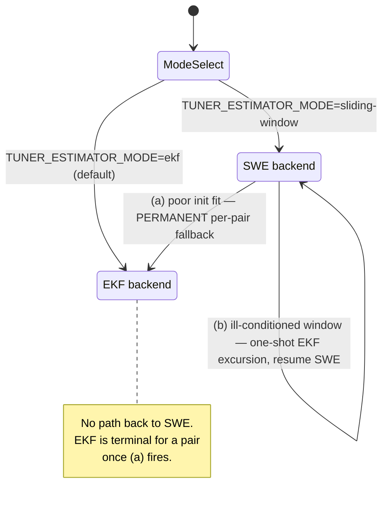
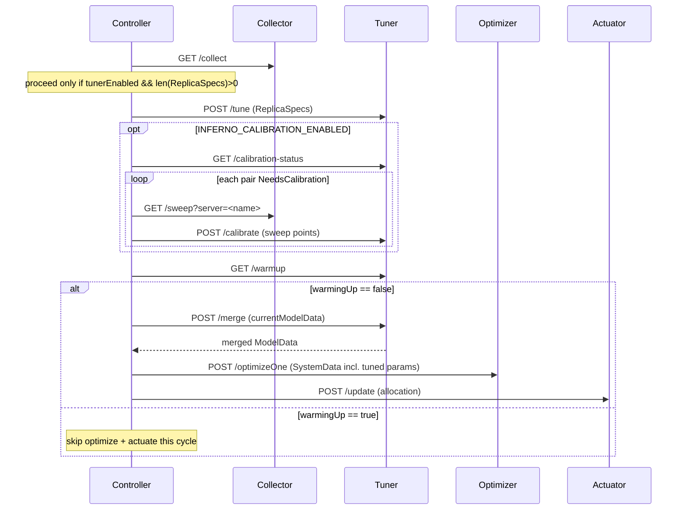
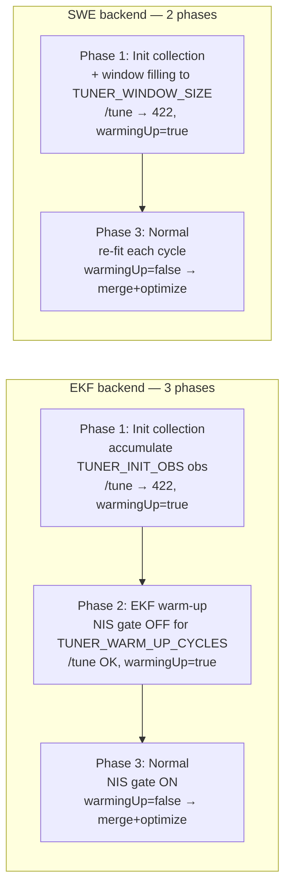
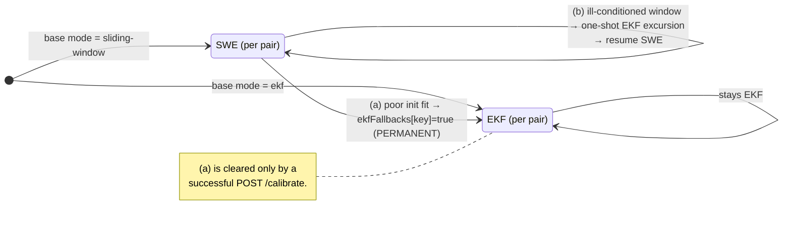

# Model-tuner usage in the control loop

How the controller drives the **model-tuner** across a cold-start-to-steady-state lifecycle,
the two estimator backends it can run (EKF and Sliding-Window Nelder-Mead), how they switch,
and how benchmarking-on-the-fly calibration overlays on all of it.

Audience: operators tuning a deployment, and developers touching the controller ↔ tuner path.
Concepts and configuration come first; a precise reference with `file:line` anchors follows each
section. For the deeper *why* of individual mechanisms this doc cross-links the existing design
docs rather than duplicating them.

---

## What the tuner does

The optimizer needs per-`(model, accelerator)` performance parameters — `α, β, γ` in

```
iterationTime = α + β·computed_tokens + γ·transferred_tokens
```

The tuner **learns these online** from live observations (`TTFT`, `ITL`) reported per replica each
control cycle, and hands the refined parameters back to the controller, which injects them into the
optimizer's `SystemData` before solving. Without the tuner (`TUNER_HOST` unset) the optimizer runs
on the static seed values from `model-data.json` every cycle.

## TL;DR

- **One backend is chosen at startup** via `TUNER_ESTIMATOR_MODE` — `ekf` (default) or `sliding-window`.
- The controller gates the optimizer behind the tuner's **warm-up** signal: from cold start it
  collects observations (and, for EKF, warms up) *without optimizing*, then enters normal operation.
- **EKF has three lifecycle phases; SWE has two** (no NIS warm-up phase).
- **Switching between backends is one-directional: SWE → EKF only.** There is **no EKF → SWE**
  switch. Two distinct SWE → EKF paths exist (a permanent per-pair fallback and a one-shot transient
  excursion) — see [Switching](#switching-between-backends).
- **Calibration** (`INFERNO_CALIBRATION_ENABLED`) is an optional overlay that fixes structural
  unidentifiability by sweeping load points and fitting jointly; it slots into the cycle before the
  warm-up gate so a calibrated pair can clear warm-up the same cycle.

| | **EKF** (default) | **SWE / SWNM** (`sliding-window`) |
|---|---|---|
| Estimator | Stateful Extended Kalman Filter | Sliding window + Nelder-Mead re-fit each cycle |
| Lifecycle phases | 3 (collect → warm-up → normal) | 2 (collect → normal) |
| Outlier defense | NIS gate (χ² 2-DOF ≥ 7.378) | one-pass residual rejection (`TUNER_RESIDUAL_THRESHOLD`) |
| Ill-conditioning defense | condition-number guard on init fit | κ-guard holds last fit + one-shot EKF excursion |
| Cross-cycle state | covariance continuity | fixed-size window buffer |
| Chosen | when `TUNER_ESTIMATOR_MODE≠sliding-window` | when `TUNER_ESTIMATOR_MODE=sliding-window` |



---

## Per-cycle control flow

Every control cycle the controller runs this sequence (`pkg/controller/controller.go` `Optimize()`).
The tuner block only runs when the tuner is enabled **and** at least one replica reported a usable
observation:

```go
// pkg/controller/controller.go, Optimize()
if a.tunerEnabled && len(collectorInfo.ReplicaSpecs) > 0 {
    POSTTune(collectorInfo.ReplicaSpecs)          // feed this cycle's observations
    if calibrationEnabled() { a.maybeCalibrate(...) }
    warmingUp = GETWarmUp()                        // always consulted (even if /tune 422'd)
    if warmUpKnown && !warmingUp {
        POSTMerge(&a.State.currentModelData)       // overlay learned params
    }
}
if warmingUp { /* skip optimize + actuate this cycle */ }
```



### Gate reference

| Call | Fires when | Anchor |
|---|---|---|
| tuner block | `a.tunerEnabled && len(collectorInfo.ReplicaSpecs) > 0` (`tunerEnabled = TUNER_HOST != ""`) | `controller.go` `Optimize()` |
| `POST /tune` | always, inside the block; may return **422** while still collecting/filling | `utils.go` `POSTTune` |
| calibration sub-flow | `calibrationEnabled()` (`INFERNO_CALIBRATION_ENABLED` = `true`/`1`) | `calibrator.go` `maybeCalibrate` |
| `GET /warmup` | **always** consulted, even when `/tune` returned 422 (guarded by `warmUpKnown` so an unreachable tuner still lets the cycle proceed) | `controller.go`; `utils.go` `GETWarmUp` |
| `POST /merge` | only if `warmUpKnown && !warmingUp` | `controller.go`; `utils.go` `POSTMerge` |
| skip optimize+actuate | `warmingUp == true` (subject to timeout, below) | `controller.go` |

> **The warmup-on-422 fix.** During init collection `/tune` returns HTTP 422. The controller
> consults `/warmup` **regardless** of the `/tune` result and only merges when warm-up is genuinely
> complete *and* the tuner was reachable (`warmUpKnown`). This prevents the earlier failure where a
> 422 fell through as `warmingUp=false` and the optimizer was called with zero perfParms → 404.

### Model-data flow

Three copies of `ModelData` live in controller `State`:

- `originalModelData` — read from `model-data.json` (reset each cycle in dynamic mode); never mutated by the tuner.
- `currentModelData` — starts as a copy of the original; **updated only via `/merge`** (the sole export path for learned params).
- `SystemData.Spec.Models` — synced from `currentModelData` right after a successful merge, then passed to the optimizer.

`/tune` receives `ReplicaSpecs` as **input only** — it updates the tuner's internal `ParameterStore`
but does not itself return params into the controller's view. `/merge` overlays that store onto the
controller's `currentModelData`.

---

## Lifecycle phases (from cold start)

The controller sees the tuner move through phases via the single `warmingUp` boolean from
`GET /warmup`. Internally the tuner distinguishes init collection, EKF warm-up, and steady state
(`pkg/service/service.go` `IsWarmingUp`).



**Phase 1 — Init-observation collection (both backends).** The `InitEstimator` accumulates
`TUNER_INIT_OBS` observations (default 5) before it will attempt a multi-point Nelder-Mead fit.
`/tune` returns HTTP 422 (`"collecting initial observations N/M"`); with `TUNER_INIT_HOLD_BACK=true`
(default) `/warmup` reports `warmingUp=true`, so the controller **collects but does not optimize**.
In SWE mode the sliding window must also fill to `TUNER_WINDOW_SIZE` before the first fit (`/tune` →
`"sliding window filling N/M"`).

**Phase 2 — EKF warm-up (EKF only).** After the init fit succeeds, the EKF runs with its **NIS
outlier gate disabled** for `TUNER_WARM_UP_CYCLES` cycles (default 5) — i.e. `skipNIS = updateCount <
warmUpCycles`. Only a positivity check runs. `/tune` succeeds (HTTP 200) but `/warmup` still reports
`warmingUp=true`, so the controller **tunes but does not optimize**. **SWE has no Phase 2** — with no
Kalman covariance to settle and no NIS gate, it enters normal operation immediately after the window
fills.

**Phase 3 — Normal operation (both backends).** `/warmup` reports `warmingUp=false`. The controller
`/merge`s the learned params into `currentModelData`, then optimizes and actuates. EKF now applies
its NIS gate each update; SWE re-fits its window each cycle.

### Warm-up timeout failsafe

Controller-side, `INFERNO_WARM_UP_TIMEOUT` (default **10** cycles; `0` = wait indefinitely) caps how
long the controller will hold back. If the tuner never reports `warmingUp=false` within the timeout,
the controller proceeds with whatever model data it has. Note the interaction with **zero perfParms
blocks optimizer**: if the seed params are zero and the tuner has not yet produced usable values, the
optimizer will 404 the pair — which is why blis/from-scratch experiments set `INFERNO_WARM_UP_TIMEOUT=0`
to wait for genuine convergence. See [`docs/operational-notes.md`](operational-notes.md).

### Reference

| Item | Value | Anchor |
|---|---|---|
| Init observations | `TUNER_INIT_OBS` = 5 | `model-tuner/pkg/service/defaults.go` |
| Init hold-back (report warmingUp during collection) | `TUNER_INIT_HOLD_BACK` = true | `defaults.go` |
| EKF warm-up cycles (NIS gate off) | `TUNER_WARM_UP_CYCLES` = 5 | `service.go`: `skipNIS := updateCount < ts.warmUpCycles` |
| SWE window / residual | `TUNER_WINDOW_SIZE` = 10, `TUNER_RESIDUAL_THRESHOLD` = 0.5 | `defaults.go` |
| Controller warm-up timeout | `INFERNO_WARM_UP_TIMEOUT` = 10 (0 = ∞) | `pkg/controller/defaults.go` `DefaultWarmUpTimeout` |
| Warm-up decision | any pair not past init/warm-up ⇒ `warmingUp=true` | `service.go` `IsWarmingUp` |

---

## Estimator backends

### EKF (default)

A stateful Extended Kalman Filter (`model-tuner/pkg/core/tuner.go`) that tracks `α, β, γ` with
covariance continuity across cycles. Two observation environments:

- `EnvironmentDecode` — decode-only serving: observes `[AvgQueueTime, AvgITL]`, state `[α, β]`.
- `EnvironmentPrefillDecode` — prefill+decode: observes `[AvgTTFT, AvgITL]`, state `[α, β, γ]`.

Each update runs an **NIS (Normalized Innovation Squared) gate**: under the correct model NIS
follows χ² with 2 DOF, so updates with `NIS ≥ 7.378` (the 97.5th percentile, `defaultMaxNIS` in
`tuner.go`) are rejected as outliers and rolled back. The gate is suppressed during Phase 2 warm-up.

### SWE / SWNM (`sliding-window`)

A Sliding-Window Nelder-Mead estimator (`model-tuner/pkg/estimator/sliding_window_estimator.go`).
It keeps a fixed circular buffer of the last `TUNER_WINDOW_SIZE` observations (default 10) and
**re-runs Nelder-Mead every cycle**, warm-started from the previous fit. Outlier defense is a
one-pass **residual rejection**: the single worst observation is dropped if its relative squared
error exceeds `TUNER_RESIDUAL_THRESHOLD` (default 0.5). There are no covariance matrices to tune.

SWE exists as an alternative for cases where the EKF diverges or its NIS gate misfires in practice
(see `model-tuner/docs/superpowers/specs/2026-04-20-sliding-window-estimator-design.md`).

---

## Switching between backends

The base backend is fixed at startup. **Dynamic switching only happens when the base mode is SWE,
and always goes SWE → EKF.** There is no EKF → SWE transition — once a pair is in EKF (either as the
base mode or via the permanent fallback below), it stays there.



### (a) Permanent per-pair fallback: SWE → EKF

**When:** at the moment a pair's sliding-window estimator is first created, the tuner runs the
multi-point init fit and checks its objective value. If the fit is **poor** — `funcValue >
TUNER_INIT_FIT_THRESHOLD` (default 10.0) — or the fit **errors**, that pair is pinned to EKF for the
rest of the run.

**Effect:** `ekfFallbacks[key] = true`. Thereafter `if ts.useSliding && !ts.ekfFallbacks[key]` is
false for that pair, so it routes through the EKF path. The flag is **never cleared** during normal
operation — only a successful `POST /calibrate` (`delete(ts.ekfFallbacks, key)`) resets it.

```go
// model-tuner/pkg/service/service.go  slidingEstimatorFor(...)
if fitted, err := ie.Fit(); err == nil {
    fv := ie.LastFitFuncValue()
    if ts.initFitThreshold > 0 && fv > ts.initFitThreshold {
        ts.ekfFallbacks[key] = true            // poor fit → permanent EKF
        return swe
    }
} else if ts.initFitThreshold > 0 {
    ts.ekfFallbacks[key] = true                // fit error → permanent EKF
    return swe
}
```

### (b) One-shot transient EKF excursion: SWE → (EKF) → SWE

**When:** during normal SWE operation, if the current window's Nelder-Mead fit is **ill-conditioned**
— Jacobian condition number `κ > TUNER_MAX_CONDITION_NUMBER` (default 1000) — and a prior good fit
exists, SWE **holds** its last good fit (`heldOnIllConditioning = true`, returns `lastFit`) rather
than adopting the degenerate one.

**Effect:** when `HeldLastGoodFit()` is true, the tuner runs a single seeded EKF predict+update
(`ekfExcursion`, a fresh tuner with `RunWithValidation(env, skipNIS=true)`, then discarded) to refine
the held fit for this one cycle. **SWE resumes next cycle** — this is transient, not a mode change.

```go
// model-tuner/pkg/estimator/sliding_window_estimator.go  Fit(...)
if swe.maxConditionNumber > 0 {
    if kappa := fitConditionNumber(used, fitted); kappa > swe.maxConditionNumber {
        if swe.lastFit != nil {
            swe.heldOnIllConditioning = true
            return swe.lastFit, nil            // hold last good fit
        }
        // ... else GuessInitState / error
    }
}

// model-tuner/pkg/service/service.go  tuneGroupSliding(...)
if swe.HeldLastGoodFit() {
    if excursed := ts.ekfExcursion(model, accelerator, fitted, env); excursed != nil {
        fitted = excursed                       // one-shot refinement, resume SWE next cycle
    }
}
```

The condition number is a relative-scaled Jacobian condition number computed at the fitted
parameters (`model-tuner/pkg/estimator/identifiability.go` `fitConditionNumber`); healthy fits sit
well below ~100, degenerate (collapsed β/γ) fits exceed a few thousand.

### Reference

| Path | Exact criterion | Anchor |
|---|---|---|
| (a) permanent fallback | `funcValue > TUNER_INIT_FIT_THRESHOLD` (10.0) **or** init fit error | `service.go` `slidingEstimatorFor`; `ekfFallbacks[key]` |
| (b) one-shot excursion | `κ > TUNER_MAX_CONDITION_NUMBER` (1000) **and** a prior good fit exists | `sliding_window_estimator.go` `Fit` / `HeldLastGoodFit`; `service.go` `ekfExcursion` |
| (a) cleared by | successful `POST /calibrate` | `service.go` `delete(ts.ekfFallbacks, key)` |

---

## Calibration overlay

Enabled with `INFERNO_CALIBRATION_ENABLED=true`. Calibration addresses **structural
unidentifiability**: three parameters (`α/β/γ`) cannot be pinned from two observations (`TTFT`,
`ITL`) at a single operating point per cycle — `β` and `γ` trade off freely. Rather than waiting for
live load to passively span the space, calibration deliberately sweeps a handful of load points and
fits them jointly. (The guards in [Switching](#switching-between-backends) are *compensatory* — they
stop a degenerate fit from doing harm but cannot manufacture the diversity identification requires.)

**Trigger.** The tuner reports per-pair status via `GET /calibration-status`; the controller acts on
any pair whose `NeedsCalibration` is true:

```
NeedsCalibration = IsReady && FitDone && illConditioned && !calibrated
```

i.e. the pair has collected its init observations and attempted a fit, that fit is ill-conditioned
(`κ > TUNER_MAX_CONDITION_NUMBER`), and it has not already been calibrated.

**Where it slots in.** The sub-flow runs **after `/tune` but before the `/warmup` gate**, so a
freshly-calibrated pair can clear warm-up and feed `/merge` in the *same* cycle. Per triggered pair
the controller calls `GET /sweep?server=<name>` on the Collector (which drives server-sim `/simulate`
over a small load grid) and posts the measured points to `POST /calibrate` on the tuner.

**On success**, calibration graduates the pair: it stores the jointly-fitted params with
`UpdateCount = warmUpCycles` (so the warm-up gate no longer blocks it), seeds the per-pair
estimators from the sweep, and **clears any (a) EKF fallback** for that pair. Calibration is
rejected (HTTP 422) if the sweep fit is still ill-conditioned or its objective is poor — better no
calibration than a degenerate one. Calibration state is in-memory (re-calibrate on restart).

Full detail — grid construction, skew factors, the room-correction analogy, and the end-to-end
validation — is in [`docs/calibration.md`](calibration.md).

### Reference

| Item | Value / criterion | Anchor |
|---|---|---|
| Enable | `INFERNO_CALIBRATION_ENABLED` = `true`/`1` | `pkg/controller/calibrator.go` `calibrationEnabled` |
| Trigger | `IsReady && FitDone && illConditioned && !calibrated` | `model-tuner/pkg/service/service.go` `CalibrationStatus` |
| Sweep grid factors | `INFERNO_CALIB_RPM_FACTORS` = `0.25,0.5,0.75,1.0` | controller; see `docs/env-vars.md` |
| Graduate on success | `UpdateCount = warmUpCycles`; `delete(ekfFallbacks[key])`; `calibrated[key]=true` | `service.go` calibrate path |
| Reject | ill-conditioned sweep or poor fit → HTTP 422 | `service.go` |

---

## Configuration reference

Tuner-side variables are read by the tuner process (`model-tuner`); controller-side by the
controller. See [`docs/env-vars.md`](env-vars.md) for the complete list.

| Variable | Side | Default | Affects |
|---|---|---|---|
| `TUNER_HOST` | controller | unset | Tuner enabled only when set; unset ⇒ optimizer runs on static seeds |
| `TUNER_ESTIMATOR_MODE` | tuner | `ekf` | Base backend: `ekf` \| `sliding-window` |
| `TUNER_INIT_OBS` | tuner | `5` | Phase 1 observation count before first fit |
| `TUNER_INIT_HOLD_BACK` | tuner | `true` | Report `warmingUp=true` during Phase 1 |
| `TUNER_WARM_UP_CYCLES` | tuner | `5` | EKF Phase 2 cycles with NIS gate off (0 disables Phase 2) |
| `TUNER_WINDOW_SIZE` | tuner | `10` | SWE circular-buffer capacity |
| `TUNER_RESIDUAL_THRESHOLD` | tuner | `0.5` | SWE one-pass outlier rejection cutoff |
| `TUNER_INIT_FIT_THRESHOLD` | tuner | `10.0` | (a) permanent SWE→EKF fallback trigger |
| `TUNER_MAX_CONDITION_NUMBER` | tuner | `1000.0` | Identifiability guard: (b) excursion, calibration trigger, reject |
| `INFERNO_WARM_UP_TIMEOUT` | controller | `10` | Max hold-back cycles before proceeding (0 = ∞) |
| `INFERNO_CALIBRATION_ENABLED` | controller | `false` | Enable the calibration sub-flow |
| `INFERNO_CALIB_RPM_FACTORS` | controller | `0.25,0.5,0.75,1.0` | Sweep load grid (below nominal) |

---

## See also

- [`docs/calibration.md`](calibration.md) — benchmarking-on-the-fly calibration in depth.
- [`docs/operational-notes.md`](operational-notes.md) — tuner convergence/skips, zero-perfParms warm-up, EKF identifiability, saturated-pod handling.
- [`docs/env-vars.md`](env-vars.md) — full environment-variable reference.
- [`docs/concurrency-control.md`](concurrency-control.md) — how the tuner observes optimizer-chosen concurrency (`M*`).
- `model-tuner/tunerservice/README.md` and `model-tuner/docs/tunerservice-design.md` — tuner service lifecycle, NIS math, `guessInitState`.
- `model-tuner/docs/superpowers/specs/2026-04-20-sliding-window-estimator-design.md`, `…/2026-04-09-init-estimator-design.md`, `…/plans/2026-04-21-init-fit-threshold.md` — estimator internals and the fallback selector.
