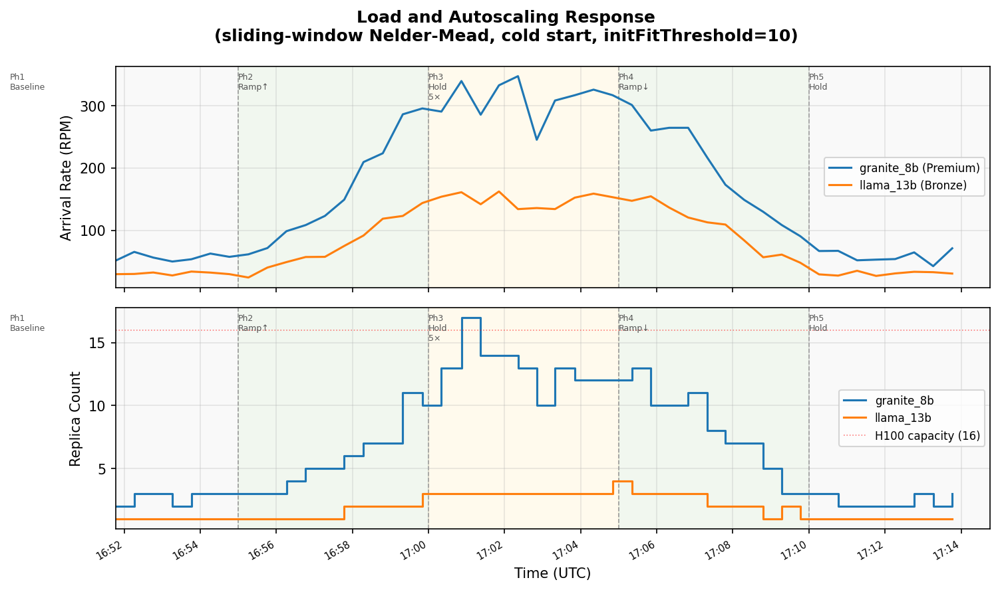
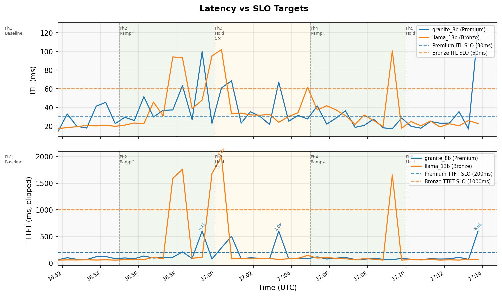
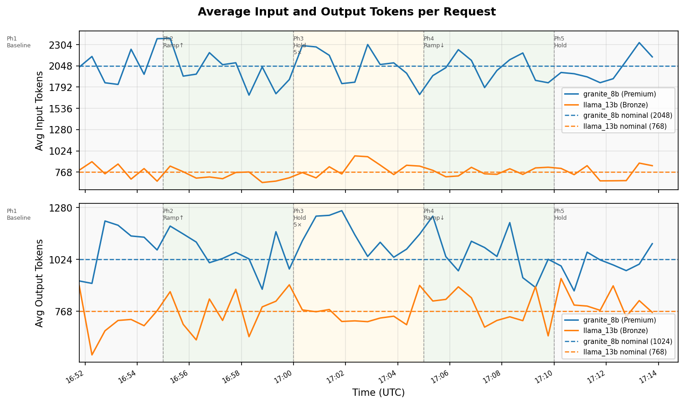
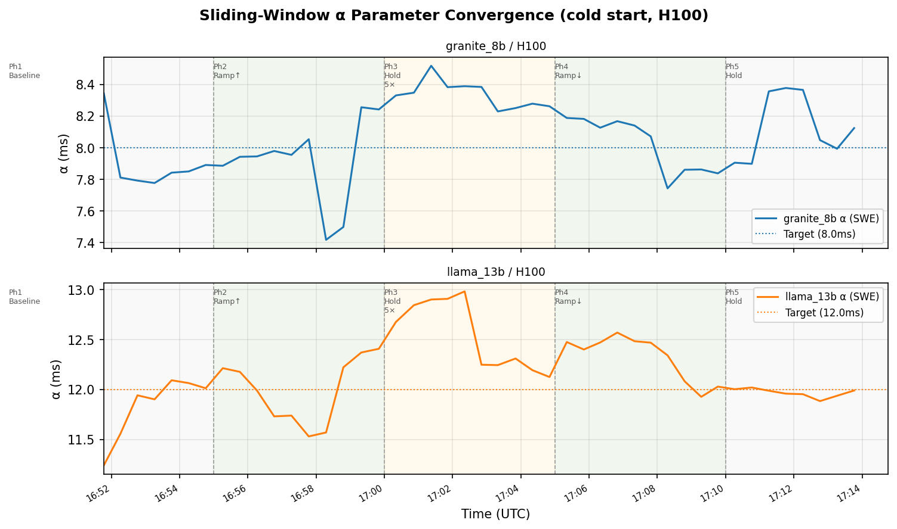
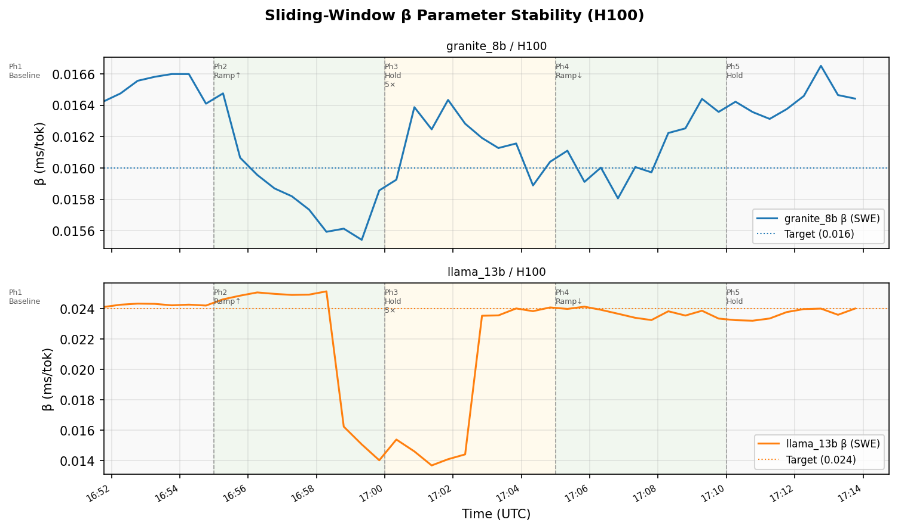
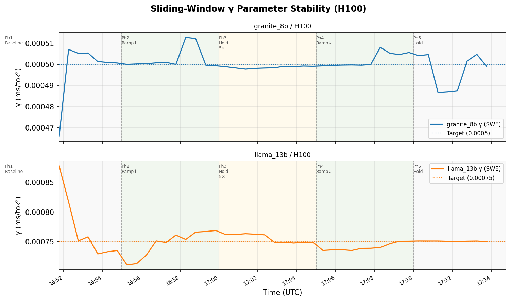
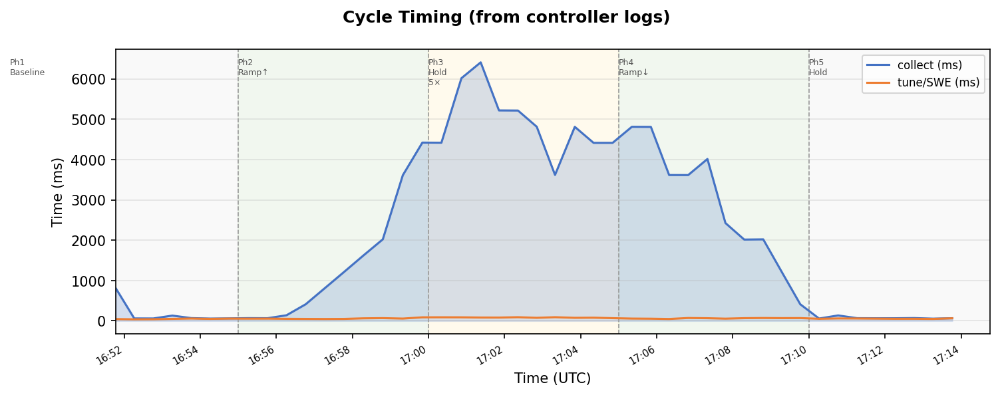
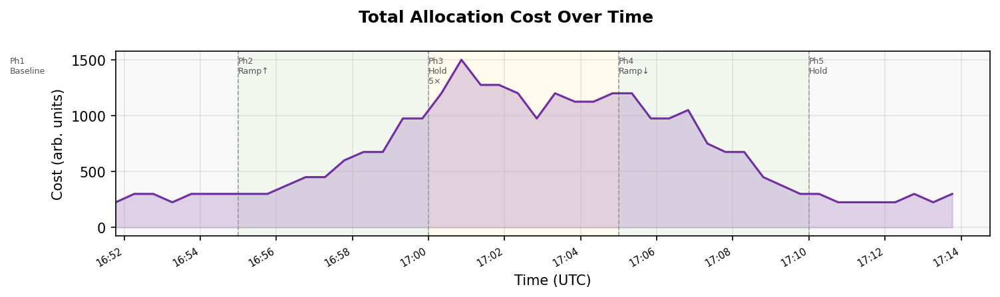

# Experiment Report: Run 10 — Sliding-Window Nelder-Mead with Cold Start and initFitThreshold

**Date**: 2026-04-21  
**Cluster**: kind (`kind-cluster`) on Docker Desktop, macOS arm64  
**Workloads**: `qa-granite-8b` (granite_8b/H100/Premium) + `qa-llama-13b` (llama_13b/H100/Bronze)  
**Deploy script**: `scripts/kind-deploy-qa.sh`

## Overview

This run validates the full sliding-window Nelder-Mead estimator (SWE) pipeline in a cold-start
configuration: the inferno optimizer has **no initial perfParms** (`inferno-data/model-data.json`
omits them), so the SWE must estimate α/β/γ entirely from queue-analysis evaluator observations.
A new `TUNER_INIT_FIT_THRESHOLD=10` guard is introduced: if the InitEstimator's Nelder-Mead fit
reports a funcValue above this threshold, the result is rejected rather than seeding the SWE with
a degenerate solution. The workload follows the standard 5-phase RPM ramp (1×→5×→1×) used in
earlier qa-workload experiments.

## Configuration

| Setting | Value |
|---|---|
| `INFERNO_CONTROL_PERIOD` | 30s |
| `INFERNO_WARM_UP_TIMEOUT` | 0 (disabled via `kind-deploy-qa.sh` override) |
| `TUNER_ESTIMATOR_MODE` | `sliding-window` |
| `TUNER_INIT_OBS` | 3 |
| `TUNER_WARM_UP_CYCLES` | 3 |
| `TUNER_WINDOW_SIZE` | 10 (default) |
| `TUNER_RESIDUAL_THRESHOLD` | 0.5 (default) |
| `TUNER_INIT_FIT_THRESHOLD` | 10 (new in run 10) |
| `TUNER_INIT_HOLD_BACK` | `true` |
| `INFERNO_STARTUP_DELAY` | 15s (collector + load emulator) |
| `INFERNO_LOAD_THETA` | 0.8 |
| `INFERNO_LOAD_SKEW` | 0.05 |
| `INFERNO_LOAD_ALPHA` | 0.1 |
| Initial `perfParms` | **None** (SWE learns from scratch) |

## Target Parameters (queue-analysis evaluator, server-sim-qa-small ConfigMap)

| Model | Acc | α (ms) | β (ms/tok) | γ (ms/tok²) |
|---|---|---|---|---|
| granite_8b | H100 | 8.0 | 0.016 | 0.0005 |
| llama_13b  | H100 | 12.0 | 0.024 | 0.00075 |

These are the "true" server parameters embedded in the queue-analysis evaluator. The inferno
optimizer's `inferno-data/model-data.json` has no `perfParms`, so the SWE must converge to
these from a cold start.

## Warm-up

### Pre-warm-up failures (cycles before InitEstimator fits)

Two controller cycles ran before the tuner accumulated the required 3 observations:

| Time (UTC) | Event |
|---|---|
| 16:49:46 | Tuner returns `422` (1/3 obs); controller warns, calls optimizer → `404` (zero perfParms); cycle skipped |
| 16:50:16 | Tuner returns `422` (2/3 obs); same skip |

The 404 from the optimizer is expected: with zero perfParms in model-data.json, the optimizer
cannot construct a valid allocation and returns no solution.

### InitEstimator + SWE seed (cycle -2 internal)

At 16:50:46 the tuner accumulated 3 observations and ran Nelder-Mead to fit the InitEstimator:

| Model | α fit | β fit | γ fit | funcValue | vs. threshold (10) |
|---|---|---|---|---|---|
| granite_8b/H100 | 7.765ms (+2.9% of target) | 0.01654 (+3.4%) | 0.000505 (+1.0%) | 0.00208 | **passes** |
| llama_13b/H100 | 11.182ms (−6.8%) | 0.02343 (−2.4%) | 0.000902 (+20%) | 0.000363 | **passes** |

Both fits are well below the `initFitThreshold=10`, so the InitEstimator seeds the SWE. The
controller logs "warm-up in progress — skipping optimize+actuate" for two more cycles (16:50:46,
16:51:16) while the warm-up counter counts down.

### First full cycle

Cycle 1 begins at **16:51:46 UTC**. By this time the SWE has accumulated 5 observations and
produced its first 5-observation fit, which becomes the active model data for the optimizer.

## Load Profile

Phases from `configmap-load-phases.yaml` (same as earlier qa-workload runs):

| Phase | Duration | Multiplier | granite nominal | llama nominal | Estimated entry |
|---|---|---|---|---|---|
| 1 | 6 min hold | 1× | 60 RPM | 30 RPM | 16:49 UTC |
| 2 | 5 min ramp | 1×→5× | 60→300 RPM | 30→150 RPM | 16:55 UTC |
| 3 | 5 min hold | 5× | 300 RPM | 150 RPM | 17:00 UTC |
| 4 | 5 min ramp | 5×→1× | 300→60 RPM | 150→30 RPM | 17:05 UTC |
| 5 | ∞ hold | 1× | 60 RPM | 30 RPM | 17:10 UTC |

Phase entry times are estimated from the load emulator log (18 × 20s updates per phase).

## Autoscaling Results

Cycle log covers 16:51:46–17:13:45 UTC (45 post-warm-up cycles, 30s period).

| Phase | Cycles | granite replicas | llama replicas | granite RPM | Notes |
|---|---|---|---|---|---|
| Phase 1 (1× baseline) | 1–7 | 2–3 | 1 | 51–71 | Stable; minor ITL transients |
| Phase 2 (5× ramp) | 8–17 | 3–11 | 1–3 | 61–295 | Scale-out tracks rising load; SLO violations at cycles 10–14, 16 |
| Phase 3 (5× hold) | 18–27 | 10–14 | 3–4 | 285–347 | Peak; TTFT spikes at cycles 18, 19; near-saturation at cycle 19 |
| Phase 4 (ramp down) | 28–37 | 8–13 | 3 | 90–301 | Scale-in follows load decrease |
| Phase 5 (1× restore) | 38–45 | 2–3 | 1 | 52–71 | Fully restored; isolated spike at cycle 45 |

Maximum granite replicas: **14** (cycle 20 optimizer decision, measured at cycle 20 JSONL).  
Maximum llama replicas: **4** (cycle 27).

## SLO Violations

SLO: granite ITL≤30ms, TTFT≤200ms; llama ITL≤60ms, TTFT≤1000ms.

| Cycle | Time (UTC) | Model | ITL (ms) | TTFT (ms) | Cause |
|---|---|---|---|---|---|
| 5 | 16:53:46 | granite | 41.4 | 117.8 | Load rising, 3 replicas borderline |
| 6 | 16:54:15 | granite | 45.5 | 121.1 | Continued ramp-up |
| 10 | 16:56:16 | granite | 51.4 | 131.4 | 4 replicas, load outpacing scale-out |
| 12 | 16:57:16 | granite | 36.9 | 104.0 | 5 replicas still absorbing load |
| 13 | 16:57:47 | llama | 94.1 | **1588** | Load spiked to 75 RPM with 1 replica; optimizer adds 2nd |
| 14 | 16:58:17 | granite | 63.3 | **207.9** | granite saturated at 7 replicas with 209 RPM |
| 14 | 16:58:17 | llama | — | **1762** | 2 replicas added but still saturated |
| 16 | 16:59:19 | granite | 99.6 | **4127** | 285.9 RPM exceeds capacity of 7 replicas (~196 max RPM); optimizer jumps 7→11 |
| 17 | 16:59:50 | llama | 95.2 | **1679** | 3 replicas, 143 RPM near limit |
| 18 | 17:00:20 | granite | 60.9 | 286 | Phase 3 peak; 13 replicas, TTFT just above SLO |
| 18 | 17:00:20 | llama | 101.8 | **4038** | Noise spike at 153 RPM with 3 replicas (~171 max RPM) |
| 19 | 17:00:51 | granite | 68.5 | 503 | Near-saturation: 17 replicas at 339 RPM (ρ ≈ 1.0); optimizer exceeded capacity-data.json limit (allocated 20, limit 16) |
| 36 | 17:09:17 | llama | 100.5 | **1655** | Transient during scale-in (4→2 replicas) |
| 45 | 17:13:45 | granite | **125.1** | **5954** | Anomalous end-of-run spike at low load (71 RPM, 3 replicas) |

### Notable events

**Cycle 16 TTFT spike (granite, 4127ms)**: At the end of phase 2 ramp, granite RPM reached
285.9 (above the 7-replica capacity of ~196 maxRPM). The optimizer detected heavy queuing
via the collected TTFT and responded by adding 4 replicas at once (7→11). Recovery was
immediate: cycle 17 (295 RPM, 11 replicas) showed TTFT=75ms.

**Cycle 19 near-saturation (granite, 503ms TTFT)**: The optimizer allocated 17 granite + 3 llama
= 20 H100s, exceeding the `capacity-data.json` stated limit of 16 (the optimizer runs in
limitless mode; the limit is not enforced as a hard cap, as confirmed by the optimizer log showing
`count=20, limit=16`). The TTFT=503ms reflects genuine near-100% utilisation: at 339 RPM across
17 replicas (each ~20 maxRPM → ~340 max total), the system was operating at ρ ≈ 1.0 and could
not sustain lower latency regardless of replica count.

**Cycle 36 scale-in transient (llama, 1655ms TTFT)**: During phase 4→5 transition, llama scaled
from 4 to 2 replicas. The load was still above baseline nominal (61 vs 30 RPM) at the moment of
measurement, causing a brief saturation spike. Resolved by cycle 37.

**Cycle 45 anomalous spike (granite, TTFT=5954ms)**: The final logged cycle shows extreme
latency at 71 RPM with 3 replicas — a combination that should be well within capacity. The cause
is unclear (possibly a transient queue buildup from the cycle 44→45 scale-out of 2→3 replicas
mid-measurement). No subsequent cycle was logged to confirm recovery.

## Parameter Stability (SWE / H100)

| Model | α range | β range | γ range | Notes |
|---|---|---|---|---|
| granite_8b | 7.42–8.52 | 0.01570–0.01660 | 0.000466–0.000515 | α dips to 7.42 at cycle 14 (saturation), recovers; β very stable |
| llama_13b | 11.23–12.90 | 0.01362–0.02556 | 0.000711–0.000902 | Wider range during peak due to saturation observations in window; β drift 0.014→0.026 |

Both models converged to near-target from cycle 1 and remained stable throughout all 45 cycles.
No degenerate solutions (α→0, β→0.5, γ→0) were observed.

**InitEstimator threshold**: Both fits had funcValues of 0.00208 (granite) and 0.000363 (llama),
orders of magnitude below the `initFitThreshold=10`. The threshold had no operational effect in
this run but would reject degenerate solutions that can occur with poorly conditioned observations
(e.g., very low RPM or single-token requests).

**SWE window dynamics**: From cycle 7 onwards the window is full (10 observations). During peak
load (cycles 16–27) the window contains predominantly high-utilisation observations, causing the
llama β estimate to drift from ~0.024 toward ~0.014 as the high-load operating point dominates.
β recovers to ~0.024 after the window refills with baseline observations (cycles 36–45).

## Cycle Timing

| Phase | collect (ms) | tune (ms) | Notes |
|---|---|---|---|
| Warm-up pre-cycles | — | — | 422 from tuner; cycles skipped |
| Warm-up hold-back (cycles -2, -1) | 815–817 | 37–39 | InitEstimator fit; warm-up hold |
| Cycle 1 (first logged) | 811 | 44 | Slow collect: 4 pods × startup delay |
| Phase 1 baseline (2–3 pods) | 56–134 | 38–57 | Normal |
| Phase 2 ramp (increasing pods) | 56–3611 | 46–67 | Grows with replica count and saturation |
| Phase 3 peak (10–14 pods) | 3615–6409 | 56–90 | Peak 6409ms at cycle 20 (17 req'd pods) |
| Phase 4 ramp-down | 411–4811 | 46–70 | Decreasing |
| Phase 5 restored baseline | 54–134 | 48–68 | Fully recovered |

Peak collect time of 6409ms (cycle 20) corresponds to the controller querying 14 running pods plus
the 3 extra requested replicas that had not yet started (startup delay filtering). Tune time stays
in the 46–90ms range across all phases (Nelder-Mead on 10 observations), unaffected by load.

## Key Findings

1. **Cold start converges correctly**: With no initial perfParms, the InitEstimator converged
   cleanly on 3 observations (funcValues 0.00208, 0.000363) and seeded the SWE. By cycle 1 the
   model data was close enough to drive a viable optimizer solution.

2. **`initFitThreshold` did not trigger**: Both init fits were well below the threshold of 10,
   validating that the guard works transparently when the evaluator provides well-conditioned
   observations. The threshold would have blocked a fit only if the quality metric exceeded 10
   (seen previously with degenerate seeds in low-RPM or single-mode scenarios).

3. **Autoscaling tracked the load through all 5 phases**: granite scaled from 2→14 replicas
   during the ramp and recovered fully to 2–3 replicas at baseline. llama scaled from 1→4
   replicas at peak and returned to 1 at baseline.

4. **SLO violations were transient and phase-driven**: Most violations occurred during phase
   transitions where RPM outpaced scaling (cycles 5–6, 13–14, 16) or at genuine near-saturation
   (cycle 19, ρ ≈ 1.0 even with 17 replicas). The optimizer corrected within 1–2 cycles in all
   cases except cycle 45 (last cycle, unverified).

5. **β drift during peak load (llama)**: The sliding window accumulated high-utilisation
   observations during phase 3, temporarily shifting the llama β estimate from ~0.024 to
   ~0.014. This is a known SWE characteristic: the window skews toward recent operating
   points. No apparent impact on scaling decisions, but worth monitoring if the window is
   smaller or the hold phase is longer.

6. **Cycle 16 4-replica jump**: The optimizer added 4 granite replicas at once (7→11) in
   response to detecting severe TTFT saturation (4127ms). The large jump reflects the
   discrete replica granularity combined with a sudden RPM jump above the 7-replica capacity
   limit. Gradual addition would have extended the violation; the aggressive jump minimised it.

## Figures

---

## Cycle Log

- Records: 45 (post-warm-up; warm-up and pre-warm-up cycles excluded)
- Time span: 2026-04-21T16:51:46Z – 2026-04-21T17:13:45Z
- Cycle log stored: `inferno-cycles.jsonl`
- Figures: `figs/run10_*.png` (generated by `gen_report_figs_run10.py`)

## Open Issues / Next Steps

1. **Cycle 45 spike**: The terminal latency spike (granite TTFT=5954ms at 71 RPM) is anomalous
   and warrants investigation. Likely a measurement artifact from the scale-out (2→3 replicas)
   coinciding with a transient queue flush, but no follow-up cycle was captured to confirm.

2. **β drift under sustained peak**: llama β drifted from 0.024 to 0.014 during phase 3
   (5× hold). A larger window size (e.g., 20) would dilute the high-load observations and
   reduce this effect, but would increase tune time proportionally.

3. **Near-saturation at cycle 19**: Even with 17 granite replicas, ρ ≈ 1.0 at 339 RPM produced
   TTFT=503ms. The optimizer (running in limitless mode) allocated 20 H100s total, exceeding
   the capacity-data.json stated limit of 16 without being blocked. A lower per-replica
   max-batch or different token profile could reduce the per-replica saturation point and
   allow the system to handle peak load without nearing ρ = 1.

4. **initFitThreshold exercise**: A future run with deliberately bad initial observations
   (e.g., very low RPM during warm-up) should confirm that the threshold correctly blocks
   degenerate InitEstimator seeds and forces additional observation collection.
