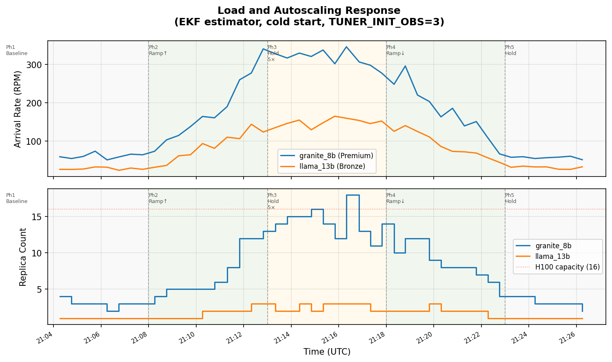
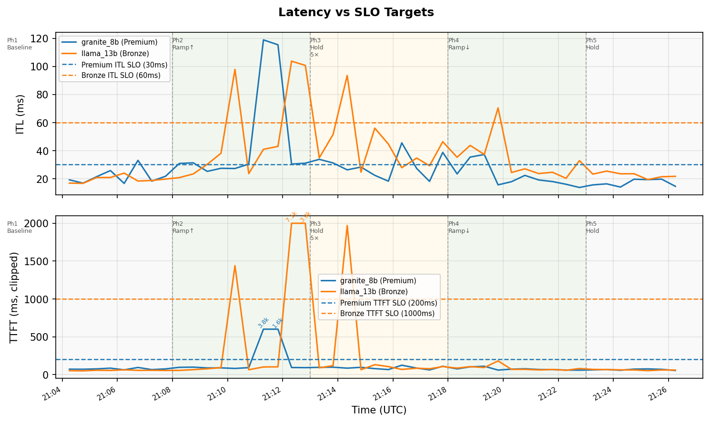
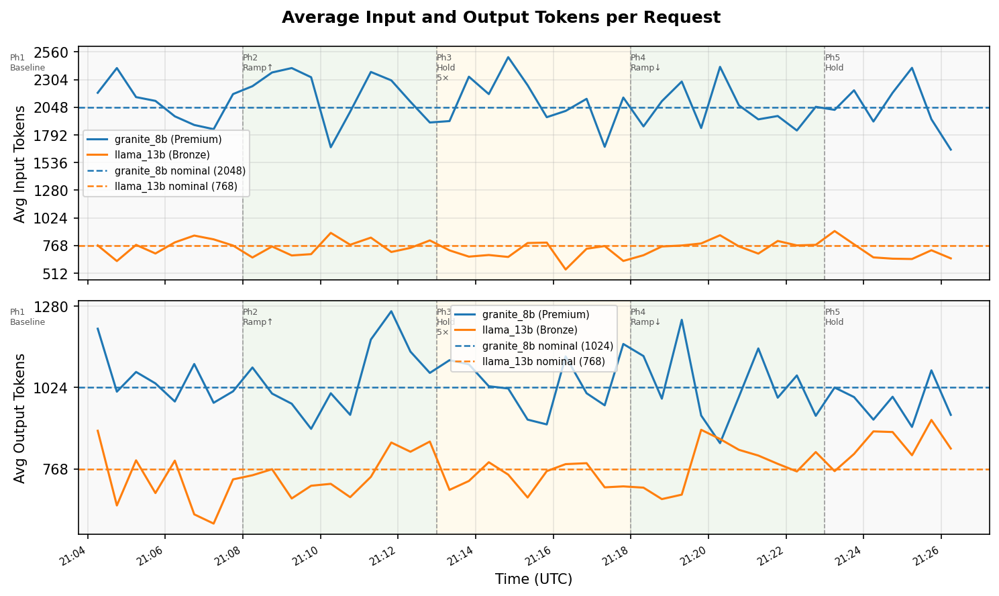
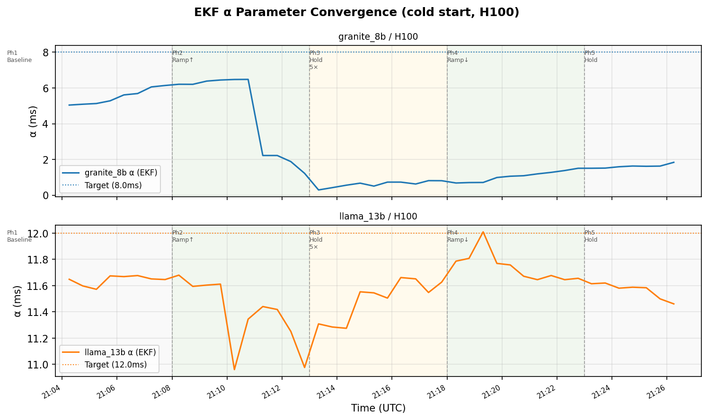
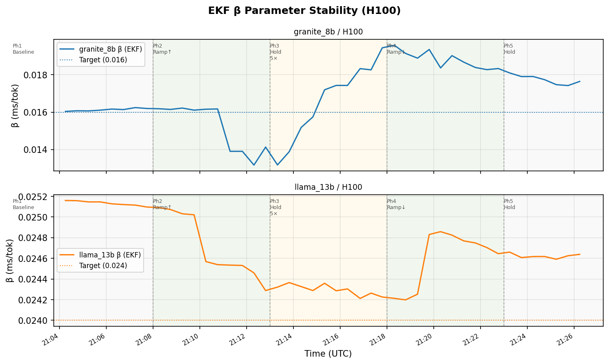
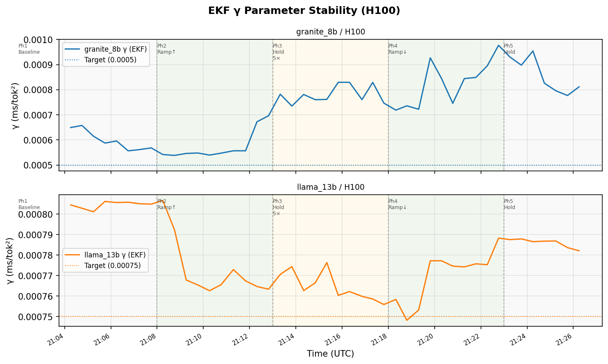
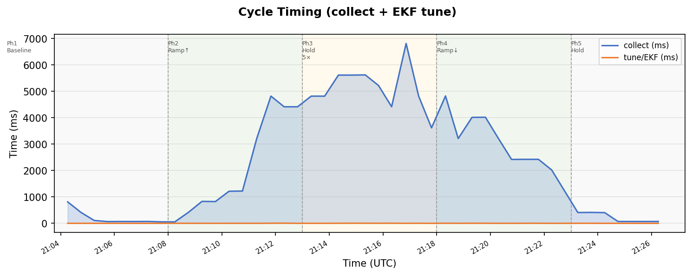
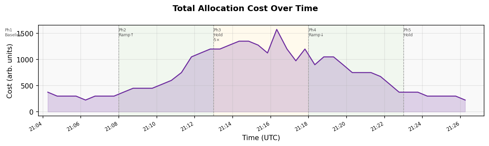

# Experiment Report: Run 11 — EKF Estimator with Cold Start

**Date**: 2026-05-04  
**Cluster**: kind (`kind-cluster`) on Docker Desktop, macOS arm64  
**Workloads**: `qa-granite` (granite_8b/H100/Premium) + `qa-llama` (llama_13b/H100/Bronze)  
**Deploy script**: `scripts/kind-deploy-qa.sh`

## Overview

This run validates the EKF (Extended Kalman Filter) estimator pipeline in a cold-start
configuration: no initial `perfParms` in `inferno-data/model-data.json`, so the EKF must
estimate α/β/γ entirely from queue-analysis evaluator observations. The EKF replaces the
sliding-window Nelder-Mead (SWE) used in run 10; it maintains a probabilistic state estimate
with Kalman gain updates rather than re-fitting NM on a rolling window. The workload follows
the standard 5-phase RPM ramp (1×→5×→1×).

Two EKF-specific anomalies were observed and root-cause analysed (see
[`ekf-analysis-run11.md`](ekf-analysis-run11.md)):

1. **NM init fit for granite underestimated alpha** (5.1 vs target ~8) due to near-degenerate
   initial observations at low load.
2. **Granite alpha crashed at cycle 15** (6.48 → 2.22) caused by the `functions.go` zero-sentinel
   return on queue model error, which produced a sign-flipped Jacobian at the saturation boundary
   and drove alpha downward via a negative Kalman gain.

## Configuration

| Setting | Value |
|---|---|
| `INFERNO_CONTROL_PERIOD` | 30s |
| `INFERNO_WARM_UP_TIMEOUT` | 10 |
| `TUNER_ESTIMATOR_MODE` | `ekf` |
| `TUNER_INIT_OBS` | 3 |
| `TUNER_WARM_UP_CYCLES` | 3 |
| `TUNER_INIT_FIT_THRESHOLD` | 10 |
| `TUNER_INIT_HOLD_BACK` | `true` |
| `INFERNO_STARTUP_DELAY` | 15s (collector + load emulator) |
| `INFERNO_LOAD_THETA` | 0.8 |
| `INFERNO_LOAD_SKEW` | 0.05 |
| `INFERNO_LOAD_ALPHA` | 0.1 |
| Initial `perfParms` | **None** (EKF learns from scratch) |

## Target Parameters (queue-analysis evaluator, server-sim-qa-small ConfigMap)

| Model | Acc | α (ms) | β (ms/tok) | γ (ms/tok²) |
|---|---|---|---|---|
| granite_8b | H100 | 8.0 | 0.016 | 0.0005 |
| llama_13b  | H100 | 12.0 | 0.024 | 0.00075 |

These are the "true" server parameters embedded in the queue-analysis evaluator. The inferno
optimizer's `inferno-data/model-data.json` has no `perfParms`, so the EKF must converge to
these from a cold start.

## Warm-up

### InitEstimator fit (before cycle 1)

After accumulating 3 observations, the InitEstimator ran Nelder-Mead to fit initial EKF state:

| Model | α fit | β fit | γ fit | funcValue | vs. threshold (10) |
|---|---|---|---|---|---|
| granite_8b/H100 | 5.104ms (−36% of target) | 0.01606 (+0.4%) | 0.000697 (+39%) | 0.0007 | **passes** |
| llama_13b/H100  | 11.702ms (−2.5% of target) | ~0.025 (+4%) | ~0.0008 (+7%) | 0.00123 | **passes** |

Both fits pass the `initFitThreshold=10`. The granite α underestimation (5.1 vs 8.0) is the
near-degeneracy issue described in `ekf-analysis-run11.md` §Issue 1: all 3 init observations
were at low load (λ≈14–16 RPM) where the queueing component is negligible and multiple
(α, β, γ) triplets fit equally well. The llama fit was closer to truth because its initial
observations spanned slightly wider load variation.

### First full cycle

Cycle 1 begins at **21:04:15 UTC**. By this point the EKF warm-up counter has counted down
from 3 and the first optimizer call is allowed.

## Load Profile

Phases from `configmap-load-phases.yaml`:

| Phase | Duration | Multiplier | granite nominal | llama nominal | Estimated entry |
|---|---|---|---|---|---|
| 1 | 6 min hold | 1× | 60 RPM | 30 RPM | 21:02 UTC |
| 2 | 5 min ramp | 1×→5× | 60→300 RPM | 30→150 RPM | 21:08 UTC |
| 3 | 5 min hold | 5× | 300 RPM | 150 RPM | 21:13 UTC |
| 4 | 5 min ramp | 5×→1× | 300→60 RPM | 150→30 RPM | 21:18 UTC |
| 5 | ∞ hold | 1× | 60 RPM | 30 RPM | 21:23 UTC |

Phase entry times are estimated from the load emulator log (18 × 20s updates per phase).

## Autoscaling Results

Cycle log covers 21:04:15–21:26:14 UTC (45 post-warm-up cycles, 30s period).

| Phase | Cycles | granite replicas | llama replicas | granite RPM | Notes |
|---|---|---|---|---|---|
| Phase 1 (1× baseline) | 1–9 | 2–4 | 1 | 51–74 | Stable; alpha converging from 5.0 toward 6.5 |
| Phase 2 (5× ramp) | 10–16 | 4–12 | 1–2 | 103–260 | Scale-out tracks rising load; EKF saturation event at cycle 15 |
| Phase 3 (5× hold) | 17–27 | 11–18 | 2–3 | 278–346 | Peak; alpha corrupted (0.3–1.9); replicas over-provisioned to compensate |
| Phase 4 (ramp down) | 28–37 | 6–14 | 1–2 | 108–298 | Scale-in follows load decrease; alpha slowly recovering |
| Phase 5 (1× restore) | 38–45 | 2–4 | 1 | 52–67 | Replicas fully restored; alpha at 1.84 (not yet converged to ~8) |

Maximum granite replicas: **18** (cycle 25, exceeds 16-H100 capacity-data limit).  
Maximum llama replicas: **3** (cycles 17, 21, 23, 24, 26).

## SLO Violations

SLO: granite ITL≤30ms, TTFT≤200ms; llama ITL≤60ms, TTFT≤1000ms.

| Cycle | Time (UTC) | Model | ITL (ms) | TTFT (ms) | Cause |
|---|---|---|---|---|---|
| 6 | 21:06:44 | granite | **33.1** | 94.0 | Borderline load at 3 replicas |
| 9 | 21:08:14 | granite | **30.8** | 95.8 | Phase 2 ramp beginning |
| 10 | 21:08:45 | granite | **31.3** | 98.3 | Load jumped to 103 RPM |
| 13 | 21:10:15 | llama | **97.9** | **1439.8** | Load spiked to 94 RPM with 2 replicas |
| 14 | 21:10:45 | granite | **30.4** | 91.6 | 6 replicas, 161 RPM near saturation |
| 15 | 21:11:17 | granite | **118.9** | **3803.9** | EKF saturation event: Jacobian sign flip; alpha crashes 6.48→2.22 |
| 16 | 21:11:49 | granite | **115.4** | **1555.9** | Alpha frozen at 2.22 (corrupted); 12 replicas still insufficient |
| 17 | 21:12:19 | granite | **30.4** | 93.3 | Load 278 RPM; alpha continues degrading |
| 17 | 21:12:19 | llama | **103.7** | **7076.6** | 3 replicas added but still saturated (144 RPM) |
| 18 | 21:12:49 | granite | **31.1** | 91.5 | Alpha degraded to 1.23 |
| 18 | 21:12:49 | llama | **100.7** | **3887.1** | Continued saturation from cycle 17 |
| 19 | 21:13:19 | granite | **33.8** | 95.4 | Alpha at minimum (0.30) |
| 20 | 21:13:49 | granite | **31.2** | 97.7 | Alpha recovering (0.43) |
| 21 | 21:14:20 | llama | **93.6** | **1970.1** | 3-replica noise spike at 155 RPM |
| 25 | 21:16:19 | granite | **45.6** | 123.7 | 18 replicas allocated (above H100 capacity), ITL spike |
| 28 | 21:17:48 | granite | **38.7** | 109.7 | Phase 4 transition; load still 278 RPM with 14 replicas |
| 30 | 21:18:47 | granite | **35.4** | 102.1 | 12 replicas, 296 RPM |
| 31 | 21:19:18 | granite | **37.2** | 110.1 | 12 replicas, 220 RPM, alpha still low (0.72) |
| 32 | 21:19:48 | llama | **70.5** | 180.4 | Transient noise at 111 RPM with 3 replicas |

### Notable events

**Cycle 15 EKF saturation event (granite)**: At 21:11:17 with 8 replicas and 190 RPM, the
EKF Jacobian column for α was computed via centered differences. The forward perturbation
`h(α+δ)` caused `queue-analysis.Analyze()` to exceed the model's throughput limit, and
`functions.go` returned a zero sentinel `[0, 0]` (non-nil) rather than `nil`. The centered
difference became `(0 − ITL_valid) / (2δ)` — negative where it should be positive. This
flipped the sign of K_alpha, so the large positive ITL/TTFT innovation drove alpha downward:
6.48 → 2.22 (−66%) in a single cycle. See `ekf-analysis-run11.md` §Issue 2 for the full
root cause analysis and fix.

**Cycles 15–19 cascading alpha degradation**: With the sign-corrupted Jacobian persisting
while the model remained near saturation, successive EKF updates continued degrading alpha:
2.22 (cycle 15) → 1.88 (cycle 17) → 1.23 (cycle 18) → 0.30 (cycle 19 minimum). The
optimizer compensated by allocating more replicas — 14–18 at peak — which reduced per-replica
load and allowed the model to exit the saturation boundary. Alpha began recovering at cycle 20.

**Cycle 25 over-capacity allocation (granite)**: The optimizer allocated 18 granite H100s,
exceeding the `capacity-data.json` stated limit of 16. This is consistent with run 10 behaviour:
the optimizer runs in limitless mode and the capacity limit is not enforced as a hard cap.
The 18-replica allocation produced ITL=45.6ms (SLO violation) because the alpha estimate (0.74)
was still far below the true value (~8), causing the optimizer to over-provision in an attempt
to keep computed latency below the SLO.

**Cycles 17–18 llama TTFT spikes**: llama experienced severe TTFT at cycles 17 (7076ms) and
18 (3887ms) while at 3 replicas with 123–144 RPM. These are genuine saturation spikes
coinciding with the peak load phase. The optimizer added replicas promptly but queue buildup
during the transition window caused the observed violations.

**Alpha recovery (cycles 20–45)**: As replica counts rose and per-replica load decreased,
the queue model exited the saturation region and the Jacobian became physically correct again.
Alpha recovered monotonically from 0.30 (cycle 19) through 1.51 (cycle 38) to 1.84 (cycle 45).
The true target (~8.0) was not reached within the 45-cycle run.

## Parameter Stability (EKF / H100)

| Model | α range | β range | γ range | Notes |
|---|---|---|---|---|
| granite_8b | 0.30–6.48 | 0.01317–0.01958 | 0.000539–0.000977 | Converging in phase 1 (5.0→6.5), crashes at cycle 15, slow recovery to 1.84 at end |
| llama_13b  | 10.96–12.01 | 0.02420–0.02516 | 0.000748–0.000807 | Stable throughout; small dip at cycle 13 from saturation noise, recovers by cycle 14 |

**Granite α trajectory** (selected cycles):

| Cycle | Time | α (ms) | Phase | Note |
|---|---|---|---|---|
| 1 | 21:04:15 | 5.05 | 1 | EKF init (NM fit) |
| 7 | 21:07:14 | 6.06 | 1 | Converging toward truth |
| 14 | 21:10:45 | **6.48** | 2 | Peak before crash |
| 15 | 21:11:17 | **2.22** | 2 | Saturation event: −66% in one cycle |
| 19 | 21:13:19 | **0.30** | 3 | Minimum; 5 replicas allocated as 18 |
| 27 | 21:17:19 | 0.82 | 3→4 | Slow recovery begins |
| 38 | 21:22:45 | 1.51 | 5 | Still recovering at baseline |
| 45 | 21:26:14 | 1.84 | 5 | End of run; not converged |

**llama α** oscillated narrowly (10.96–12.01) throughout all 45 cycles, demonstrating that the
EKF is well-behaved when the model does not encounter the saturation boundary. llama β
(0.024–0.025) and γ (~0.0008) were also stable — notably tighter than the SWE β range seen
in run 10 (0.014–0.026), because the EKF does not accumulate a biased window of high-load
observations.

## Cycle Timing

| Phase | collect (ms) | tune (ms) | Notes |
|---|---|---|---|
| Phase 1 baseline (2–4 pods) | 68–814 | 1–2 | 814ms at cycle 1 (startup delay filtering) |
| Phase 2 ramp (increasing pods) | 416–3216 | 2–3 | Grows with replica count; 3216ms at cycle 15 (8 pods) |
| Phase 3 peak (11–18 pods) | 4414–6812 | 2–7 | Peak 6812ms at cycle 26 (13 running pods) |
| Phase 4 ramp-down | 1216–4824 | 1–5 | Decreasing with pod count |
| Phase 5 restored baseline | 71–415 | 1–3 | Fully recovered to sub-100ms |

**Tune time** (EKF): 1–7ms throughout all phases. This is an order-of-magnitude improvement
over the SWE in run 10 (46–90ms), because the EKF updates incrementally per replica observation
rather than re-fitting NM on a 10-observation window each cycle.

**Collect time** scales with the number of running pods (one `/simulate` call per pod via the
k8s API server proxy). The peak of 6812ms at cycle 26 corresponds to 13 running granite pods
plus 3 llama pods, consistent with ~415ms per pod round-trip.

## Key Findings

1. **EKF cold start is viable**: With no initial perfParms, the InitEstimator converged on 3
   observations (funcValues 0.0007, 0.00123) and seeded the EKF. By cycle 1 the model data
   was usable for the optimizer. The llama fit was accurate (α within 2.5%); the granite fit
   underestimated α by 36% due to low-load near-degeneracy.

2. **Saturation boundary bug causes catastrophic alpha degradation**: The root cause is that
   `functions.go` returns a zero-sentinel `[0, 0]` (not nil) on queue model error. This
   produces a sign-flipped Jacobian column via centered differences, inverting K_alpha and
   driving alpha downward on positive innovation. The recommended fix is to change
   `return zero` to `return nil` so `NumericalJacobian` skips the column cleanly.
   See `ekf-analysis-run11.md` §Issue 2.

3. **Autoscaling remained viable despite corrupted parameters**: Despite granite α collapsing
   to 0.30, the optimizer continued to produce workable replica decisions (18 replicas peak,
   tracking load through all phases) because the queue model with a lower α overestimates
   latency at any given replica count, biasing the optimizer toward more replicas — which
   happens to be the correct direction when load is high.

4. **llama EKF was stable and accurate throughout**: llama α (10.96–12.01) and β (0.024–0.025)
   stayed near their true values for all 45 cycles. The EKF did not exhibit the β drift seen
   in the SWE run 10 (which accumulated a biased high-load window during phase 3 hold).

5. **EKF tune time is 10× faster than SWE**: EKF tune: 1–7ms vs SWE 46–90ms in run 10.
   This is the primary operational advantage of the EKF in high-replica scenarios.

6. **SLO violations were concentrated around the saturation event and phase transitions**:
   The granite violations at cycles 15–20 are attributable to the Jacobian bug (correct
   alpha would have prevented the alpha crash). The llama violations at cycles 13, 17, 18, 21
   are genuine phase-transition saturation spikes. Both categories resolved within 1–3 cycles.

7. **Near-degeneracy at init is the init estimator's fundamental limitation**: The low-load
   init observations make multiple (α, β, γ) triplets equally valid. The NM converged to
   α≈5.1 rather than α≈8. The EKF then spent cycles 1–14 correcting this bias. Real fix:
   seed the NM starting point from static `model-data.json` values, or ensure at least one
   init observation is collected at high load.

## Figures

---

## Cycle Log

- Records: 45 (post-warm-up; warm-up pre-cycles excluded)
- Time span: 2026-05-04T21:04:15Z – 2026-05-04T21:26:14Z
- Cycle log stored: `inferno-cycles.jsonl`
- EKF analysis: `ekf-analysis-run11.md`
- Figures: `figs/run11_*.png` (generated by `gen_report_figs_run11.py`)

## Open Issues / Next Steps

1. **Fix `functions.go` zero-sentinel return**: Change all `return zero` error paths to
   `return nil` in `model-tuner/pkg/core/functions.go`. This eliminates the root cause of
   the cycle 15 alpha crash. Optionally add a defense-in-depth guard in `service.go/tuneGroup`
   that rejects updates with >30% relative alpha change per cycle. See `ekf-analysis-run11.md`
   for exact code locations and diff.

2. **Fix NM init near-degeneracy**: Seed the `GuessInitState` starting point from static
   `model-data.json` values when available, rather than deriving α₀ from `baseFactor × ITL`.
   This removes the low-load degeneracy problem entirely. Alternatively, require at least one
   init observation at ≥50% MaxRPS before running the NM fit.

3. **Granite α did not converge by end of run**: At cycle 45, α=1.84 vs target ~8.0. With
   the Jacobian bug fixed and the saturation event eliminated, the EKF would have continued
   converging from its cycle 14 value of 6.48 rather than regressing. A clean re-run after
   applying the fix is needed to confirm full convergence.

4. **Over-capacity allocation (cycle 25)**: The optimizer allocated 18 H100s against a
   capacity limit of 16. Same limitless-mode behaviour as observed in run 10. Relevant only
   when the optimizer's decision is incorrect (alpha corruption case here) — normal operation
   does not exceed 16 for this workload profile.

5. **llama β tighter than SWE run 10**: llama β was 0.024–0.025 in run 11 vs 0.014–0.026
   in run 10. The EKF avoids the SWE's window-bias toward high-load observations, which is
   a structural advantage. A longer phase 3 hold (e.g., 15 min instead of 5) would stress-test
   whether the EKF also drifts under sustained peak load.
