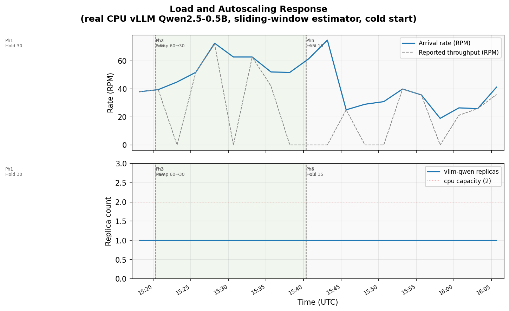
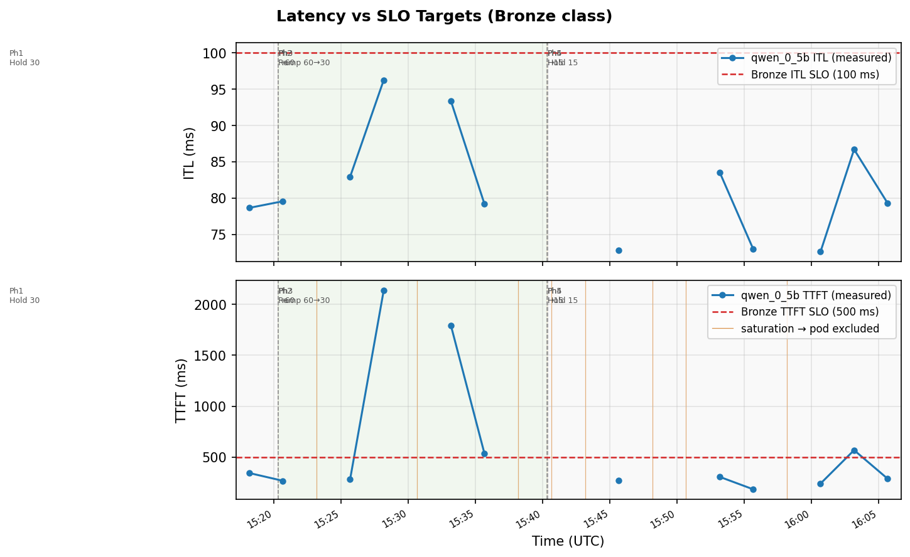
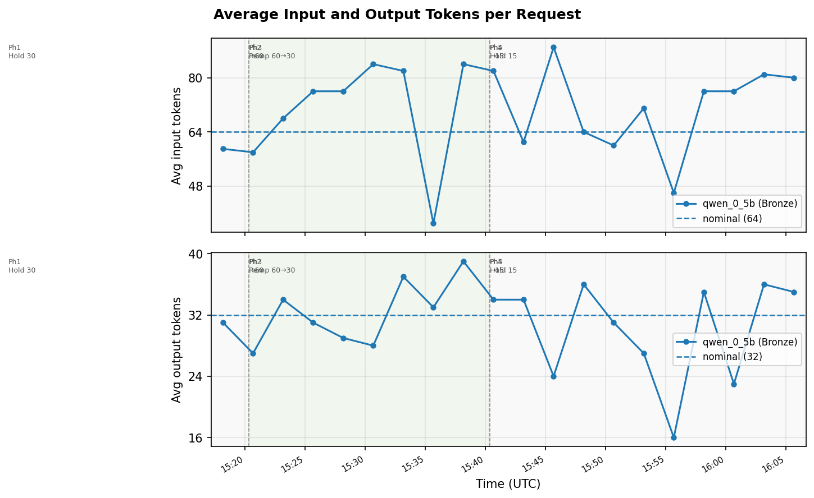
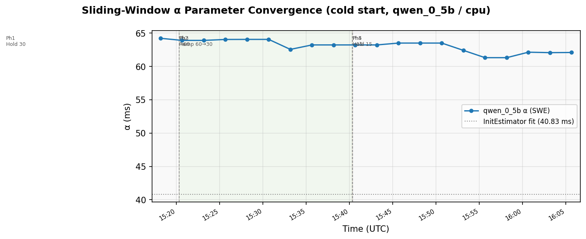
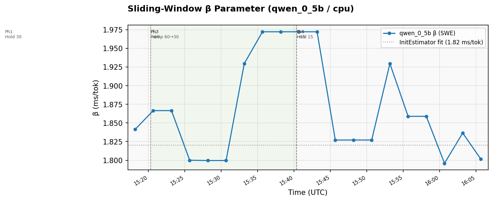
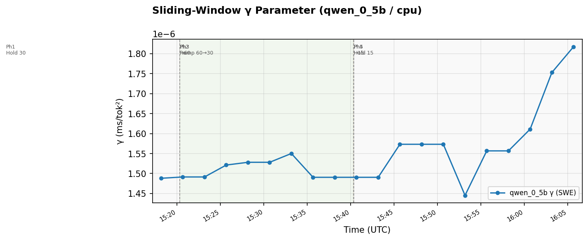
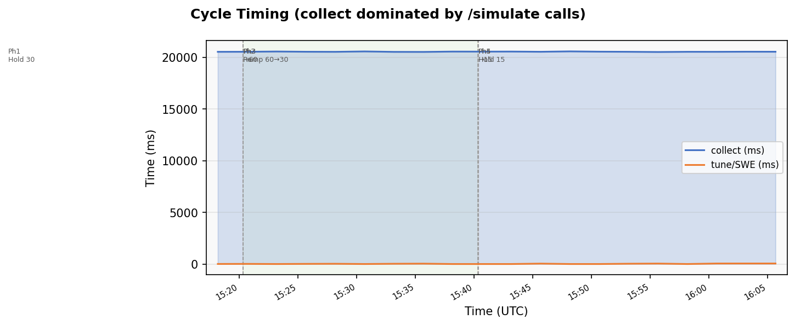
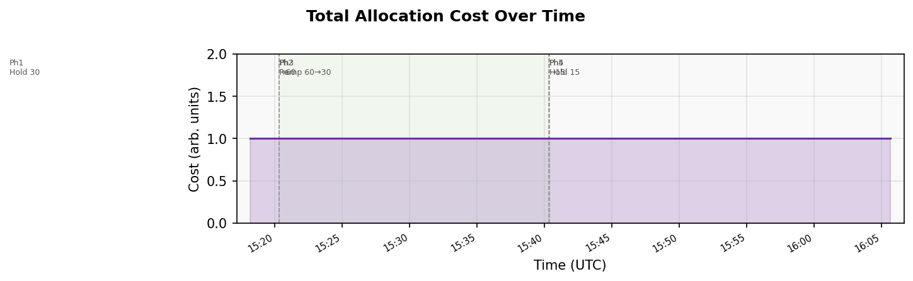

# Experiment Report: Run 12 — vllm-server Evaluator with Real CPU vLLM (Qwen2.5-0.5B), Cold Start

**Date**: 2026-05-31
**Cluster**: kind (`kind-cluster`) on Docker Desktop, macOS arm64
**Workload**: `vllm-qwen` (qwen_0_5b / cpu / Bronze) paired with a CPU-only vLLM Deployment
**Deploy script**: `scripts/kind-deploy-vllm.sh`

## Overview

This run is the first end-to-end exercise of the `vllm-server` evaluator backend
on a real (non-simulated) inference server: a CPU-only vLLM serving
Qwen2.5-0.5B-Instruct, paired one-to-one with the managed deployment via the
Actuator's pairing reconciler. The control loop is configured for cold start —
`inferno-data-vllm/model-data.json` ships only `name/acc/accCount/maxBatchSize/atTokens`
and no `perfParms` — so the sliding-window estimator (SWE) must learn α/β/γ
entirely from the evaluator's measurements of the real vLLM pod.

The run executed cleanly end-to-end (pairing resolved, cold-start convergence,
20 logged cycles, no crashes), but **autoscaling was never triggered**: the
managed deployment held at 1 replica throughout despite measured TTFT spiking
to ~2.1 s and observed RPM crossing the per-replica `maxRPM` predicted by the
optimizer. The controller's saturation re-simulation logic — designed for the
queue-analysis simulator — interacts poorly with the real vLLM evaluator: when
the evaluator reports overloaded, the re-simulation at lower RPS returns HTTP
500, the pod is excluded from `ReplicaSpecs`, and the saturation signal is lost
to both the tuner and the optimizer.

## Configuration

| Setting | Value |
|---|---|
| `INFERNO_CONTROL_PERIOD` | 150s (2.5 min — matches evaluator's max measurement window) |
| `INFERNO_WARM_UP_TIMEOUT` | 0 (disabled — wait for full EKF convergence) |
| `INFERNO_STARTUP_DELAY` | 0 |
| `DEFAULT_MAX_BATCH_SIZE` (controller) | 128 |
| `TUNER_ESTIMATOR_MODE` | `sliding-window` |
| `TUNER_INIT_OBS` | 3 |
| `TUNER_WARM_UP_CYCLES` | 3 |
| `TUNER_INIT_FIT_THRESHOLD` | 10 |
| `TUNER_INIT_HOLD_BACK` | `true` |
| Initial `perfParms` | **None** (SWE learns from scratch) |
| `INFERNO_LOAD_INTERVAL` | 120s |
| `INFERNO_LOAD_ALPHA` | 0.2 |
| `INFERNO_LOAD_THETA` | 0.9 |
| `INFERNO_LOAD_SKEW` | 0.0 |
| Workload `maxBatchSize` (deployment label) | 8 |
| Service class SLO | ITL ≤ 100 ms, TTFT ≤ 500 ms (Bronze) |
| `cpu` accelerator capacity | 2 |

## Pairing

The Actuator's pairing reconciler bound the managed pod to its vLLM peer at
the start of the run:

```
pairing: bound infer/vllm-qwen-server-76755754b8-9zd24
        <-> infer/vllm-qwen-cpu-6858d798bc-kpfdn
        with id 8cf9daa2-32b1-4e48-9074-f440deb4ba82
```

The evaluator sidecar resolved this pair-id via the downward API and
forwarded inference probes to the paired vLLM pod for the entire run.

## Load Profile

`yamls/deploy/configmap-load-phases-vllm.yaml`:

| Phase | Duration | Ratio | Estimated entry (UTC) | Effective behaviour |
|---|---|---|---|---|
| 1 | 20m | 1.0 | 15:00:20 | Hold at 30 RPM (nominal × 1.0) |
| 2 | 1s  | 2.0 | 15:20:20 | Step up to 60 RPM |
| 3 | 20m | 1.0 | 15:20:21 | Linear ramp 60 → 30 RPM |
| 4 | 1s  | 0.5 | 15:40:21 | Step down to 15 RPM |
| 5 | hold | 0.5 | 15:40:22 | Hold at 15 RPM |

With `INFERNO_LOAD_ALPHA=0.2` (20 % noise) and `INFERNO_LOAD_INTERVAL=120s`,
the per-cycle observed RPM had ~10–15 RPM of stochastic spread around each
target. Observed peaks: **74.8 RPM** (cycle 11), **72.6 RPM** (cycle 5).

## Warm-up

| Time (UTC) | Event |
|---|---|
| 15:00:20 | Cycle skipped — collector returned empty data (pods still warming up) |
| 15:03:11 | Tuner returns `422` (1/3 obs); optimizer `404` (no perfParms); cycle skipped |
| 15:05:41 | Optimizer `404`; cycle skipped |
| 15:08:11 | Tuner returns `422` (2/3 obs); optimizer `404`; cycle skipped |
| 15:10:41 | InitEstimator fit complete (α=40.83, β=1.82, γ=0.094, funcValue=0.0124 — passes threshold of 10); SWE seeded; controller reports `warm-up in progress — skipping optimize+actuate` |
| 15:13:11 | Saturation in re-sim → pod excluded → empty `ReplicaSpecs` → tuner skipped → optimizer `404`; cycle skipped |
| 15:15:41 | SWE update 2 (α=65.64, β=1.67, γ=1.57e-6 — γ correction by 5 orders of magnitude); warm-up hold |
| 15:18:11 | First fully-actuated cycle (cycle 1 in JSONL) |

The InitEstimator's first γ fit (0.094) was orders of magnitude away from
plausible values; the very first SWE refit immediately corrected it to
1.57e-6, where it has stayed for the remainder of the run.

## Cold-start Convergence (cpu / qwen_0_5b)

After 14 SWE updates (cycles 1–20 in the JSONL):

| Parameter | InitEstimator | SWE settled range | Notes |
|---|---|---|---|
| α (ms) | 40.83 | 61.3 – 64.2 | Steady drift upward in first 6 cycles, then narrow band |
| β (ms/tok) | 1.82 | 1.80 – 1.97 | Stable; brief excursions during high-saturation cycles |
| γ (ms/tok²) | 0.094 (rejected) | 1.45e-6 – 1.82e-6 | Slight upward drift in last 5 cycles |

There is no "ground truth" to compare against here: the parameters are
properties of the live CPU vLLM under the run's input/output token mix and
batch geometry, not values seeded into a simulator. What the run does
demonstrate is that the SWE converges and stays in a narrow band even when
~25 % of cycles return zero-throughput observations (see below).

The optimizer accepts these parameters and computes per-replica `maxRPM` of
84–104, which is roughly **2× higher than what the real vLLM actually
sustains**. This is the mechanical reason for the never-scaled behaviour
described next.

## Autoscaling Outcome

**Replicas held at 1 throughout all 20 logged cycles.** The optimizer's view
of the system, taken from its log:

| Cycle | RPM | inTok | outTok | Optimizer rho | Optimizer maxRPM | sat? |
|---|---|---|---|---|---|---|
| 1  | 38.0 | 59 | 31 | 0.013 | 100.4 | false |
| 2  | 39.5 | 58 | 27 | 0.012 | 103.5 | false |
| 5  | 72.6 | 76 | 29 | 0.028 | 84.1  | false |
| 11 | 74.8 | 61 | 34 | 0.033 | 90.9  | false |

ρ (utilization) is computed as `arrivalRate / (replicas × maxRPM)`. The
optimizer sees ρ ≈ 0.03 even at the run's peak of 74.8 RPM, because the SWE's
α/β/γ fit gives a per-replica `maxRPM` ≈ 90 — well above the actual capacity.
With ρ that low, the model-predicted ITL/TTFT comfortably meet the SLOs and
no scale-out is recommended.

But the **measured** TTFT tells a different story:

| Cycle | RPM | Measured ITL (ms) | Measured TTFT (ms) | SLO ITL/TTFT | Outcome |
|---|---|---|---|---|---|
| 4  | 51.9 | 82.9  | 283.8  | 100/500   | OK |
| 5  | 72.6 | 96.3  | **2135.3** | 100/500 | **TTFT × 4.3 over SLO** |
| 7  | 62.8 | 93.4  | **1791.7** | 100/500 | **TTFT × 3.6 over SLO** |
| 8  | 52.1 | 79.2  | **533.8**  | 100/500 | TTFT just over SLO |
| 19 | 25.9 | 86.7  | **569.1**  | 100/500 | TTFT just over SLO |

ITL never exceeds the 100 ms SLO; TTFT crosses it five times, severely so at
cycles 5 and 7. The SWE absorbed cycles 5 and 7 into its window and
classified them as outliers (`outliers removed, refitting total=8 kept=7`,
`total=9 kept=8`) — so the high-TTFT data was downweighted in the model fit
rather than driving it toward a tighter capacity estimate.

## Saturation Re-simulation Skips

The Collector's saturation policy (introduced for the queue-analysis simulator)
re-runs `/simulate` at progressively lower load (0.90 → 0.75 → 0.60 × MaxRPS,
up to 3 attempts) when the evaluator returns a non-empty `Saturation` field.
For the queue-analysis simulator this works: the simulator can re-evaluate at
a lower RPS deterministically. For the **vllm-server evaluator** it does not:
the evaluator is asking the **real** vLLM pod, and once that pod is in an
overloaded state, the re-simulation at 0.0 req/s simply returns HTTP 500.

| Cycle | Time (UTC) | Reported RPM | Saturation handling | Outcome |
|---|---|---|---|---|
| 3  | 15:23:11 | 44.93 | re-sim 1/3 → evaluator 500 → pod skipped | empty ReplicaSpecs |
| 6  | 15:30:41 | 62.77 | same | empty ReplicaSpecs |
| 9  | 15:38:11 | 51.78 | same | empty ReplicaSpecs |
| 10 | 15:40:41 | 61.42 | same | empty ReplicaSpecs |
| 11 | 15:43:11 | 74.80 | same | empty ReplicaSpecs |
| 13 | 15:48:11 | 29.04 | same | empty ReplicaSpecs |
| 14 | 15:50:41 | 30.91 | evaluator 500 (no re-sim attempted; bare error) | empty ReplicaSpecs |
| 17 | 15:58:11 | 18.98 | evaluator 500 | empty ReplicaSpecs |

8 of the 20 logged cycles (40 %) ended with the pod excluded from
`ReplicaSpecs`. In those cycles:

- `curAlloc.itl/ttft = 0` and `curAlloc.throughput = 0` (no contributing pods)
- The tuner is skipped silently (`tune: 0 ms` in the timing log)
- The optimizer runs against the previous cycle's α/β/γ
- The high-TTFT signal that triggered the saturation flag never reaches the
  EKF or the optimizer

The re-simulation logic essentially **erases evidence of overload** rather than
preserving it. This is the central issue the user wants to revisit: the policy
makes sense for a simulator that can be re-run at any operating point, but for
a real server in a real overloaded state, the right response is probably to
*record the observed (saturated) ITL/TTFT/throughput* and let the optimizer
react to it, rather than discard the cycle.

## Cycle Timing

`collect: ~20.5 s` per cycle, dominated by a single `/simulate` call to the
evaluator. The evaluator's measurement window is configured for ~20 s of
real traffic against the vLLM pod, so this is an inherent latency, not a
system overhead.

| Phase | collect (ms) | tune (ms) | optimize (ms) | actuate (ms) |
|---|---|---|---|---|
| Run-wide | 20509 – 20568 | 0 – 51 | 0 – 2 | 6 – 14 |

`tune = 0 ms` corresponds to the saturation-skipped cycles (no observation to
tune on). The non-zero tune times grew from ~10 ms (window size 4) to ~50 ms
(window size 10) as the SWE filled its buffer — consistent with run 10's
observation that Nelder-Mead cost scales linearly with observation count.

## Key Findings

1. **End-to-end pairing works.** The Actuator's pairing reconciler bound the
   managed pod to its vLLM peer immediately, the evaluator resolved its
   `pair-id` via the downward API, and `/simulate` calls reached the right
   vLLM pod for the entire 65-minute run. No re-binding events were observed.

2. **Cold start converged on the real vLLM.** Despite zero initial
   `perfParms`, the InitEstimator → SWE pipeline produced a stable
   (α≈62 ms, β≈1.85 ms/tok, γ≈1.6e-6 ms/tok²) within 3 cycles, and stayed
   inside a ±5 % band for the remaining 17 cycles. The InitEstimator's first
   γ fit (0.094) was discarded by the very first SWE refit.

3. **The optimizer's per-replica maxRPM is too optimistic.** With α≈62, β≈1.85,
   γ≈1.6e-6 and the run's token mix, the optimizer estimates per-replica
   maxRPM ≈ 85–100. The real vLLM saturates somewhere closer to 40–50 RPM
   (judging from the cycles that produced TTFT > 500 ms). The SWE's
   parameters fit the unsaturated cycles well, but they cannot extrapolate
   the queueing behaviour at higher utilisation — particularly because the
   high-RPM cycles get marked as outliers and downweighted, and the
   high-RPM saturated cycles get dropped entirely.

4. **Saturation re-simulation is a no-op on real servers.** Re-running
   `/simulate` at lower RPS only makes sense for a simulator. On the real
   vLLM, the second `/simulate` call returns 500 (the vLLM pod is still
   under load from the test traffic, and the evaluator cannot manufacture a
   lower-load measurement on demand). The result: the very cycles that
   *should* trigger scale-out are the ones where the controller has the
   *least* information.

5. **No scale-out occurred.** The optimizer ran in 12 of the 20 cycles
   (the 8 saturation-skipped cycles continued with stale model data and
   produced rho < 0.05 estimates) and recommended `numRep=1` every time.
   Total cost stayed at 1 throughout.

## Open Issues / Next Steps

1. **Saturation policy review** *(primary follow-up)*. The Collector's
   `overloadMaxRetries` / `overloadTargetUtilization` / `overloadRetryStep`
   logic in `pkg/collector/collector.go` was designed for the queue-analysis
   simulator. For the `vllm-server` evaluator, candidate alternatives:
   - Pass the saturated measurement straight through (don't re-simulate),
     letting the optimizer see degraded ITL/TTFT and react.
   - Skip the re-simulation only when the evaluator backend is `vllm-server`
     (introspect the deployment label) and keep the simulator behaviour for
     `queue-analysis` / `blis`.
   - Synthesize a "saturated" placeholder observation (e.g., set
     `throughput = arrivalRate × 0.5`, leave ITL/TTFT at the reported
     elevated values) so the optimizer at least sees rho ≈ 1.0.

   The user's note ("needs more investigation") flags this as the design
   question to answer before re-running.

2. **Per-replica maxRPM calibration**. Even when the SWE accepts a cycle,
   the resulting `maxRPM` ≈ 90 doesn't match the real vLLM's apparent
   ~40–50 RPM saturation point. Two possible angles: (a) the `maxBatchSize=8`
   on the deployment label vs `maxBatch=128` actually used by the optimizer
   after `DEFAULT_MAX_BATCH_SIZE=128` kicks in (cycle 1 logs
   `batch=8->128`); (b) the SWE's α/β/γ may need an additional term to
   capture the M/M/c-style queueing coefficient that dominates near
   saturation.

3. **Stronger forcing function**. The phase schedule's "stress" phase is
   really a 20-minute *decay* from 60 → 30 RPM, not a sustained hold at
   60 RPM. Even with a working saturation policy the test would need a
   longer hold above 60 RPM (or a higher peak) to give the autoscaler
   anything to react to. A simple change to `configmap-load-phases-vllm.yaml`
   (replace the third phase's `ratio: 1.0` with `ratio: 2.0`) would convert
   it into a true 20-minute hold at 2× nominal.

4. **Bronze-only deployment**. This run had only one workload to keep the
   first vllm-evaluator integration simple. Once the saturation policy
   question is settled, repeating the run with a second managed deployment
   (different model + service class) will exercise multi-tenant capacity
   sharing on a real server.

## Figures

















---

## Cycle Log

- Records: 20 (post-warm-up)
- Time span: 2026-05-31T15:18:11Z – 2026-05-31T16:05:41Z
- Cycle log stored: `inferno-cycles.jsonl`
- Figures: `figs/run12_*.png` (generated by `gen_report_figs_run12.py`)
- Component logs: `logs/inferno-{controller,collector,optimizer,actuator,tuner}.log`
