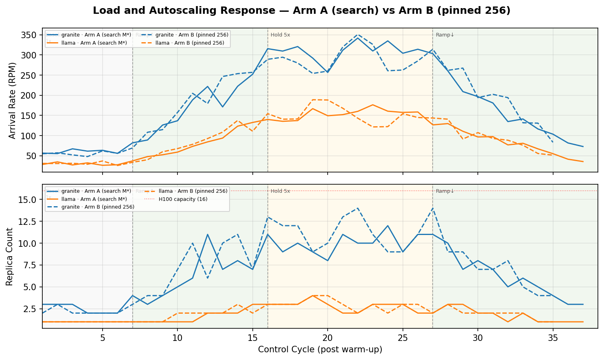
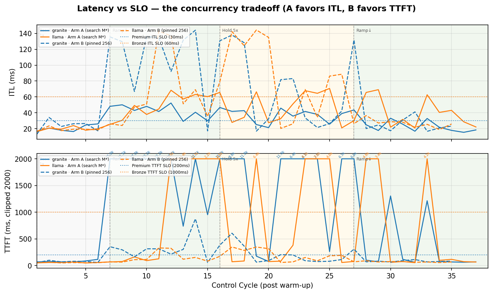
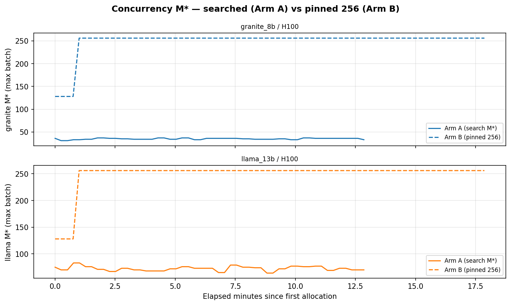
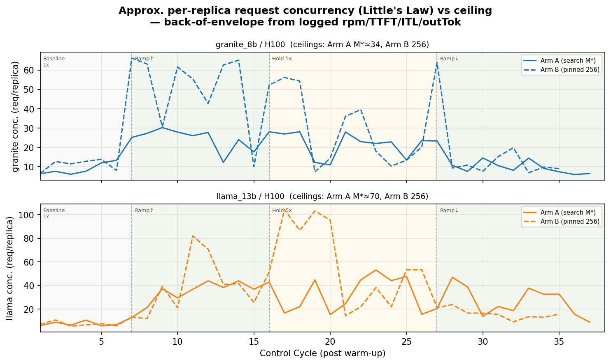
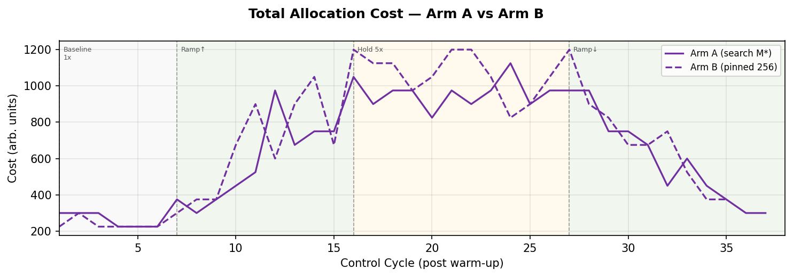
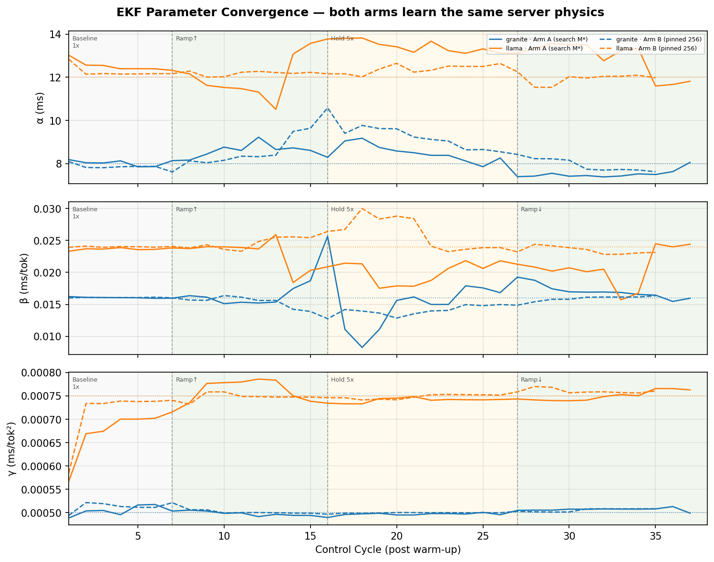
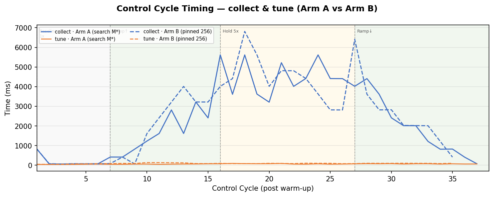

# Experiment Report: Run 15 — Server Concurrency Control A/B (search M\* vs pinned 256)

**Date**: 2026-06-17
**Cluster**: kind (`kind-cluster`) on Podman Desktop, macOS arm64
**Workloads**: `qa-granite-8b` (granite_8b/H100/Premium) + `qa-llama-13b` (llama_13b/H100/Bronze)
**Deploy script**: `scripts/qa/kind-deploy.sh`

## Overview

This run measures the impact of the **optimal-concurrency search** feature (optimizer-light
v0.8.0) by running the same workload twice and contrasting:

- **Arm A — concurrency control ON**: `DEFAULT_MAX_BATCH_SIZE` unset. For each
  `(server, accelerator)` the optimizer searches the smallest max-batch `M*` that reaches
  near-peak throughput under the SLO (`OptimalConcurrency`), bounded above by the model-data
  `maxBatchSize` ceiling. `M*` is re-searched every cycle and written to the
  `inferno.server.allocation.maxbatchsize` label.
- **Arm B — concurrency control OFF**: `DEFAULT_MAX_BATCH_SIZE=256`. The controller pins
  `ServerSpec.MaxBatchSize=256` on every server, which the optimizer treats as an explicit
  override and uses as-is (`optimizer-light/pkg/core/allocation.go:105`), skipping the search.
  Every replica runs with a fixed concurrency ceiling of 256.

The single switch is `DEFAULT_MAX_BATCH_SIZE` on the controller container. The several other
fields named `maxBatchSize` (the `model-data.json` search ceiling, the evaluator configmap's
fallback, the deployment-label seed) do **not** toggle the feature — see CLAUDE.md
"Enabling / disabling concurrency control" for the disambiguation table.

Both arms learn the EKF parameters α/β/γ from scratch (no initial `perfParms`) and run the
standard 5-phase RPM sweep (1×→5×→1×). To probe whether the feature's impact is more pronounced
with slow-starting servers, **`INFERNO_STARTUP_DELAY` was raised to 45s** (run 10 used 15s).

## Configuration

| Setting | Arm A | Arm B |
|---|---|---|
| `DEFAULT_MAX_BATCH_SIZE` | **unset (search M\*)** | **256 (pinned)** |
| `INFERNO_CONTROL_PERIOD` | 30s | 30s |
| `INFERNO_STARTUP_DELAY` | 45s (collector + load emulator) | 45s |
| `INFERNO_WARM_UP_TIMEOUT` | 0 (wait for EKF) | 0 |
| `INFERNO_LOAD_THETA` / `ALPHA` / `SKEW` | 0.8 / 0.1 / 0.05 | same |
| model-data `maxBatchSize` (ceiling) | 128 | 128 (irrelevant — override skips search) |
| Initial `perfParms` | none (EKF from scratch) | none |

Everything except `DEFAULT_MAX_BATCH_SIZE` is identical across the two arms.

## Target Parameters (queue-analysis evaluator, server-sim-qa-small ConfigMap)

| Model | Acc | α (ms) | β (ms/tok) | γ (ms/tok²) |
|---|---|---|---|---|
| granite_8b | H100 | 8.0 | 0.016 | 0.0005 |
| llama_13b  | H100 | 12.0 | 0.024 | 0.00075 |

SLOs: granite (Premium) ITL ≤ 30 ms, TTFT ≤ 200 ms; llama (Bronze) ITL ≤ 60 ms, TTFT ≤ 1000 ms.

## Methodology and cycle alignment

Both arms used a fresh deploy (workload pods recreated, so each passed the same 45s startup
gate) and converged the EKF in ~6 warm-up cycles to the target α/β/γ above — confirming the
two runs observe the **same server physics**, so any difference is attributable to the
concurrency knob alone (see Figure 5).

The arms ran at different wall-clock times but step through the identical phase sequence on the
same 30s period. Verified post-hoc: **peak RPM lands at cycle 22 in both arms**. All
cycle-indexed figures therefore use the post-warm-up cycle number as a shared x-axis, with the
phase bands: baseline cycles 1–6, ramp↑ 7–15, hold-5× 16–27, ramp↓ 27+.

| Phase | Cycles | granite nominal | llama nominal |
|---|---|---|---|
| 1 — baseline 1× | 1–6 | 60 RPM | 30 RPM |
| 2 — ramp ↑ 5× | 7–15 | 60→300 | 30→150 |
| 3 — hold 5× | 16–27 | 300 | 150 |
| 4 — ramp ↓ 1× | 27–35 | 300→60 | 150→30 |

## Results — comparison tables

### Baseline (cycles 1–6, ~60/30 RPM)

| Metric | Arm A (search) | Arm B (pinned 256) |
|---|---|---|
| granite replicas | 2–3 | 2–3 |
| granite ITL (avg / SLO 30) | 20.4 ✅ | 23.3 ✅ |
| granite TTFT (avg / SLO 200) | 81 ✅ | 74 ✅ |
| llama replicas | 1 | 1 |
| llama ITL (avg / SLO 60) | 19.6 ✅ | 19.1 ✅ |
| total cost (avg) | 262 | 238 |

**At baseline the two arms are effectively identical.** With shallow batches at low load, the
concurrency ceiling is not the binding constraint, so searching M\* vs pinning 256 makes no
material difference. Concurrency control neither helps nor hurts when the system is underloaded.

### Peak (cycles 16–27, 5× ≈ 300/150 RPM)

| Metric | Arm A (search) | Arm B (pinned 256) | Δ |
|---|---|---|---|
| granite replicas | 8–12 | 9–14 | B uses more |
| granite **ITL** (avg / max, SLO 30) | **37.2 / 47** | 72.2 / **138** | A ~2× better |
| granite **TTFT** (avg / max, SLO 200) | **6472 / 11892** | **216 / 607** | B ~30× better |
| llama ITL (avg, SLO 60) | 46.6 ✅ | 81.3 ❌ | A meets SLO |
| llama TTFT (avg, SLO 1000) | 1975 ❌ | 191 ✅ | B meets SLO |
| total cost (avg / max) | 962 / 1125 | 1075 / 1200 | A ~12% cheaper |

### Whole-run summary

| Metric | Arm A (search M\*) | Arm B (pinned 256) |
|---|---|---|
| Concurrency ceiling | searched, granite ≈31–37 / llama ≈64–83 | fixed 256 |
| Mean total cost | **647** | 722 (+12%) |
| Max granite replicas | **12** (cycle 24) | 14 (cycle 22) |
| Peak H100 usage | 12–13 / 16 | **15 / 16** (near cap) |
| granite SLO-violating cycles | 21/37 | 20/35 |
| llama SLO-violating cycles | 12/37 | 11/35 |
| Dominant failure mode under overload | **TTFT** (queueing) | **ITL** (deep batches) |

## Key findings

1. **The feature buys a latency *profile*, not a uniform win.** Concurrency control (A) favors
   **ITL**: a small searched M\* (≈34 granite / ≈70 llama) limits batch depth, keeping per-token
   latency near the SLO. Pinned-256 (B) favors **TTFT**: a deep ceiling admits requests
   immediately instead of queueing, but every batch runs deep so ITL inflates ~2× at peak and
   even runs slightly hotter at baseline. The total count of SLO-violating cycles is nearly
   equal between arms (≈21 vs ≈20 for granite) — what differs is *which* SLO breaks.

2. **Concurrency control is more resource-efficient.** Arm A held mean cost ~12% lower (647 vs
   722) and peaked at 12 granite replicas vs Arm B's 14, while Arm B nearly pinned the 16-H100
   ceiling at peak (15/16) — i.e. Arm B would become capacity-bound first at higher load.
   Searching M\* lets the optimizer trade a little concurrency for fewer, better-utilised
   replicas.

3. **The class mix matters.** At peak, Arm A kept the **Bronze** class (llama) within its ITL
   SLO while Arm B violated it (81 vs 60 ms); Arm B kept llama's TTFT lower. For a
   Premium/Bronze fleet where ITL is the tighter Bronze constraint, concurrency control
   protected the cheaper class.

4. **The 45s startup delay amplifies Arm A's TTFT penalty (hypothesis supported).** Arm A's
   catastrophic peak TTFT (avg 6.5 s, max 11.9 s) is the queueing penalty of a low batch
   ceiling: when load jumps, requests queue while the optimizer scales out — and the new
   replicas do not count toward relief for 45s. Pinned-256 sidesteps this by absorbing the
   burst into deep batches (TTFT avg 216 ms). This is the regime where the startup delay bites
   hardest, and confirms the direction of the original hypothesis. A dedicated
   startup-delay sweep (below) would quantify the slope.

5. **Both arms learn identical physics.** The EKF converged to the same α/β/γ targets in both
   arms (Figure 5), so the differences above are purely the concurrency knob, not a modeling
   artifact.

6. **Approximate concurrency reveals the queueing.** Figure 7 estimates per-replica
   in-system concurrency via Little's Law (`L = (rpm/60)·(TTFT + outTok·ITL)`). For Arm A under
   overload the estimate exceeds the M\*≈34 ceiling — impossible for *running* concurrency, so
   the excess is **queued** requests, exactly mirroring the TTFT spike. This is a derived
   estimate only; see "Logging gaps" for why a measured in-flight count would be better.

## Figures

## Cycle Logs

- Arm A: `armA-cycles.jsonl` (37 post-warm-up cycles), `armA-mstar.csv` (M\* / replica scrape).
- Arm B: `armB-cycles.jsonl` (35 cycles), `armB-mstar.csv`.
- Figures regenerated by `gen_report_figs_run15.py`.

## Logging gaps surfaced by this experiment

Two quantities central to assessing concurrency control are **not** in the cycle log and had to
be scraped or estimated for this report. Both are worth adding to `pkg/monitor/record.go`:

1. **`M*` (the searched/pinned concurrency)** — the optimizer emits it as
   `AllocationData.MaxBatch` and the actuator writes it to a label; it is just never logged.
   Scraped here into `arm{A,B}-mstar.csv`. (Also tracked as a future dashboard panel.)
2. **Actual average in-flight / batch concurrency per replica** — there is no measured value;
   Figure 7 is a Little's-Law estimate that conflates queued + running requests. A measured
   in-batch concurrency (from server-sim / the evaluator) would let us show actual vs ceiling
   utilisation directly instead of inferring it.

## Next steps

1. **Startup-delay sweep** — repeat the A/B at `INFERNO_STARTUP_DELAY` ∈ {15, 45, 60}s to
   quantify how the Arm A TTFT penalty (finding 4) scales with server start time. This directly
   tests the original hypothesis that the feature's impact grows with slower starts.
2. **Log `M*` and add measured concurrency** (see gaps above) so future A/B runs need no
   side-channel scraping and the dashboard can plot concurrency vs ceiling.
3. **Higher peak multiplier** — Arm B reached 15/16 H100 at 5×; an 8–10× phase would show
   whether pinned-256 hits the capacity wall while searched-M\* still has headroom.
