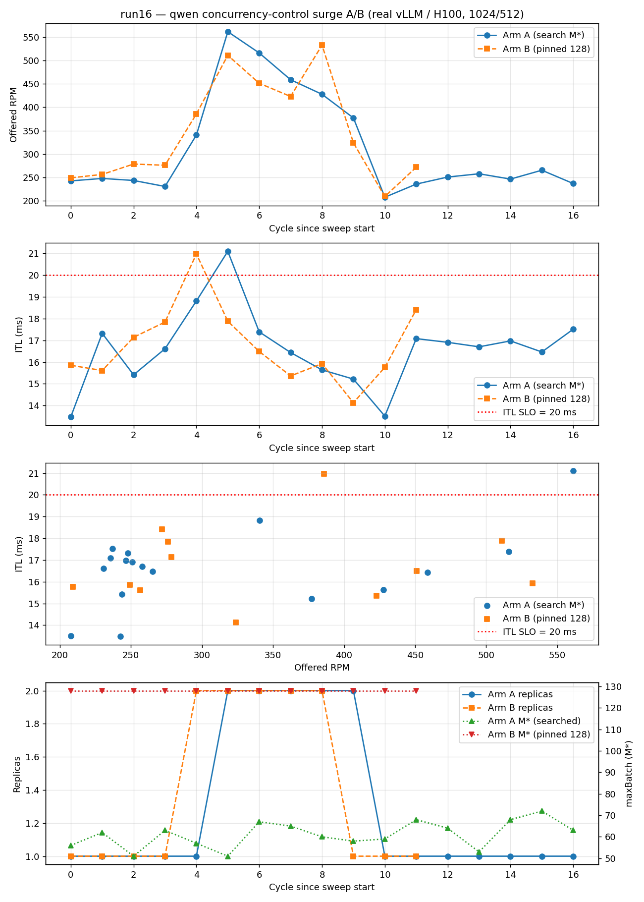

# Experiment Report: Run 16 — Concurrency Control on **Real vLLM**, Surge A/B (search M\* vs pinned 128)

**Date**: 2026-06-18
**Cluster**: OpenShift `pokprod001` (shared), namespaces `inferno-system` / `inferno-workload`
**Workload**: `vllm-qwen-14b-server` — Qwen2.5-14B-Instruct, single H100, Bronze, `vllm-server` evaluator paired to a real `vllm/vllm-openai:v0.21.0` server (`--max-num-seqs 32`… see note below)
**Deploy script**: `MODELS=qwen scripts/vllm-gpu/oc-deploy.sh`

## TL;DR

**Null result.** On a real vLLM/H100 server, pinning the concurrency ceiling high (M\*=128)
is **indistinguishable** from letting the optimizer search M\* (≈51–72) — both during steady
state *and* during a load surge. Peak ITL was 21.10 ms (Arm A) vs 20.98 ms (Arm B); each arm
breached the 20 ms ITL SLO for exactly one cycle at the surge, then scaled 1→2 replicas and
recovered identically. ITL-vs-offered-RPM is the same cloud for both arms (Figure, panel 3).

This **confirms and extends** the run15→run16 hypothesis: run15's large A/B contrast was an
artifact of the **analytic queue-analysis evaluator** (which models ITL as if the running batch
equals M\*, so a high pin directly inflated modeled latency). Real vLLM with continuous batching
only batches as deep as the *offered load* allows; the M\* in-flight cap is the binding
constraint only when it sits **below** the operating concurrency — and here it never does, in
either arm.

## What this run set out to test

run15 (analytic, kind) showed a ~2× ITL difference between searching M\* and pinning it high.
run16 asks whether that reproduces on **real** vLLM. An earlier run16 session (2026-06-17)
found that in **steady state** a high pin is a no-op on real vLLM, because replica count is
throughput-bound: a single H100 saturates at a *throughput-limiting* concurrency well below 128,
so the cap never binds. This session tested the remaining hypothesis — the **knee-of-the-curve
transient**:

> In steady state both arms sit at the delay-throughput knee identically. During a load
> **surge**, before the controller scales out (120 s period → ~2–3 min reaction lag), the single
> existing replica is overloaded. The theory: Arm A's searched M\*≈64 in-flight cap holds the
> replica *at the knee* (sheds excess, ITL≈SLO) while Arm B's 128 cap lets the operating point
> slide up the steep part of the curve (ITL inflates, SLO violated). The advantage would be a
> **transient** living in the surge window.

## Configuration

| Setting | Arm A | Arm B |
|---|---|---|
| `DEFAULT_MAX_BATCH_SIZE` | **unset (search M\*)** | **128 (pinned)** |
| `INFERNO_CONTROL_PERIOD` | 120 s | 120 s |
| `INFERNO_WARM_UP_TIMEOUT` | 10 | 10 |
| `INFERNO_SIMULATE_TIMEOUT_SEC` | 60 | 60 |
| model-data `maxBatchSize` (search ceiling) | 128 | 128 (irrelevant — override skips search) |
| Initial `perfParms` (seeded) | α 10.65, β 0.0418, γ≈0 | same |
| H100 capacity | 6 | 6 |

Everything except `DEFAULT_MAX_BATCH_SIZE` is identical across the two arms. Arm B was produced
from the running Arm A deployment by `oc set env … DEFAULT_MAX_BATCH_SIZE=128` (controller
restart → fresh warm-up), so both arms exercise the **same vLLM pod and the same physics**.

**SLOs** (qwen, Bronze): ITL ≤ **20 ms**, TTFT ≤ **1500 ms**. The ITL SLO is the binding metric
by design (loose TTFT), set just below the knee (ITL ~20 ms ≈ conc 64 on the measured curve) so
the searched M\* would land near 64 and the contrast, if any, would surface on ITL.

**Token shape**: 1024 in / 512 out (`uniform-bounded` sampling). Chosen from the pre-flight
curve sweep: the heavier 1024/2048 shape is a KV cliff (KV→100% at conc ~96, TTFT 21 s) and was
rejected; 1024/512 gives a soft knee at conc ~64 / ~384 RPM / ITL ~20 ms with no cliff
(`preflight/curve-qwen-real.csv`).

## Load profile — step surge (`manifests/vllm-gpu/configmap-load-phases.yaml`)

| Phase | Duration | Nominal RPM | Purpose |
|---|---|---|---|
| baseline | 8 m | 250 (1×) | below knee, 1 replica within SLO |
| step ↑ | 1 m | 250→500 | ~instant surge vs the 120 s period |
| hold | 8 m | 500 (2×) | overload transient + scale-out + recovery |
| ramp ↓ | 2 m | 500→250 | return to baseline |

Per arm: deploy → wait for EKF warm-up to clear → reset `nominal.rpm`/`load.rpm` to 250,
truncate the cycle log, restart the load emulator (so the surge runs **after** warm-up) → let
the profile run → capture the cycle log.

## Results

### Per-cycle (qwen), both arms

Arm A (search M\*), `armA-surge-cycles.jsonl`:

| cyc | RPM | ITL / 20 | replicas | M\* |
|----:|----:|---------:|:--------:|----:|
| 2 | 243 | 13.5 ✅ | 1 | 56 |
| 3 | 248 | 17.3 ✅ | 1 | 62 |
| 4 | 244 | 15.4 ✅ | 1 | 51 |
| 5 | 231 | 16.6 ✅ | 1 | 63 |
| 6 | 341 | 18.8 ✅ | 1 | 57 |
| **7** | **561** | **21.1 ❌** | 1→2 | 51 |
| 8 | 516 | 17.4 ✅ | 2 | 67 |
| 9 | 459 | 16.4 ✅ | 2 | 65 |
| 10 | 428 | 15.6 ✅ | 2 | 60 |
| 11 | 377 | 15.2 ✅ | 2 | 58 |
| 12 | 208 | 13.5 ✅ | 2→1 | 59 |
| 13–18 | ~210–265 | 16–18 ✅ | 1 | 53–72 |

Arm B (pinned 128), `armB-surge-cycles.jsonl`:

| cyc | RPM | ITL / 20 | replicas | M\* |
|----:|----:|---------:|:--------:|----:|
| 4 | 249 | 15.9 ✅ | 1 | 128 |
| 5 | 256 | 15.6 ✅ | 1 | 128 |
| 6 | 279 | 17.1 ✅ | 1 | 128 |
| 7 | 276 | 17.8 ✅ | 1 | 128 |
| **8** | **386** | **21.0 ❌** | 1→2 | 128 |
| 9 | 511 | 17.9 ✅ | 2 | 128 |
| 10 | 451 | 16.5 ✅ | 2 | 128 |
| 11 | 423 | 15.4 ✅ | 2 | 128 |
| 12 | 533 | 15.9 ✅ | 2 | 128 |
| 13 | 324 | 14.1 ✅ | 2→1 | 128 |
| 14–15 | ~210–272 | 16–18 ✅ | 1 | 128 |

### Summary

| Metric | Arm A (search) | Arm B (pinned 128) |
|---|---|---|
| M\* | searched, **51–72** (mean ≈60) | fixed **128** |
| Peak ITL | **21.10 ms** | **20.98 ms** |
| ITL-SLO breaches | **1 cycle** | **1 cycle** |
| Replica trajectory | 1 → 2 (at surge) → 1 | 1 → 2 (at surge) → 1 |
| Baseline ITL (1 replica, ~250 RPM) | ~15.7 ms | ~16.1 ms |

### Binned ITL vs offered RPM (the honest comparison)

| RPM bin | Arm A ITL (n) | Arm B ITL (n) |
|---|---|---|
| 200–299 | 16.18 (11) | 16.77 (6) |
| 300–399 | 17.02 (2) | 17.55 (2) |
| 400–499 | 16.04 (2) | 15.93 (2) |
| 500–599 | 19.25 (2) | 16.90 (2) |

At every offered-load bin the two arms are within ~0.5–1.3 ms — and at the highest bin Arm A is
actually *higher*. There is no systematic upward shift for the high-pin arm.

## Figure

Panels: (1) offered RPM vs cycle-since-sweep-start; (2) ITL vs cycle with the 20 ms SLO line;
(3) **ITL vs offered RPM scatter** — the two clouds overlap, the clearest evidence of the null;
(4) replicas (left) and M\* (right) — Arm A searches ≈51–72, Arm B pinned at 128, yet ITL is the
same. (The surge lands one cycle later in Arm B purely from where the step crossed the collect
window; cycle-indexed panels are aligned to each arm's first record.)

## Why the contrast does not reproduce

The knee theory requires Arm A's cap to bind *below* where the overloaded single replica
operates during the reaction lag. It doesn't:

1. **The searched M\*≈60 is itself above the transient operating concurrency.** At the surge the
   single replica saw ~385–561 RPM; on the measured qwen curve that is conc ≈40–55 — at or below
   Arm A's own searched cap. So Arm A's in-flight semaphore never engaged either. Both arms ran
   *uncapped in practice*.
2. **Real vLLM is throughput-bound, not ceiling-bound.** Continuous batching only deepens the
   batch as far as offered load and GPU throughput allow; the operating point is pinned by
   saturation, not by M\*. The cap (60 vs 128) is invisible until it drops below that point.
3. **The single-cycle breach is a reaction-lag artifact, identical in both arms.** Both arms
   carried the surge on one replica for exactly one 120 s cycle (ITL ~21), then the optimizer
   scaled to 2 and ITL fell back under SLO. That breach is governed by the *control period*, not
   the concurrency knob.

**Corollary (the inverse demonstration, not run here).** To make M\* matter on real vLLM you
must pin Arm B *below* saturation (e.g. M\*=8). A low cap clips per-pod throughput → forces
over-provisioning / dropped load → a positive demonstration that the search avoids a badly-chosen
*low* fixed concurrency. That is the natural follow-up (tracked as run16 "resume option 1").

## Scientific takeaway

- **The optimal-concurrency *search* is the safe default on real continuous-batching servers.**
  It costs nothing when the ceiling is non-binding (the common case) and protects against a
  mis-set *low* cap. A high fixed cap is harmless here only because real vLLM self-limits.
- **run15's headline contrast was an evaluator artifact.** Any A/B that pins M\* high on the
  analytic `queue-analysis` evaluator will over-state the feature's benefit, because that model
  ties ITL to M\* directly. Conclusions about concurrency control should be drawn on real
  servers, or with an evaluator that models continuous batching.
- **For SLO protection during surges, the lever is the control period / scale-out latency, not
  the concurrency ceiling.** Both arms breached for exactly one cycle; shortening the period or
  pre-warming replicas would shrink that, while changing M\* would not.

## Caveats

- Single model, single accelerator type, 6-H100 cap; no GPU contention from a second model.
- The two arms ran at different wall-clock times and the surge crossed the collect window at
  slightly different points (peak captured RPM 561 vs 386), so the comparison is made on binned
  ITL-vs-RPM and on the matched qualitative trajectory, not cycle-for-cycle.
- `--max-num-seqs`: the vLLM server template carries the original `32`. The model-data search
  ceiling and the pinned value are 128, i.e. **above** what the server honors. This does not
  affect the conclusion — both arms operated well below 32 in-flight at these loads — but a
  faithful re-run should set the ceiling = `--max-num-seqs`. (For the *low-pin* follow-up the
  server limit is irrelevant since 8 < 32.)
- One sweep per arm (no repeats); the single-cycle breach is inherently noisy.

## Artifacts (`experiments/run16/`)

- `armA-surge-cycles.jsonl` — Arm A (search), 17 cycles.
- `armB-surge-cycles.jsonl` — Arm B (pinned 128), 12 cycles.
- `run16-surge-ab.png` — the 4-panel comparison figure.
- `plot_surge.py` — regenerates the figure from the two JSONL files.
- `preflight/` — KV-cache + delay-throughput curve sweep that set the shape and SLOs
  (`curve-qwen-real.csv`, `kv-cache-preflight.md`, `incluster_sweep.py`).
- Earlier exploratory logs from the 2026-06-17 session: `armA-cycles.jsonl` (2× tight-SLO
  search arm), `armB-5x-loose-cycles.jsonl` (5× loose-SLO pinned arm).

## Next steps

1. **Low-pin demo (M\*=8)** — the inverse demonstration above; the positive result that shows why
   you can't just hand-pick a fixed concurrency.
2. **Faithful ceiling** — re-run with the model-data `maxBatchSize` and any pin set equal to the
   vLLM `--max-num-seqs`.
3. **Shorter control period / pre-warm** — quantify how the one-cycle surge breach shrinks with
   reaction latency, since that (not M\*) is the SLO lever here.
