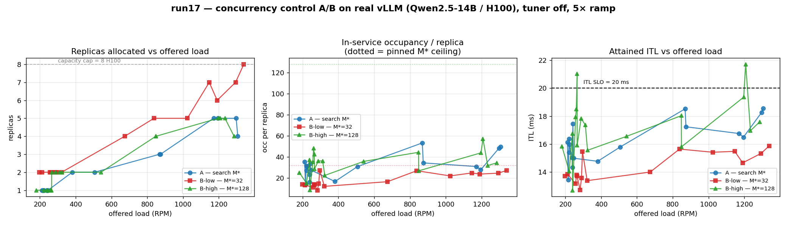

# run17 — Concurrency Control A/B/B on Real vLLM (post continuous-streaming)

**Date:** 2026-06-21
**Cluster:** OpenShift `pokprod001` (shared, H100) — namespaces `inferno-system` / `inferno-workload`
**Workload:** single `vllm-qwen-14b-server` (Qwen2.5-14B-Instruct, real vLLM `--max-num-seqs 128`), Bronze (ITL ≤ 20 ms, TTFT ≤ 1500 ms)
**Predecessor:** [run16](../run16/experiment-report-2026-06-18-run16.md) (2-arm surge, clean null). This run extends it after the continuous-streaming + parallel-activation changes landed, adds a **third (low-pin) arm**, a longer 5× ramp, and an isolated (tuner-off) configuration.

## TL;DR

A three-arm comparison of how the optimizer's **optimal-concurrency M\*** is chosen, on a throughput-bound real vLLM server under a 5× load ramp:

| Arm | M\* | Baseline (250 RPM) | Peak (1250 RPM) | Story |
|---|---|---|---|---|
| **A — search** | searched ≈50 | **1 replica** | **4.8 replicas** | adapts: fewest replicas, SLO met |
| **B-low — pinned 32** | 32 | **2 replicas** | **6.6 replicas** | over-provisions ~2× / ~1.4×, runs cool |
| **B-high — pinned 128** | 128 | ~1.4 replicas | **4.8 replicas** | **≈ Arm A** — high cap is dead weight |

**Thesis confirmed:** no single fixed concurrency is right everywhere. A **low** fixed cap (32) over-provisions hardware for latency headroom no one asked for; a **high** fixed cap (128) is **dead weight** on throughput-bound vLLM (it never binds — occupancy ~42 never approaches 128, so it allocates exactly like the search); only the **per-(model,accelerator,load) search adapts**. B-high ≈ A reproduces and extends run16's null.



## Configuration

| Knob | run16 | run17 | Why |
|---|---|---|---|
| H100 capacity | 6 | **8** | headroom for 5× |
| Eval window | 30 s | **60 s** | statistical significance, ≤ control period |
| Load-emulator interval | 30 s | **10 s** | track current time vs the 120 s cycle |
| Control period | 120 s | 120 s | unchanged |
| Traffic | step 2× | **5× ramp, 30 min** | run15-style; exercise allocation dynamics |
| **Tuner (EKF)** | on | **OFF (`NO_TUNER`)** | **isolation** — see below |
| `saturationPolicy` | None | **PriorityExhaustive** | record the capped peak (deficit) instead of failing |
| Node exclusion | — | **+`pokprod-b93r39s1`** | a dead GPU on that node (see Ops notes) |

**Load profile** (5-phase, chained-multiplicative ratios; `nominal.rpm`=250 ⇒ 5× = 1250 RPM):
baseline 10 m (1×) → ramp 6 m (→5×) → hold 6 m (5×) → ramp-down 4 m → hold (1×).

### Why the tuner was turned off (isolation, not avoidance)

run17 isolates **dynamic concurrency control + scaling** from **online model training (EKF)**. The optimizer ran on the run16-converged seeded `perfParms` (held fixed across all three arms), so the only variable between arms is the M\* policy — removing the EKF as a confound and making the arms directly comparable. The seed is feasible and accurate (cycle 1, pre-tuner, produces a valid M\*≈50 allocation), so this is a clean control, not a workaround for convenience.

It did, however, **surface a real model-tuner defect** that must be fixed before the EKF can run in this single-replica regime — filed as **[llm-inferno/model-tuner#19](https://github.com/llm-inferno/model-tuner/issues/19)** (see Findings §4).

## Results

Aggregated per-deployment metrics by load regime (`experiments/run17/analyze.py`):

```
                 repl   M*   occ/repl  ITL   TTFT  offered  thr   deficit
BASELINE ~250
  A (search)      1.0    50    26.7    15.5   80    228     206    9.8%
  B-low (32)      2.0    32    14.4    13.7   72    265     266   -0.5%
  B-high (128)    1.4   128    30.7    16.7   88    260     273   -5.2%
PEAK ~1250
  A (search)      4.8    50    39.3    17.5   86   1242     981   21.0%
  B-low (32)      6.6    32    24.6    15.4   79   1199     927   22.7%
  B-high (128)    4.8   128    42.0    18.9   92   1231     908   26.2%
```

## Findings

1. **Low fixed cap (B-low) over-provisions.** M\*=32 sits below the in-service concurrency a single replica needs (~40 at peak), so the optimizer adds replicas to keep per-replica occupancy under the cap: **2 replicas at baseline (vs A's 1), 6.6 at peak (vs A's 4.8)**. The payoff is *better* ITL (13.7/15.4 vs A's 15.5/17.5) — latency headroom bought with ~40–100% more hardware, at **no throughput benefit**.

2. **High fixed cap (B-high) ≈ search (A).** B-high allocates the **same replicas as A** (4.8 at peak). On throughput-bound vLLM the operating concurrency (occ ~42) never approaches 128, so the cap never binds and the optimizer lands on the same allocation the search does — it just runs each replica slightly hotter (occ 42 vs 39, ITL 18.9 vs 17.5, nearest the 20 ms SLO). **A high pin buys nothing and slightly raises latency risk.** This reproduces and extends run16's null with a third data point.

3. **The latency profile — not throughput — is the differentiator.** Ordering by per-replica occupancy is crisp: B-high hottest (30.7→42.0) → A (26.7→39.3) → B-low coolest (14.4→24.6), and ITL tracks it directly. Per-replica throughput differences are fully explained by occupancy via Little's law, **not** by the cap throttling hardware throughput. (Echoes run15: concurrency control buys a latency *profile*.)

4. **Offered-load vs throughput is confounded — do not headline it.** The peak "deficit" (21–26%) is **similar across all three arms** and dominated by (a) ramp-lag transients (few peak cycles, replicas still catching up) and (b) the known evaluator **window-edge throughput undercount**. Calibration: at baseline (un-saturated) the deficit is ~0% (B-low/B-high) to ~10% (A), i.e. roughly the measurement floor — so throughput is not the signal that separates the arms. A rigorous throughput claim needs steady-peak cycles separated from ramp cycles and a cross-check against vLLM's native `request_success_total` rate.

## Operational notes

- **Dead GPU on `pokprod-b93r39s1`** (`UnexpectedAdmissionError: ... nvlink ... GPU is lost`, allocatable 6 / capacity 8). The scheduler kept placing the 5th+ vLLM pod there → ~200 terminal litter pods on the first Arm A attempt (peak ran 4/5). Fixed with a scoped `nodeAffinity` exclusion on the vLLM Deployment (ample healthy H100 elsewhere). **Report to cluster admins.**
- **`saturationPolicy: None` fails the cycle at the cap.** With `unlimited:false` + `None`, when M\*=32 demand exceeds 8 H100 the optimizer returns no-feasible-allocation and the controller *skips* (no record at the peak). Switched to **`PriorityExhaustive`** — still hard-bounded by capacity (8, no runaway via `unlimited`) but best-effort-fills to the cap and **records** the capped peak. This is what makes B-low's peak measurable.
- **Load-emulator restart footgun** (re-confirmed): restarting the emulator while it's mid-ramp persists a phase-adjusted value into `nominal.rpm`. Correct order: **stop emulator → reset `nominal.rpm`/`load.rpm` to 250 → restart**.

## Conclusion

On real, throughput-bound vLLM, **the value of the optimizer's M\* search is robustness to a mis-chosen fixed cap, not a uniform win at a fixed operating point**: it matches the best fixed pin's cost where a high pin happens to be harmless (B-high), and avoids the silent over-provisioning of a plausible-but-low pin (B-low). A hand-picked concurrency is wrong on at least one side; the search is right across the load range.

## Artifacts

- `armA-search-cycles.jsonl`, `armB-low32-cycles.jsonl`, `armB-high128-cycles.jsonl` — per-arm cycle logs (raw per-container pod logs under `logs/`)
- `analyze.py` — regime summary table · `plot_run17.py` → `run17-three-arm.png`

**Reproduce** (all three arms; configs in `manifests/vllm-gpu/` + `inferno-data/vllm-gpu/`):
```bash
NO_TUNER=1 MODELS=qwen                 scripts/vllm-gpu/oc-deploy.sh   # Arm A (search)
NO_TUNER=1 ARM_MAXBATCH=32  MODELS=qwen scripts/vllm-gpu/oc-deploy.sh  # Arm B-low
NO_TUNER=1 ARM_MAXBATCH=128 MODELS=qwen scripts/vllm-gpu/oc-deploy.sh  # Arm B-high
# per arm: save with scripts/vllm-gpu/save-cycle-log.sh <arm-label>
```

## Follow-ups
- **[model-tuner#19](https://github.com/llm-inferno/model-tuner/issues/19)** — single-replica EKF fit drifts γ infeasible; must be fixed to run these arms with the tuner *on*.
- Re-run with the tuner on (once #19 lands) to confirm the EKF doesn't change the allocation contrast.
- Throughput study: separate steady-peak from ramp cycles; cross-check against vLLM native metrics; quantify the window-undercount bias.
