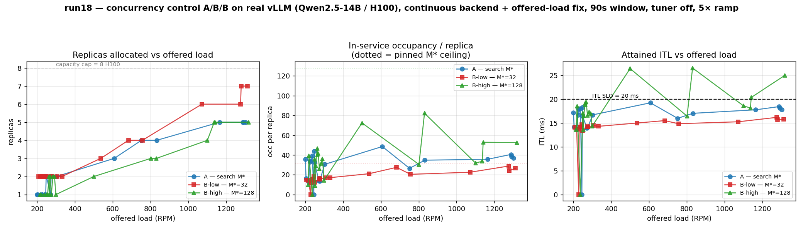
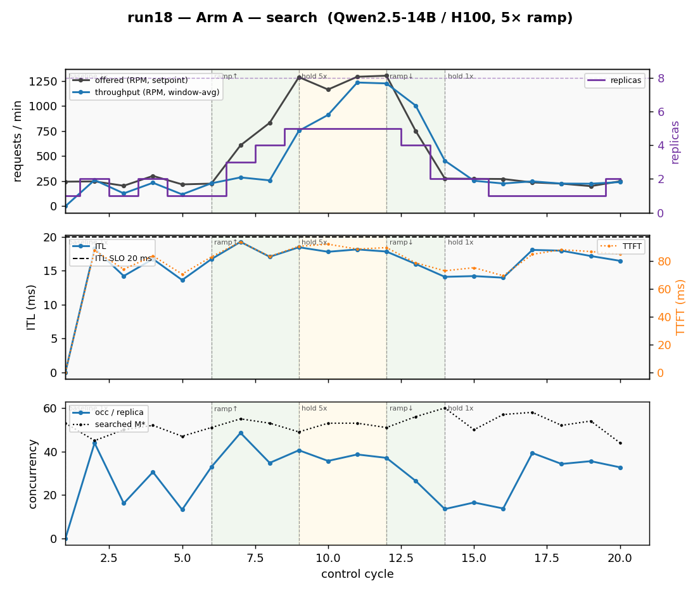
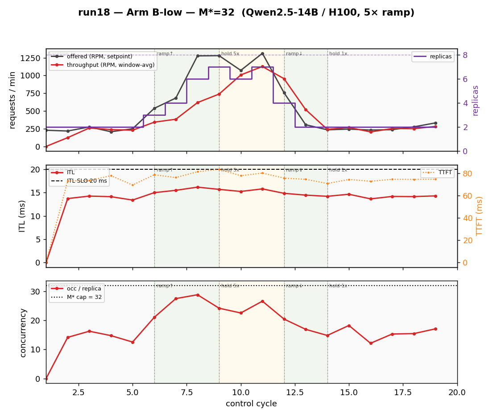
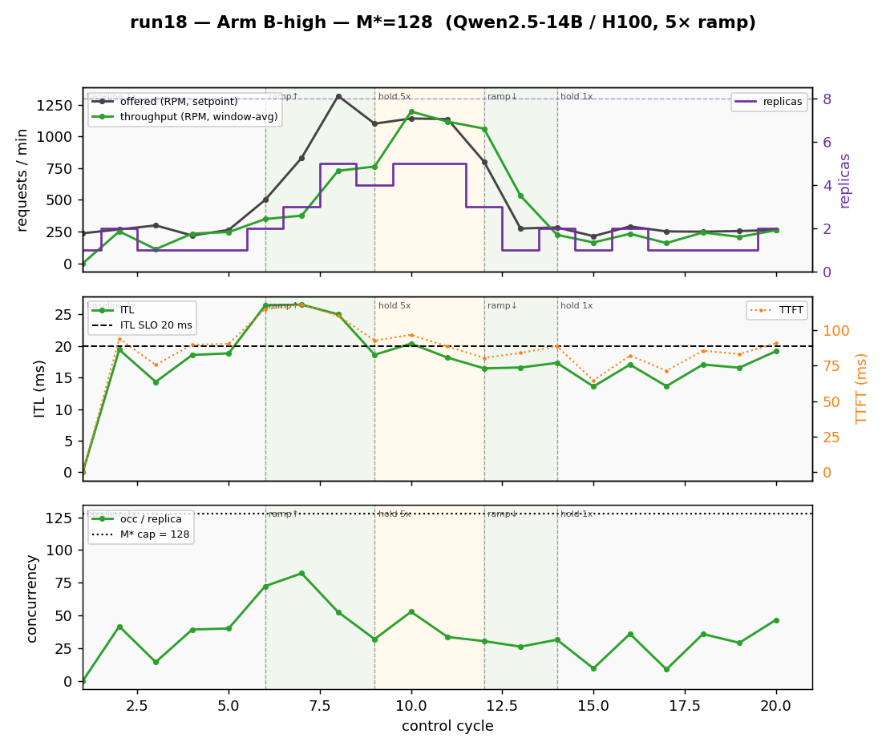

# run18 — Concurrency Control A/B/B on Real vLLM (continuous backend + offered-load fix)

**Date:** 2026-06-23
**Cluster:** OpenShift `pokprod001` (shared, H100) — namespaces `inferno-system` / `inferno-workload`
**Workload:** single `vllm-qwen-14b-server` (Qwen2.5-14B-Instruct, real vLLM `--max-num-seqs 128`), Bronze (ITL ≤ 20 ms, TTFT ≤ 1500 ms)
**Predecessor:** [run17](../run17/experiment-report-2026-06-21-run17.md) (same three-arm design on the *windowed* `vllm-server` backend). This run re-runs the identical A/B/B comparison on the new **`continuous-vllm-server`** evaluator backend (server-sim #24) with the **offered-load consistency fix** (server-sim #26/#27) and a **90 s trailing window**, to confirm the allocation contrast survives the backend change.

## TL;DR

Three arms of how the optimizer's **optimal-concurrency M\*** is chosen, on a throughput-bound real vLLM server under a 5× load ramp:

| Arm | M\* | Baseline (~250 RPM) | Peak (~1250 RPM) | Story |
|---|---|---|---|---|
| **A — search** | searched ≈52 | **1.4 replicas** | **5.0 replicas** | adapts: fewest replicas, SLO met |
| **B-low — pinned 32** | 32 | **2.0 replicas** | **6.5 replicas** | over-provisions ~1.4× / ~1.3×, runs cool |
| **B-high — pinned 128** | 128 | **1.3 replicas** | **4.8 replicas** | **≈ Arm A** — high cap is dead weight, runs **hottest** |

**Thesis reproduced and sharpened.** The continuous backend + offered-load fix + 90 s window leave the allocation contrast intact: a **low** fixed cap (32) over-provisions hardware for latency headroom no one asked for; a **high** fixed cap (128) is **dead weight** on throughput-bound vLLM (occupancy ~43 never approaches 128, so it allocates like the search) **and runs hottest** — peak ITL lands **right at the 20 ms SLO (20.5)** and **breaches it transiently (26 ms) during the ramp**, because the slack cap lets occupancy spike to ~80 before the optimizer adds replicas. Only the per-(model,accelerator,load) **search adapts**.



## Configuration

| Knob | run17 | run18 | Why |
|---|---|---|---|
| Evaluator backend | windowed `vllm-server` | **`continuous-vllm-server`** | persistent arrival loop + trailing-window aggregation (server-sim #24) |
| Offered-load measurement | setpoint at `/solve` | **window-averaged** (#26/#27) | per-pod `(λ, throughput, latency)` temporally consistent |
| Eval window | 60 s | **90 s trailing** | more statistical stability vs the run17 few-peak-cycles / throughput-undercount problem |
| Control period | 120 s | 120 s | window (90) < period (120) |
| **Tuner (EKF)** | OFF | **OFF (`NO_TUNER`)** | isolation — hold perfParms fixed so the only variable between arms is M\* policy (model-tuner#19 still blocks single-replica EKF) |
| `saturationPolicy` | PriorityExhaustive | PriorityExhaustive | record the capped peak instead of failing |
| H100 capacity | 8 | 8 | — |
| Traffic | 5× ramp, 30 min | 5× ramp, 30 min | baseline 250 → 5×=1250 RPM |

**Load profile** (5-phase, chained-multiplicative ratios; `nominal.rpm`=250):
baseline 10 m (1×) → ramp 6 m (→5×) → hold 6 m (5×) → ramp-down 4 m → hold (1×).

### Data-source semantics (important; corrects a run17-era loose statement)

Verified against `pkg/collector/handlers.go` on this **no-Prometheus** setup:
- **Deployment-level offered (`rpm` / `ArrivalRate`)** = the emulator's `inferno.server.load.rpm` **label setpoint** (per-tick, with the emulator's jitter) — **not** a window average, and **not** a sum of per-pod offered.
- **Deployment-level throughput** = **Σ over reporting pods** of each pod's **window-averaged** completion rate.
- The **offered-load fix** (window-averaged `effectiveInput.RPS`) feeds the **per-pod `ReplicaSpecs` → tuner**, and was **validated live** at the `/latest` envelope (`effectiveInput.RPS == result.offeredRPS == window-avg`, e.g. 4.378 RPS/pod). It is *not* re-aggregated into deployment `rpm`.

Consequence: the deployment-level `(offered, throughput)` pair mixes a setpoint against a window-average, so the "deficit" below is **indicative only** — lean on **relative cross-arm comparison at equal offered load**. (Follow-up filed: aggregate deployment offered as Σ per-pod window-avg.)

## Results

Aggregated per-deployment metrics by load regime (`experiments/run18/analyze.py`):

```
                 repl   M*   occ/repl  ITL   TTFT  offered  thr   deficit
BASELINE ~250
  A (search)      1.4    52    24.8    14.7   74    244     219    10.4%
  B-low (32)      2.0    32    14.0    12.9   68    253     239     5.6%
  B-high (128)    1.3   128    27.6    15.5   77    259     221    14.7%
PEAK ~1250
  A (search)      5.0    52    38.0    18.0   90    1262   1031    18.3%
  B-low (32)      6.5    32    25.5    15.7   81    1235    872    29.3%
  B-high (128)    4.8   128    42.7    20.5   97    1174    951    19.0%
```

Cross-check vs run17 peak (repl / occ / ITL): A 4.8/39.3/17.5, B-low 6.6/24.6/15.4, B-high 4.8/42.0/18.9 — **run18 matches within noise** (5.0/38.0/18.0, 6.5/25.5/15.7, 4.8/42.7/20.5).

## Findings

1. **The contrast reproduces on the new backend.** Continuous traffic + offered-load fix + 90 s window did not change the allocation story: A adapts (fewest replicas, SLO met), B-low over-provisions (~1.4× baseline / ~1.3× peak, runs cool), B-high ≈ A (same replicas, runs hot). The backend change is allocation-neutral, as intended.

2. **B-high ≈ search (A) on replicas, but runs hottest — now with an SLO breach.** B-high allocates the same replicas as A (4.8 at peak) because occupancy (~43) never approaches the 128 cap. But the slack cap lets the optimizer **pile occupancy onto few replicas during the ramp** (occ spikes to **72–82**, ITL **25–26 ms**, above the 20 ms SLO) before scaling out, and peak ITL settles **right at the SLO (20.5)**. A high pin buys nothing on cost and **adds latency risk** — sharper than run17's 18.9 ms.

3. **Low fixed cap (B-low) over-provisions.** M\*=32 sits below the operating concurrency (~40 single-replica at peak), so the optimizer adds replicas to keep per-replica occupancy under the cap: **2.0 at baseline (vs A's 1.4), 6.5 at peak (vs A's 5.0)**. The payoff is the *best* ITL (12.9/15.7 vs A's 14.7/18.0) — latency headroom bought with ~30–40% more hardware, at no throughput benefit. B-low never breaches the SLO, even on the ramp.

4. **Occupancy is the differentiator.** Ordering by per-replica occupancy is crisp: B-low coolest (14.0→25.5) → A (24.8→38.0) → B-high hottest (27.6→42.7), and ITL tracks it directly. Concurrency control buys a **latency profile**, not hardware throughput.

5. **Offered-load fix works at the per-pod level.** `/latest` now reports `effectiveInput.RPS == result.offeredRPS` (window-averaged), making the per-pod `(offered, throughput, latency)` triple temporally consistent — the input the tuner will consume once model-tuner#19 lands. Deployment-level offered still rides the label (see Data-source semantics; follow-up filed).

## Per-arm detail

### Arm A — search M\* (the adaptive baseline)



M\* is searched per cycle and lands ≈47–60 throughout (`maxBatch` in the log). Baseline **flaps 1↔2 replicas** at the SLO boundary (occ ~25 on a single replica is near the edge where adding a replica is marginally cheaper under the SLO). Through the ramp the optimizer scales **1 → 3 → 5** and holds **5 at peak** with occ ~38 and ITL ~18 ms (inside SLO), then drains cleanly back to 1 replica. Throughput tracks offered with the expected ramp lag, converging at the steady peak (offered 1292 / thr 1235 at cyc 11). This is the reference the two pinned arms are measured against.

### Arm B-low — pinned M\*=32 (over-provision, cool)



M\*=32 binds **immediately**: even at baseline the optimizer runs **2 replicas** (occ ~14, far under 32) because a single replica's operating occupancy (~30–40) would exceed the cap. The ramp drives the replica count to **6–7** (vs A's 5) to keep per-replica occupancy ≤ 32; occupancy stays cool (~25 at peak) and ITL is the **lowest of the three arms** (15.7 at peak) and never approaches the SLO. The cost is the extra hardware — the over-provisioning the search avoids. Clean drain back to 2 replicas at the 1× tail (still over-provisioned at baseline).

### Arm B-high — pinned M\*=128 (dead-weight cap, hot)



M\*=128 **never binds** — occupancy peaks ~52 and averages ~43, nowhere near 128 — so the allocation is **indistinguishable from Arm A's search (4.8 vs 5.0 replicas at peak)**. The distinguishing behaviour is the **ramp transient**: with no cap to force early scale-out, the optimizer lets occupancy **spike to 72–82** on the first two ramp cycles (cyc 6–7) and **ITL breaches the SLO at 25–26 ms** before replicas catch up; peak ITL then settles at the **SLO edge (20.5 ms)**. A high pin reproduces the search's cost while adding transient SLO risk — the cleanest demonstration that "just set the cap high" is not equivalent to searching.

## Operational notes

- **Continuous-backend coherence gate fires on each arm switch.** The wrapper pod persists across arms (manifest identical; only the controller's `DEFAULT_MAX_BATCH_SIZE` env changes), so on cycle 1 of B-low/B-high the evaluator loop is still running the *previous* arm's M\* while the new `maxbatchsize` label is in force. The collector correctly logs `stale result (effectiveConcurrency=32 != inForce=128); holding` and skips the pod → that cycle's per-pod metrics are 0, self-clearing the next cycle. Cycle-1 zeros are expected (warm-up cycles produce no dashboard record).
- **Offered-load fix validated live** at a phase transition: `armA-offered-load-samples.log` captures `/latest effectiveInput.RPS` tracking the window-average across the baseline→ramp transition (not snapping to the setpoint).
- **Tuner still OFF** pending [model-tuner#19](https://github.com/llm-inferno/model-tuner/issues/19) (single-replica EKF emits infeasible γ → optimizer 404s at baseline). Re-run with tuner ON once #19 lands.

## Conclusion

On real, throughput-bound vLLM, the value of the optimizer's M\* search is **robustness to a mis-chosen fixed cap**, and run18 confirms this holds on the continuous-streaming backend with consistent offered-load measurement. A high pin (128) matches the search's cost but runs each replica hottest and **breaches the ITL SLO on ramp transients**; a low pin (32) silently over-provisions ~30–40% for latency headroom no one requested. A hand-picked concurrency is wrong on at least one side; the search is right across the load range.

## Artifacts

- `armA-search-cycles.jsonl`, `armB-low32-cycles.jsonl`, `armB-high128-cycles.jsonl` — per-arm cycle logs (the dashboard JSONL)
- `logs/` — per-container dumps for every arm: control pod (controller, collector, optimizer, actuator, tuner) **and** workload pod (server-sim, evaluator), plus deploy logs
- `armA-offered-load-samples.log` — `/latest` offered-load vs setpoint across the ramp (fix validation)
- `analyze.py` — regime summary table · `plot_run18.py` → `run18-three-arm.png` + `run18-arm{A,Blow,Bhigh}.png`

**Reproduce** (all three arms; configs in `manifests/vllm-gpu/` + `inferno-data/vllm-gpu/`):
```bash
NO_TUNER=1 MODELS=qwen                  scripts/vllm-gpu/oc-deploy.sh   # Arm A (search)
NO_TUNER=1 ARM_MAXBATCH=32  MODELS=qwen scripts/vllm-gpu/oc-deploy.sh   # Arm B-low
NO_TUNER=1 ARM_MAXBATCH=128 MODELS=qwen scripts/vllm-gpu/oc-deploy.sh   # Arm B-high
# per arm, after its ~30-min profile completes:
RUN=run18 scripts/vllm-gpu/save-cycle-log.sh <arm-label>
```

## Follow-ups
- **[model-tuner#19](https://github.com/llm-inferno/model-tuner/issues/19)** — re-run with tuner ON once the single-replica EKF fit is fixed, to confirm the EKF doesn't change the allocation contrast (and to exercise the offered-load fix's primary consumer).
- **Deployment-level offered aggregation** — make `curAlloc.Load.ArrivalRate` a sum of per-pod window-averaged offered (Σ `effectiveInput.RPS×60`) instead of the label/Prometheus path, so the deployment-level `(offered, throughput)` pair is temporally consistent the way the per-pod pair now is.
- **Throughput study** — separate steady-peak from ramp cycles; cross-check against vLLM native `request_success_total`; quantify the window-edge undercount.
