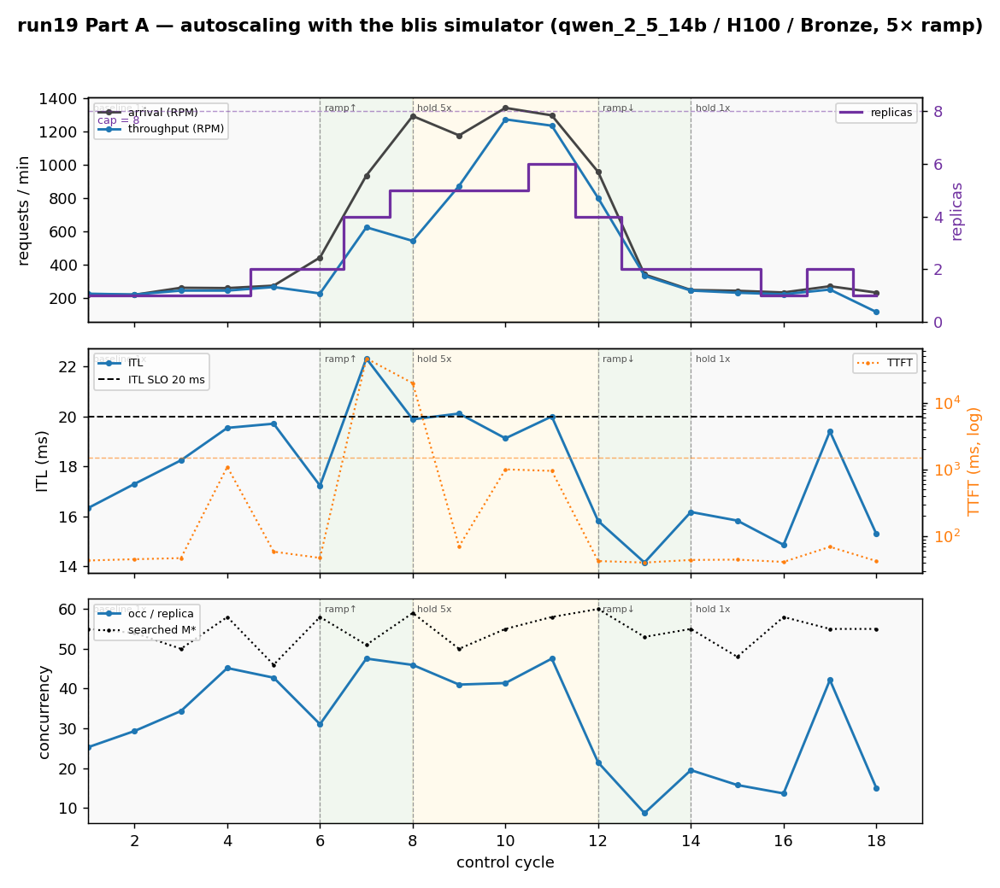
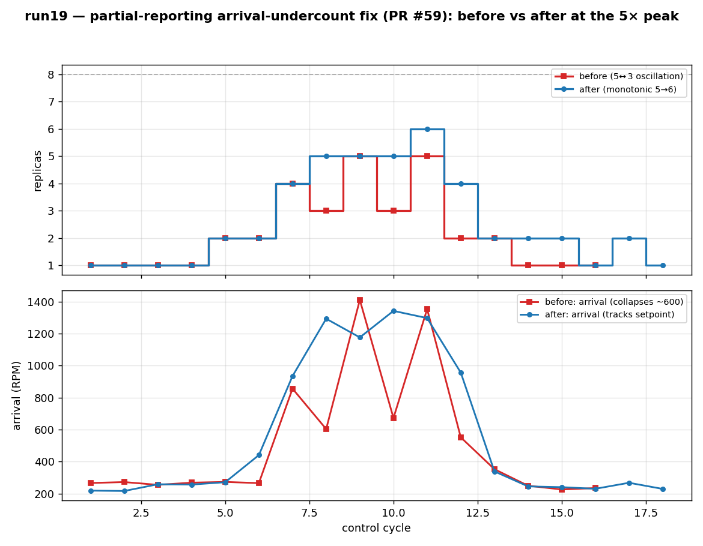
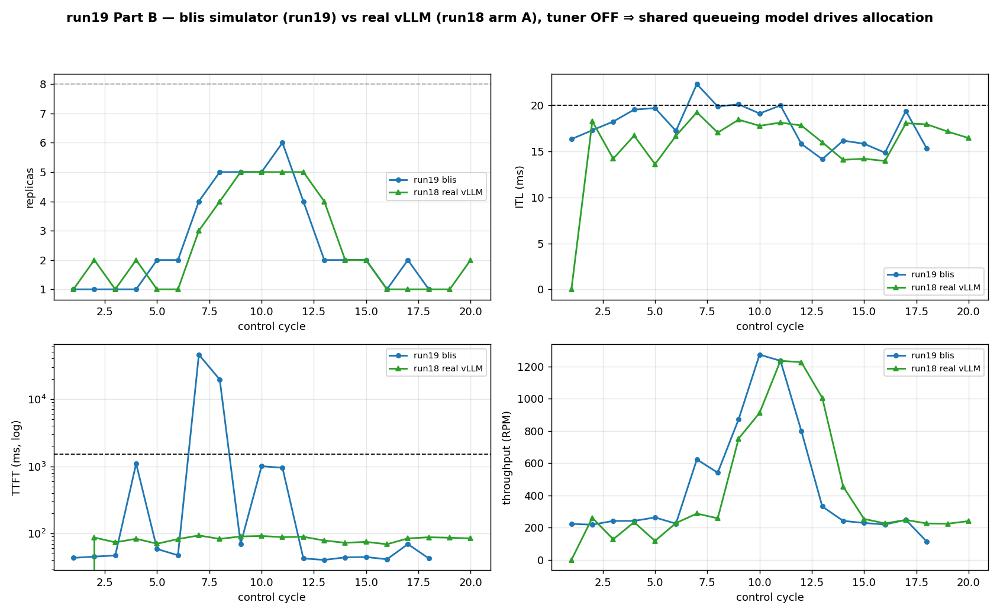

# Experiment Report: Run 19 — Autoscaling with the blis simulator (and contrast to real vLLM)

**Date**: 2026-06-26 (clean-peak rerun executed 2026-06-29)
**Cluster**: kind (`kind-cluster`) on Podman Desktop, macOS arm64
**Workload**: `blis-qwen` (`qwen_2_5_14b` / H100 / Bronze), single managed Deployment
**Evaluator backend**: blis `trained-physics` (server-sim), on-demand `GET /latest`
**Deploy script**: `scripts/blis/kind-deploy-qwen.sh`

## Overview

Run 19 re-runs **run18 arm A** (adaptive optimal-concurrency `M*` search) end-to-end on a local
kind cluster, but with the **blis `trained-physics` evaluator standing in for the real
vLLM/H100 server**. Two goals:

- **Part A** — demonstrate closed-loop autoscaling driven by a *simulated* server (blis), so the
  control loop can be exercised without GPUs.
- **Part B** — contrast the blis run against the real-GPU run18 arm A. Because the **tuner is OFF**
  and both runs feed the optimizer the same seeded perfParms, the allocation is driven by the
  shared queueing model and the replica trajectories are expected to coincide *by construction*;
  the interesting contrast is in the **observed** metrics (ITL / TTFT / throughput) the two
  backends report.

This rerun additionally serves as the **before/after validation of the partial-reporting
arrival-undercount fix** (control-loop PR #59, [`pkg/collector`](../../pkg/collector) `selectArrivalRate`).
The pre-fix run of this exact configuration oscillated 5↔3 at the load peak; the archived pre-fix
trajectory (`before-arrival-fix/`) is overlaid against the clean rerun below.

## Configuration

| Setting | Value |
|---|---|
| Evaluator backend | blis `trained-physics` |
| `SERVERSIM_CONTINUOUS` | `false` (on-demand `/latest`, server-sim #37) |
| `SERVERSIM_SATURATION_POLICY` | `pass-through` |
| Tuner | **OFF** (`TUNER_HOST` unset) — seeded run16 α/β/γ |
| `DEFAULT_MAX_BATCH_SIZE` | unset → **M\* search ON** |
| model-data `maxBatchSize` (search ceiling) | 256 |
| Seeded perfParms (qwen_2_5_14b / H100) | α=10.65, β=0.0418, γ=5.77e-5 |
| `INFERNO_CONTROL_PERIOD` | 120 s |
| Collector `/latest` timeout | 60 s |
| Capacity (H100) | 8 (`unlimited=false`) |
| Token sampling | bounded-gaussian, sum-split MaxModelLen=4096 (server-sim #38) |
| SLO (Bronze) | ITL ≤ 20 ms, TTFT ≤ 1500 ms |
| Load profile | run18 5× ramp: baseline 250 RPM (10m) → ramp → 1250 RPM (6m) → hold (6m) → ramp-down (4m) → hold 250 RPM |

Tuner OFF is a deliberate decision (see `project_run19_blis_autoscaling` / `project_ondemand_latest_noncontinuous`):
the tuner's cold-start `GuessInitState` transiently overrides the good static seed with a high γ,
which pins `M*=2` and over-scales to the capacity cap during warm-up. The static seed is
blis-correct (the EKF converges right back to it), so seeding + tuner-off avoids the wild warm-up
transient. With the tuner off the `M*` search behaves and picks ~50–60.

---

## Part A — Autoscaling with the blis simulator



**18 control cycles** captured (`armA-search-cycles.jsonl`). The loop tracked the 5× ramp cleanly:

| Phase | Cycles | Arrival (RPM) | Replicas | Notes |
|---|---|---|---|---|
| baseline 1× | 1–4 | ~220–260 | 1 | steady; ITL 16–20 ms |
| ramp ↑ | 5–7 | 270 → 935 | 2 → 4 | scale-out tracks rising load |
| hold 5× | 8–11 | 1176 → 1342 | **5 → 5 → 5 → 6** | peak; one monotonic bump to 6 (cap 8) |
| ramp ↓ | 12–13 | 956 → 339 | 4 → 2 | clean scale-in |
| hold 1× | 14–18 | ~230–270 | 2 → 1 (1↔2 flutter) | benign baseline flutter (also seen in run18) |

**Allocation.** Scale-out trajectory `1 → 2 → 4 → 5`, then a single monotonic step to **6 replicas**
at the peak hold, all under the capacity cap of 8. Scale-in was monotonic `6 → 4 → 2 → 1`. The
searched **M\* stayed in the 46–60 range every cycle** — the sensible value off the static seed,
not the tuner-induced `M*=2`, confirming the NO_TUNER decision.

**SLO attainment.** ITL rode the 20 ms Bronze boundary the whole run (14–20 ms in steady state),
marginally touching it at the peak (20.1 ms at cycle 9). TTFT stayed well under the 1500 ms SLO in
steady state (40–1000 ms) but spiked sharply on the **up-ramp transient** (cycle 7: 45.8 s; cycle 8:
19.5 s) — the one-cycle lag between the 5× load jump and the scale-out leaves the existing replicas
transiently saturated, and the blis queueing model reports the resulting queue blow-up. It clears
by cycle 9 once the replicas catch up. This is a property of the simulator's queueing model under
transient over-subscription, discussed further in Part B.

**Throughput** caught up to arrival by the peak hold (cycle 10: arrival 1342 / throughput 1272;
cycle 11: 1296 / 1234), confirming the allocation was sufficient once settled.

### The arrival-undercount fix (PR #59)



The headline result of *this* rerun. The pre-fix run of the identical configuration
(`before-arrival-fix/`, red) oscillated **5↔3 at the peak hold**: replicas `… 4, 3, 5, 3, 5, 2 …`.
The mechanism was a partial-reporting arrival under-count — fresh pods born at the pod-template
`maxbatchsize` are coherence-gated for ~1 cycle during scale-out, so the deployment-level
Σ-over-reporting arrival dropped to **~600–672 RPM** (cycles 8, 10) even though the held setpoint was
~1250 RPM. The optimizer saw the deflated arrival and scaled *down* into saturation, then back up
the next cycle when all pods reported — the 5↔3 sawtooth.

The fix (`selectArrivalRate`: prefer the offered setpoint label when `numReporting < numReplicas`)
removes the under-count. In the clean rerun (blue), arrival **tracks the held setpoint** through the
scale-out transients and replicas hold **monotonically (5 → 6)** with no scale-down. Acceptance met.

---

## Part B — Contrast to real vLLM / GPU (run18 arm A)



**Framing.** Tuner OFF ⇒ the optimizer runs on the same seeded queueing-model parameters in both
runs, so the **replica trajectory is driven by the model, not the backend** — agreement here is
expected by construction and is a *consistency check*, not a finding. The contrast that matters is
in the metrics the two backends actually report.

| Metric | run19 (blis sim) | run18 (real vLLM) | Reading |
|---|---|---|---|
| Replica trajectory | `1→2→4→5→6→…→1` | `1→2→…→5→5→5→5→…→1` | broadly coincide; run19 peaks at 6 vs run18's 5 (one extra replica at the peak) |
| Peak throughput | 1272 RPM | 1235 RPM | ≈ agree (both ≈ the 1250 RPM setpoint) |
| Max ITL | 22.3 ms (ramp transient) | 19.2 ms | both ride the 20 ms SLO; blis marginally over on the transient |
| Max TTFT | **45.8 s** (ramp transient) | 94 ms | **diverge** — see below |

**Replica agreement.** The trajectories track: baseline 1, scale to ~5 at the peak, scale back to
1. run19 takes one extra replica (6 vs 5) at the peak hold. This is a second-order consequence of
the arrival fix feeding the optimizer the full held setpoint at the transition; run18's real-vLLM
arrival came from the setpoint label directly and did not exhibit the under-count, so the two are
not bit-identical, but the autoscaling behaviour is the same shape.

**ITL / throughput agreement.** Both backends report ITL hugging the 20 ms boundary and peak
throughput ≈ the 1250 RPM setpoint. The blis trained-physics ITL curve reproduces the real server's
inter-token latency closely enough that the optimizer makes the same allocation calls.

**TTFT divergence (the honest contrast).** The two backends part ways on TTFT under transient
over-subscription. Real vLLM (run18) absorbed the 5× ramp with TTFT staying ≤ 94 ms throughout. The
blis queueing model instead reports a large transient TTFT blow-up (45.8 s at cycle 7) during the
one-cycle scale-out lag, because its M/M/c-style queue model translates brief over-subscription into
a long modeled wait. Neither model is "wrong" — they answer different questions: real vLLM's
admission/batching smooths the transient, while the blis analytic model surfaces the queueing
penalty of the under-provisioned instant. The practical implication is that **TTFT from the blis
backend should be read as a saturation indicator, not a calibrated latency**, and the SLO logic that
matters for autoscaling is ITL (which the two backends agree on). This is consistent with the
server-sim curve study (`server-sim/experiments/qwen2.5-14b-h100/REPORT.md`): the trained-physics fit
targets the steady-state ITL/throughput surface, not the transient TTFT tail.

---

## Artifacts

- `armA-search-cycles.jsonl` — 18 cycle records (the dashboard JSONL) for the clean rerun.
- `before-arrival-fix/armA-search-cycles.jsonl` — archived pre-PR-#59 run (16 cycles, 5↔3 oscillation).
- `logs/armA-search-*.log` — all five control-pod container logs + workload sidecars + load emulator.
- `figs/run19-autoscaling.png`, `figs/run19-vs-run18.png`, `figs/run19-arrival-fix.png`.
- `gen_report_figs_run19.py` — figure generator.

## Reproduce

```bash
# (user) rebuild inferno-evaluator from current server-sim main (bounded-gaussian tokens, on-demand /latest), then:
scripts/blis/kind-deploy-qwen.sh
# let the ~30-min 5x profile run, then:
RUN=run19 scripts/blis/save-cycle-log.sh armA-search
python3 experiments/run19/gen_report_figs_run19.py
```

## Residual / follow-ups

- **Zero ITL/TTFT under saturation (cosmetic).** Under deep saturation the blis pre-check can return
  zeros, which the dashboard plots as a 0 ms dropout. Not fixed here; it did not materially affect
  this run (the transient surfaced as a TTFT *spike*, not a zero). Tracked in
  `project_ondemand_latest_noncontinuous`.
- **One-cycle scale-out TTFT transient.** Inherent to a 120 s control period against a step load
  change; shorter periods or arrival-rate-anticipating scale-out would damp it. Out of scope here.
